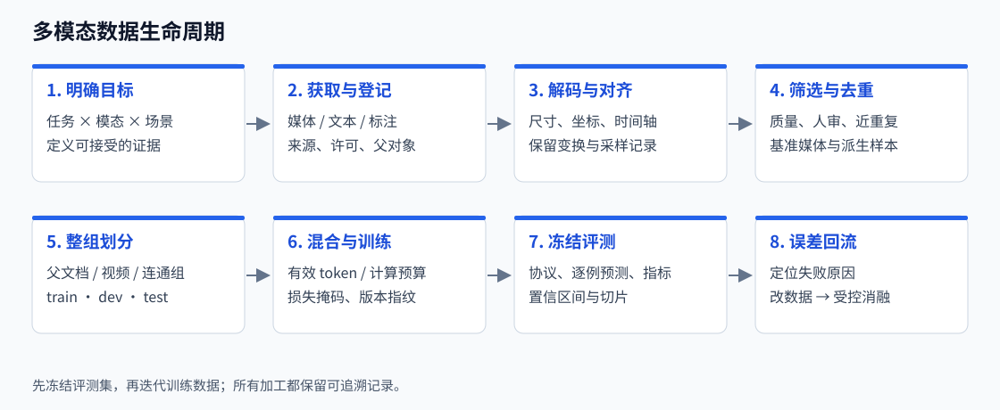
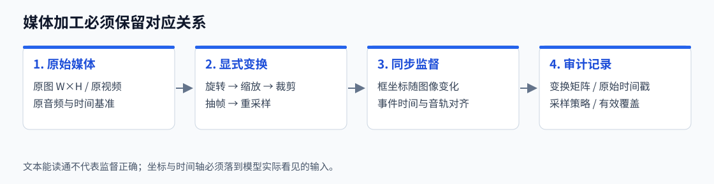
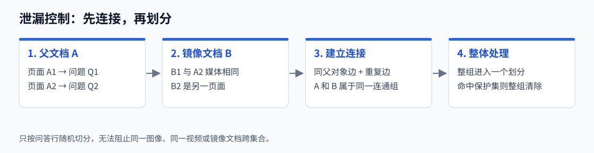
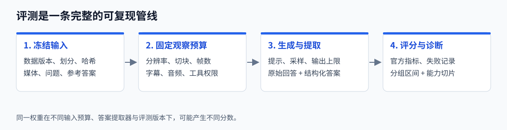
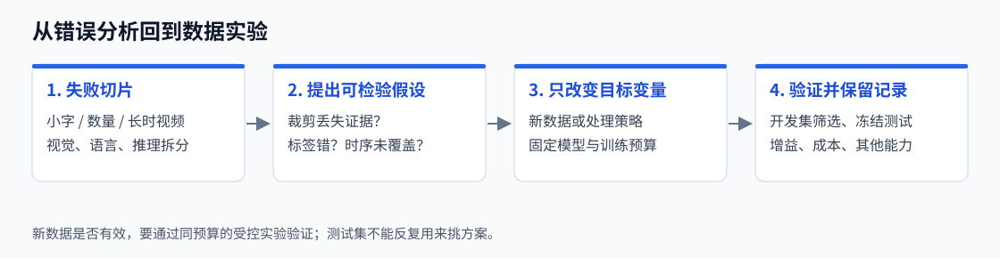

# MLLM 数据工程与评估基准：从原始媒体到可信结论

**学习目标**：能设计一条可追溯的多模态数据管线；能按任务选择评测集与指标；能判断两份成绩是否可比；能用逐例错误指导下一轮数据实验。

本文参考 Datawhale《动手学大模型》的[第 11 章：数据工程](https://datawhalechina.github.io/diy-llm/chapter11/chapter11_%E6%95%B0%E6%8D%AE%E5%B7%A5%E7%A8%8B.html)和[第 12 章：评估与基准测试](https://datawhalechina.github.io/diy-llm/chapter12/chapter12_%E8%AF%84%E4%BC%B0%E4%B8%8E%E5%9F%BA%E5%87%86%E6%B5%8B%E8%AF%95.html)的教学组织：从问题出发，解释概念，再讨论方法、实例、实现和误区。正文是面向多模态任务重新编写的资料整理，不是这两章的转载。技术依据主要来自论文、数据集项目与官方评测实现，资料核验日期为 **2026 年 10 月 6 日**。

你需要了解 Transformer、交叉熵、训练集/验证集/测试集的区别。不了解具体模型也能阅读；需要模型背景时，可跳转到[多模态大模型综述](mllm-expanded.html)。文中的 MLLM 指接收图像、视频、音频等输入并进行语言理解或生成的模型；不同模型支持的模态、输出形式和工具能力并不相同。

> **贯穿全文的例子**：我们要做一个“读报告、看图表、听讲解”的助手。它需要从报告图片提取数字、比较图表趋势，并根据视频中的画面和语音回答问题。模型答错，可能是没学会，也可能是输入丢了证据、数据标错了、参考答案过窄，或者评测器提取错了答案。数据工程与评估必须一起分析。

建议先读第一部分建立数据流程，再读第二部分理解分数。第三部分附有[标准库练习包](mllm-data-evaluation.zip)：不用 GPU，不下载模型，运行后可看到删除日志、分组划分、逐例分数和配对置信区间。所有练习数据与预测都是人为构造，不对应真实模型成绩。



*图 1：本文原创流程示意。每个箭头都应有配置、日志与版本记录；评测集在训练数据迭代之前冻结。*

## 第一部分：MLLM 数据工程

### 1.1 数据工程究竟在解决什么问题？

在纯文本任务中，我们常把数据看成字符串集合。在多模态任务中，一个训练样本是**媒体、文本、监督目标及其关系**的组合。图片里的字、题目所指的区域、视频中的事件时间、回答对应的音轨，都会影响监督是否成立。

例如，一张折线图显示 2022 年营收为 10、2023 年为 15。问题是“增长率是多少”，答案是“50%”。如果裁剪时丢掉年份标签，问题变得含糊；如果缩小图片后数字不可读，监督变成了“要求模型猜”；如果答案来自同主题的另一张图，文本再流畅也属于错配。数据工程的目标是让模型实际看到的证据，足以支持训练目标。

可以用五个问题检查一条管线：**来自哪里？有没有证据？变换后是否仍成立？是否污染评测？是否值得这份计算成本？** “能下载”“能解码”“文字通顺”只分别回答其中很小的一部分。

| 维度 | 要记录什么 | 不记录会发生什么 |
| --- | --- | --- |
| 来源与权利 | 来源数据集、原始 URL/对象 ID、采集时间、许可信息 | 无法追踪错误、无法解释用途边界 |
| 媒体身份 | 文件哈希、父文档/视频 ID、页号、片段起止时间 | 同源派生样本容易跨集合泄漏 |
| 模态关系 | 图文对应、区域坐标、音画时间基准、说话人信息 | 标签正确但对应错对象或错时刻 |
| 监督质量 | 标签来源、审核状态、拒绝原因、置信标签 | 自动合成答案与人工事实混在一起 |
| 计算成本 | 切块数、采样帧、音频时长、实际 token 长度 | 按条数配比却产生完全不同的算力分配 |

**学习提示**：数据质量不是一个全局标量。“主体居中、背景干净”的图片适合物体识别，却未必能教模型读密集表格；“长而详细”的描述也可能增加无法验证的细节。质量标准要服务于目标能力。

### 1.2 多模态样本有哪些基本形态？

先区分样本形态，再谈清洗。把所有数据都压成“单图 + 一个问题”，会损失原来的上下文和任务结构。

| 形态 | 一条记录的核心内容 | 学到的能力 | 典型错误 |
| --- | --- | --- | --- |
| 图像—描述对 | 图像、标题/说明/描述 | 视觉概念与语言关联 | 网页标题不描述图片，描述幻觉 |
| 图文交错文档 | 文本段、图片及原始顺序 | 跨段落、多图上下文 | 打乱图片位置，漏掉引用关系 |
| 视觉指令对话 | 媒体、用户问题、助手回答 | 按指令回答、格式遵循 | 模板单一，问题无需看图 |
| 区域/OCR/结构化标注 | 框、点、文字、表格结构 | 定位、读字、结构提取 | 坐标失配，合并单元格标签错误 |
| 多图任务 | 图片列表、顺序、比较问题 | 跨图比较、身份一致性 | 图像次序错、答案只用其中一图 |
| 视频任务 | 帧/原视频、时间戳、事件描述 | 动作、顺序、长时依赖 | 关键事件未被抽到，时间轴被重置 |
| 音频/音画任务 | 波形、采样率、音轨、同步信息 | 语音、环境声、音乐、融合推理 | 错误重采样，字幕代替了听音能力 |
| 偏好/行动轨迹 | 同输入的候选答案或状态—行动序列 | 偏好对齐、工具或界面操作 | 偏好偏向更长答案，行动缺失结果反馈 |

[OBELICS 论文](https://arxiv.org/abs/2306.16527)将网页建成图文交错文档，而不是独立图文对。它提示我们：文档级上下文本身就是一种训练信号。转换格式时需要保留“这段文字对应哪张图片”，而不只是保留图片数量。

下面是一条**教学用数据协议**，不是任何模型的官方格式。真正喂给模型前，还要转换成其 processor/chat template 所要求的消息与媒体占位符。

```json
{
  "id": "report42-page7-q2",
  "parent_id": "report42",
  "source": {"dataset": "internal-report-v1", "license": "recorded separately"},
  "media": [{"type": "image", "path": "page7.png", "sha256": "...",
             "width": 1800, "height": 2400}],
  "messages": [
    {"role": "user", "content": "图中 2023 年比 2022 年增长了多少？"},
    {"role": "assistant", "content": "50%。计算为 (15-10)/10。"}
  ],
  "evidence": {"page": 7, "region_xyxy": [120, 800, 1500, 1600]},
  "annotation": {"origin": "human", "reviewed": true},
  "transforms": [],
  "split": "unassigned"
}
```

这里的 `parent_id` 比样本 ID 更重要：同一报告的多个页、多个问题、不同尺寸副本，都可以追溯到一个父对象。视频片段也应能追溯到原视频，而不是每次裁剪都“获得新身份”。

### 1.3 训练阶段如何决定数据需求？

MLLM 没有唯一的训练分期。一个常见思路是先建立视觉与语言之间的连接，再训练多模态理解与指令遵循，之后改善偏好、推理或行动行为。也有模型把多模态混入较早的联合预训练阶段。**阶段名称不能代替真实的可训练模块、损失和数据构成。**

| 常见阶段/目标 | 主要监督 | 数据要求 | 应关注的问题 |
| --- | --- | --- | --- |
| 模态连接/特征对齐 | 图像条件下的文本生成等 | 概念覆盖、图文相关性、足够规模 | 冻结哪些模块？弱描述是否支持目标？ |
| 多模态联合预训练 | 图文交错、视频/音频与文本等 | 上下文完整、多任务覆盖、长序列质量 | 模态比例、文本能力保留、计算预算 |
| 指令微调 SFT | 问题 → 目标回答 | 任务多样、答案有依据、格式一致 | 是否把错误合成答案当事实？ |
| 偏好/强化学习 | 候选比较或可验证奖励 | 偏好可靠、验证器与任务一致 | 奖励漏洞、长度偏置、可核验性 |

[LLaVA 官方仓库](https://github.com/haotian-liu/LLaVA)提供特征对齐与指令微调的不同数据配置，适合观察“数据随训练目标变化”的实例。[InternVL3 论文](https://arxiv.org/abs/2504.10479)则讨论较早的原生多模态预训练设计。它们说明训练配方存在差异，不能把某个模型的数据阶段当作全部 MLLM 的固定流程。

对报告助手来说，图像描述可以建立一般视觉关联，但不会自动带来精确表格读取。需要增加带证据的 OCR、图表运算和文档问答；如果应用会遇到“页面没提供答案”，还应加入真实的不可回答样本，教模型识别证据不足。

### 1.4 数据从哪里来？如何选择数据源？

数据源通常包括网页弱监督、公开研究数据集、人工标注、自有业务数据，以及模型合成数据。选择时先问“它填补什么能力缺口”，再问“有多少条”。

| 数据源/代表资料 | 主要价值 | 使用前需要检查 |
| --- | --- | --- |
| [LAION-5B](https://arxiv.org/abs/2210.08402)一类网页图文对 | 大规模概念与语言覆盖 | 下载存活、图文相关性、重复、敏感信息、来源权利 |
| [OBELICS](https://arxiv.org/abs/2306.16527)交错文档 | 图片与长文本的上下文关系 | 网页正文提取、导航噪声、图片顺序、父网页分组 |
| [LLaVA](https://github.com/haotian-liu/LLaVA)视觉指令资料 | 多任务指令与对话形式 | 具体版本、合成来源、混合任务与原始标注 |
| [PixMo / Molmo](https://arxiv.org/abs/2409.17146)相关数据 | 高质量视觉描述及指向等监督 | 数据子集、标注协议、可用许可和任务适配 |
| DocVQA、ChartQA 等任务数据 | 明确的文档/图表能力 | 训练划分与评测划分、标签规则、原始媒体重叠 |
| 自有报告、录音、视频 | 贴近目标场景与实际分布 | 获取授权、去敏、来源登记、标注质量、时间/主体分组 |

网页的 `alt` 文本可能是文件名、广告口号或 SEO 文本，不等于人工描述。CLIP 过滤的图文对也只代表在某个相似度系统中较相关，不能保证句子每一处都被图像支持。LAION 的规模与筛选方法适合研究弱监督数据，不能据此推导“弱标签就是可靠事实”。[论文](https://arxiv.org/abs/2210.08402)

**来源记录要随数据流动**：保存原始数据集名称、发布版本、媒体或原文 ID、下载日期与处理配置。如果公开数据只能提供 URL，下载后的内容可能变化；应同时记录本地字节哈希和实际解码信息。网页可访问也不意味着页面所有媒体都可任意再分发，具体用途要依据相应许可与授权记录。

### 1.5 媒体解码：最容易被忽略的一层

进入模型之前，先让媒体稳定、可解释地解码。把失败图片静默替换成白图，会让训练和评测的统计都失真。正确做法是记录失败类型，并明确决定删除、重试还是保留为专门的鲁棒性测试。

**图像**需要检查格式、宽高、通道、透明背景、EXIF 旋转与可读性。对扫描页来说，错误旋转会改变文字方向；透明图转 RGB 的背景颜色也可能影响文字对比度。转换后的尺寸应写入记录，不要继续沿用原文件元信息。

**视频**需要记录解码器、原始时长、实际帧时间戳和抽帧策略。可变帧率视频不能简单把“第 k 帧”视为 `k/FPS` 秒；应使用解码得到的展示时间。剪出 10–20 秒片段后，标注要说明使用原始视频时间还是片段相对时间。

**音频**需要记录采样率、声道、时长、截断/补零和重采样策略。把采样率字段从 48 kHz 改成 16 kHz，不等于完成重采样；波形本身也必须按算法变换。双声道中若分别含不同说话人，直接平均混为单声道可能丢掉任务所需的信息。

| 原始问题 | 看似方便的处理 | 更可靠的工程做法 |
| --- | --- | --- |
| 超大图像 | 全部缩到很小 | 按任务保留分辨率或切块，并验证小字可读性 |
| 长视频 | 每段固定抽少数帧 | 记录覆盖范围、帧时间与预算，检查目标事件是否被观察到 |
| 无音轨视频 | 给“听到什么”生成答案 | 标为音频缺失/不可回答，避免伪监督 |
| 扫描页旋转 | 只转图片不转框 | 同步变换框、点、多边形与尺寸 |
| 损坏文件 | 重试无限循环 | 有上限重试，写失败清单与处理结果 |

### 1.6 空间与时间对齐：标签要跟着输入走



*图 2：本文原创示意。变换改变的是模型看到的证据，监督也必须在同一坐标系与时间基准上解释。*

假设框为 $(x_1,y_1,x_2,y_2)$，图像从 $W\times H$ 缩放到 $W'\times H'$。不含旋转或裁剪时，新坐标为：

$$
x'_i=x_i\frac{W'}{W},\qquad y'_i=y_i\frac{H'}{H}.
$$

如果再从左上角 $(c_x,c_y)$ 裁剪，坐标还要减去裁剪偏移；超出裁剪范围的框要裁切或删除。只有一个角落仍可见的对象，是否继续作为完整对象监督，要依据任务标注协议决定。多边形与关键点同理。

归一化到 $[0,1]$ 或 $[0,1000]$ 也不是“换个单位就结束”：需要注明采用的坐标约定、边界是否包含端点、是否基于原图或模型输入图。特别是在切块输入中，局部块坐标和全图坐标不能混用。

视频—音频对齐可以写成 $t_a=t_v+\Delta$，但这个固定偏移模型只适用于两条轨道时间基准稳定的情况。剪辑、变速、片段拼接可能需要分段映射。字幕时间戳是辅助证据，不应自动当作准确的事件标注。

[Qwen2.5-VL 技术报告](https://arxiv.org/html/2502.13923v1)把动态分辨率和视频时间信息纳入模型设计，说明媒体处理策略与模型训练分布直接相关。复现模型时，优先使用其官方 processor；自定义抽帧和缩放时，需记录与官方配置的差异。

**例子**：问题问“杯子落地前，谁说了‘小心’？”每隔 5 秒抽一帧可能遗漏杯子落地，单看字幕可能不知道谁在说话。这个任务需要事件时间、声源/说话人与画面一起对齐，不能只靠一段转录文本生成可靠标签。

### 1.7 质量过滤：规则、模型分数与人工审核如何协作？

推荐把过滤设计为分层过程，而不是单一阈值。规则层处理确定性坏样本，模型层排序不确定样本，人工层校准规则和分数是否符合目标任务。

1. **硬规则**：媒体无法解码、空文本、缺失标注、框越界、事件时间超出媒体范围。这类问题通常可以直接判定。
2. **软评分**：图文相似度、清晰度、OCR 可读性、语言检测、回答是否有依据。分数先作为排序信号，未必能直接跨数据源比较。
3. **分层人审**：按来源、语言、任务、评分区间抽样，观察误删和漏删，再定阈值或人工兜底策略。

设验证样本中有 $N_{\text{keep}}$ 条被过滤器保留，其中 $N_{\text{good,keep}}$ 条确实符合质量标准。保留集精度是 $N_{\text{good,keep}}/N_{\text{keep}}$；但仅审核保留集，无法估计被删除的好样本比例。**删除集也要抽样审核。**

CLIP 相似度擅长粗粒度图文匹配，但可能忽略否定、精确数量、细小文字与关系方向。一句“桌上有三个杯子”与实际两个杯子的图片仍可能有高相关性。因此报告助手的数据还要检查数字证据和图表单位，不能只用相关性过滤。

[DataComp](https://github.com/mlfoundations/datacomp)把数据选择放到固定训练与评测协议下研究，提供语言、图像和相似度等过滤基线。它更值得学习的是**如何验证过滤策略**，而不是照搬某个阈值。阈值依赖评分模型、来源分布和目标任务。[论文](https://papers.neurips.cc/paper_files/paper/2023/hash/56332d41d55ad7ad8024aac625881be7-Abstract-Datasets_and_Benchmarks.html)

> **常见误区**：低清、倾斜、遮挡样本不一定都是坏数据。现实业务就可能包含这些输入。应区分“标签与证据失配的无效样本”和“有难度但标签仍成立的有效样本”，同时保留目标分布中的困难切片。

### 1.8 多模态去重：为什么只对文本做 MinHash 不够？

文本去重能找出重复问句或答案，却找不到“同一图片配了不同问句”。文件 SHA256 能找到相同字节，却找不到压缩、缩放、裁剪、加水印后的副本。多模态去重需要多个层次。

| 层次 | 可采用的信号 | 找得到什么 | 主要局限 |
| --- | --- | --- | --- |
| 精确重复 | 原始字节 SHA256、标准化后的文本哈希 | 完全相同文件或文本 | 改编码/压缩就可能改变哈希 |
| 视觉近重复 | 感知哈希、局部匹配、图像嵌入 + 复核 | 缩放、压缩、部分变换副本 | 相似版式/主体可能被误并 |
| 文本近重复 | n-gram、MinHash/LSH、编辑距离 | 轻微改写、模板重复 | 不知道对应的媒体是否相同 |
| 视频/音频重复 | 片段指纹、关键帧、音频指纹 | 同源片段、重编码副本 | 剪辑、偏移与混音增加难度 |
| 文档级关联 | 来源 ID、URL、页号、镜像与派生关系 | 同一报告多页、翻译或裁剪 | 需要来源谱系，不能只靠相似度 |

实际管线可以先用便宜的哈希筛候选，再用较贵的嵌入或局部匹配查近重复，最后抽样校准。近邻检索只产生候选，不意味着“向量很近就必须合并”。两张相似的柱状图可能代表不同月份，是重要的对照样本。

去重的目标也应区分：减少浪费、避免某一来源被过度加权，以及防止评测污染。训练集内部重复可能影响采样权重；训练—测试之间重复直接影响结论可信度。二者的处理策略可以不同。

### 1.9 先按来源关系分组，再划分 train/dev/test



*图 3：本文原创示意。父对象关系和重复关系需要共同参与分组；否则“换一个来源 ID”就能绕过隔离。*

同一图片生成 10 个问答，如果按行随机划分，模型可能在训练时见过测试图。文档不同页、视频不同片段、同一说话人的相近录音也可能存在相关性。**隔离单位应对应你希望测试的泛化对象**：新问题、新图片、新文档、新主体，还是新时间段？

可以把记录看成图的节点，把“同父文档/原视频”“重复媒体”“已确认的派生副本”看成边。每个连通分量整体进入一个划分。对于同一视频的连续片段，若目标是泛化到未见视频，就必须按原视频分组，而不是按片段分组。

这会带来一个现实问题：不同来源之间的近重复连接可能形成很大的组。不要为了凑比例把组拆开。需要审计连接是否误判，并报告分组后的任务、来源与规模分布。划分比例只是约束之一，不能优先于隔离原则。

开发集用于选超参数、提示模板与过滤规则；测试集用于冻结方案后的报告。对时间变化明显的应用，可以采用较早时间训练、较晚时间测试；对主体相关任务，可以按患者、设备或说话人分组。选择依据应写进数据卡。

### 1.10 评测污染：不仅是训练里出现了测试答案

多模态污染可能来自原始图片、同源视频、文档其他页、OCR 转录、问题改写、翻译版本、带答案的解析，或者用测试题给教师模型生成的训练样本。因此污染检测不能只查完整问答字符串。

建议建立**受保护的评测注册表**：基准名称与版本、媒体哈希、问题 ID、来源/父对象信息，以及允许执行的匹配规则。对新增训练源执行媒体与文本两路扫描，命中后沿派生关系检查相关样本。本文练习用精确媒体哈希演示；真实管线还需要近重复和来源审计。

公开基准常有官方训练集，这是研究允许使用的训练资料；“来自同一个基准”并不自动等于违规。关键是是否使用了不应接触的验证/测试样本、标签或其可推断派生物，以及你的报告是否说明使用了哪些数据。

[MMStar 论文](https://arxiv.org/abs/2403.20330)讨论了视觉信息并非必需及可能的数据泄漏等评测问题。需要注意：**去掉图片仍能答对，只说明这题可能依赖语言线索或已有知识，不能单凭这一项断言训练污染。** 污染需要结合训练来源、匹配证据和对照实验判断。

测试题不应用来调节过滤阈值、合成训练题或挑选最佳 checkpoint。必须调试的公开开发集，可以用于这些目的，但应与最终报告用的冻结测试集区分。

### 1.11 合成数据：教师模型不能替代事实校验

合成数据能扩充问法、增加任务覆盖和产生结构化回答，但教师模型也会产生看似合理、实际缺乏证据的内容。对多模态任务来说，问题往往是“它是否真的看到了所需证据”，而不是语言表达是否自然。

一条更可控的流程是：**先确定证据 → 生成问题 → 生成答案 → 独立验证 → 抽样人审 → 保留来源与教师配置**。证据可以是图表原始表格、人工 OCR、区域标注或视频事件标注。若先生成复杂问题，再强迫教师回答，容易制造不可回答但被错误标为确定的样本。

| 任务 | 适合的验证 | 不可靠的替代 |
| --- | --- | --- |
| 图表运算 | 从确认的数值表计算，检查单位与基数 | 另一个语言模型说“看起来正确” |
| OCR 抽取 | 与人工文本、区域或结构标注对齐 | 文本语法通顺就通过 |
| 物体计数 | 目标范围与逐个定位复核 | 场景常识推断数量 |
| 视频时间问答 | 核对事件存在与时间范围 | 根据字幕内容猜视觉事件 |
| 不可回答问题 | 检查证据确实不足，并定义合理拒答 | 随机删图后把所有问题标为拒答 |

合成偏好对还要检查“好回答”是否只是更长、格式更漂亮。对同一输入，正确但简洁的答案可能优于带有虚构细节的长答案。保留候选原文、偏好理由与核验标签，比只保留 chosen/rejected 更便于后续排错。

对于 OCR、坐标、数值等可验证任务，可以把验证器引入奖励，但必须考虑格式投机、单位错误和部分正确。奖励函数测不到的错误，不会因为用了强化学习就自然消失。

### 1.12 数据配比与计算预算：条数不是训练暴露量

一条低分辨率图像描述与一条含几十帧的视频问答，消耗的 token、解码时间和显存可能差很多。数据配比至少要同时看**抽样概率、有效训练 token、媒体规模和实际计算成本**。

设数据源 $i$ 的抽样概率为 $p_i$，平均序列长度为 $L_i$。在简单的每次抽一条样本设置下，该源在 token 总量中的期望占比近似为：

$$
q_i=\frac{p_i L_i}{\sum_j p_jL_j}.
$$

这只估计 token 暴露量；不同架构的视觉编码器、音频编码器和注意力计算成本不同，不能把 $q_i$ 直接视为 FLOPs 占比。实际应测每类 batch 的吞吐、峰值显存与耗时。

**教学例子**：两类样本都占 50% 抽样概率，平均序列分别为 500 和 2000 token，则后者约占 80% 的 token 暴露量。若想比较“增加视频数据是否有用”，只保持训练条数相同可能让视频方案消耗更多计算，应同时报告预算约束。

常见的温度采样可写为 $p_i\propto n_i^\alpha$，$0<\alpha<1$ 会降低大源的支配程度。它不是通用最优配方：对小源反复采样可能提高覆盖，也可能更快过拟合。使用任务切片验证收益，并跟踪语言、OCR、视频等其他能力是否下降。

不要机械追求各模态均衡。报告助手需要的任务分布，可能和聊天型全能模型不同。先建立目标能力矩阵，再做配比实验，通常比照抄其他模型的混合比例更有解释力。

### 1.13 打包、损失掩码与数据加载

数据在 JSONL 中正确，不意味着进入模型后仍然正确。多模态占位符顺序、chat template、图像切块数量、标签掩码与长序列截断，都可能在最后一步制造新错误。

**SFT 损失掩码**通常只对期望模型学习生成的回答 token 计算损失，用户问题与媒体占位符不作为回答目标；具体模型/训练框架可能有不同目标。必须查看 labels，确认不是不小心把用户问题也计入回答损失，或把全部回答置为忽略。

**Packing** 将多个样本放进一个序列可以减少 padding，但需要明确注意力边界、位置编码、标签边界与媒体索引。如果独立样本互相可见，就改变了训练条件；如果图像占位符指向了另一条样本的媒体，损失仍能下降，但监督已错。

**截断**也有语义成本：若保留问题与答案，却截掉了证据所在的前半段文档或视频帧，样本不再有效。应记录截断比例，并对“媒体是否仍能支持答案”做抽样检查，而不仅检查长度合法。

大规模媒体通常使用分片与流式读取。[WebDataset](https://github.com/webdataset/webdataset)以 tar shard 等机制支持数据加载。选择存储方案时，要同步设计 shard 版本、worker 随机种子、错误重试和 resume 状态；只记录“打乱了数据”不足以复现真实采样顺序。

### 1.14 数据版本与受控消融：怎样证明新数据有效？

每次数据发布至少保留：输入源清单、许可/授权记录、转换配置、过滤阈值、去重/划分算法、删除原因统计、输出指纹和审核抽样结果。数据卡还应写清任务覆盖、限制、适用场景和已知偏差。

一个可解释的数据实验应冻结模型初始化、可训练模块、processor、优化器、训练预算和评测协议，再只改变需要检验的数据因素。否则“加了高质量数据后分数上升”可能实际上来自更长训练、不同图像分辨率或更强基座。

| 实验 | 改变项 | 尽量保持一致 | 想回答的问题 |
| --- | --- | --- | --- |
| A：基础集 | 基础混合数据 | 模型、预算、评测 | 建立基线 |
| B：更严格相关性过滤 | 过滤策略 | 同计算预算与合理任务覆盖 | 过滤是否有净收益？ |
| C：增补密集 OCR | 目标任务数据 | 同预算，记录替换了哪些源 | 小字读取是否改善？ |
| D：加入不可回答样本 | 拒答监督 | 同协议，另测可回答题 | 幻觉减少是否伴随过度拒答？ |

以上是实验设计示例，不是真实成绩。若预算固定导致训练条数不同，应同时报告条数和有效 token；若训练预算不固定，则把结论表述为“数据与额外计算共同带来的效果”，不要归因给单一因素。

**这一部分的自检**：你是否能追踪一条样本的原媒体、父对象、每次变换和答案证据？是否能解释为什么它属于 train 而不是 test？是否能复现它被保留或删除的原因？这些问题比最终生成多少 JSONL 文件更能体现管线质量。

## 第二部分：MLLM 评估与基准测试

### 2.1 先明确评估对象，再选择榜单

“模型 A 优于模型 B”需要补充：在哪类任务、哪种输入预算、哪套提示和工具条件下，以什么指标衡量？模型权重、带 OCR 工具的系统、带检索的助手与能反复调用模型的 agent，是不同的评估对象。

对于报告助手，可以先定义三类目标：事实抽取是否正确、跨模态推理是否可靠、实际使用成本是否可接受。前两类通常需要任务指标与错误分类；第三类需要延迟、输入/输出预算、失败率和资源消耗。

| 对象 | 可以测试什么 | 必须说明的额外条件 |
| --- | --- | --- |
| 单次模型推理 | 固定媒体与问题的理解/生成能力 | 权重、processor、输入预算、解码方式 |
| 工具增强系统 | OCR、检索、代码执行等组合效果 | 工具权限、调用次数、外部信息来源 |
| 多轮交互/agent | 状态变化下完成任务的能力 | 环境版本、动作预算、成功判定、重试策略 |
| 真实产品 | 端到端可用性与成本 | 任务分布、响应时间、用户评价、故障处理 |

一个带 OCR 工具的文档系统取得高分，能说明该系统有效，但不能单独证明其视觉编码器读字能力更强。把评估对象写清楚，才能公平理解结果。

### 2.2 建立能力矩阵：每个分数覆盖了什么？

MLLM 的能力可以沿两条轴展开：**模态/输入形式**与**任务/推理需求**。一般问答高分不意味着精确定位、长视频记忆或音乐理解也强。

| 能力 | 测试问题示例 | 关键证据 | 适合观察的输出 |
| --- | --- | --- | --- |
| 感知与关系 | 谁在拿杯子？杯子在哪里？ | 物体、属性、空间关系 | 答案、框/点、关系 |
| OCR 与文档 | 发票总金额、表格某列是什么？ | 小字、版式、结构 | 文本、字段、表格 |
| 图表/数学 | 增长率、趋势比较、几何关系 | 图形、标注、单位与计算 | 数值、选择项、推理 |
| 多图/长上下文 | 哪页与前页矛盾？ | 跨图引用与记忆 | 对比、引用位置 |
| 视频时序 | 开门前发生了什么？ | 帧顺序、事件、时间戳 | 事件答案、时间区间 |
| 音频理解 | 谁说了什么？背景声是什么？ | 语音、声音与声源 | 转录、分类、解释 |
| 音画融合 | 哪个人发出了这段声音？ | 同时对齐的音轨和画面 | 联合判断 |
| 可靠性 | 图里真的有这个物体吗？ | 支持/不支持答案的视觉证据 | 事实、拒答与不确定性 |

先用矩阵找覆盖缺口，再选少量代表基准。若目标只做报告抽取，文档、图表、定位和拒答测试比大量重复的一般视觉选择题更相关。若目标是全模态助手，则需单独测试各模态与联合任务。

### 2.3 图像、文档与视觉推理基准

下面列出代表性基准及其用途。链接指向论文或官方项目；这是学习地图，不是当前模型排名。不同版本、子集和评分规则应分别报告。

| 基准 | 主要观察什么 | 指标/结果阅读重点 | 使用边界 |
| --- | --- | --- | --- |
| [MMMU](https://arxiv.org/abs/2311.16502) | 多学科专业视觉理解与推理 | 官方答案处理与总体/学科表现 | 同时包含不同题型，不能全部当作普通四选一 |
| [MMMU-Pro](https://arxiv.org/abs/2409.02813) | 更强调视觉必要性与更困难的设置 | 配置/子集、选项与呈现形式 | 与原版 MMMU 不可直接合并成绩 |
| [MMStar](https://arxiv.org/abs/2403.20330) | 视觉必要的多能力题目 | 总体与能力切片、视觉依赖对照 | 仍不能单凭高分证明不存在污染 |
| [MathVista](https://arxiv.org/abs/2310.02255) | 视觉场景中的数学推理 | 题型、数值/答案提取和准确率 | 看错图与算错数要分别分析 |
| [DocVQA](https://www.docvqa.org/datasets/docvqa) | 文档图像问答 | 常见协议使用 ANLS，检查官方规则 | 短答案问答不等于整页结构化解析 |
| [ChartQA](https://arxiv.org/abs/2203.10244) | 图表视觉与逻辑问答 | 数值宽容准确率与非数值匹配 | 是否给原始表格会改变任务条件 |
| [OCRBench](https://github.com/Yuliang-Liu/MultimodalOCR) | 多种视觉文本相关任务 | 子任务、答案匹配和计分方式 | 总分不代表所有文档结构任务 |
| [OmniDocBench](https://github.com/opendatalab/OmniDocBench) | 整页文档解析、表格、公式、阅读顺序 | 文本编辑距离、TEDS、CDM 等组件指标 | 版本与 Overall 定义必须注明 |

DocVQA、OCRBench 与 OmniDocBench 都与读字有关，却不是同一个问题：问“日期是多少”是字段问答；输出整页 Markdown 涉及版式、阅读顺序、表格和公式。一个模型短答案正确，仍可能在整页解析时丢掉表格列关系。

OmniDocBench 的官方仓库记录过数据与总体指标更新；较新实现用文本正确程度、表格和公式指标组合成 **Overall↑**，但文本/阅读顺序编辑距离通常是 **↓**。因此“这个指标越低越好”必须说清指的是哪一列、哪个版本，不能凭基准名称判断。[官方指标说明](https://github.com/opendatalab/OmniDocBench#end-to-end-evaluation)

### 2.4 视频、音频与联合模态基准

| 基准/项目 | 主要模态与任务 | 比较时要固定什么 |
| --- | --- | --- |
| [Video-MME](https://github.com/MME-Benchmarks/Video-MME) | 不同长度视频的理解任务 | 帧数/抽帧、分辨率、字幕条件、是否使用音频 |
| [Video-MME-v2](https://github.com/MME-Benchmarks/Video-MME-v2) | 扩展视频理解，关注组内能力一致性与推理连贯性 | 版本、分组计分、字幕及官方媒体输入 |
| [MMAU](https://github.com/Sakshi113/MMAU) | 语音、环境声、音乐的音频理解与推理 | 数据发布版本、音频处理、选项提取 |
| [AudioBench](https://github.com/AudioLLMs/AudioBench) | 多类音频任务与统一评测流程 | 任务类型及其对应指标，不能把转录和推理混成一项 |
| [OmniBench](https://arxiv.org/abs/2409.15272) | 图像、音频、文本的联合理解 | 哪些模态可见、对照设置、联合证据依赖 |

**视频理解不等于帧级图像问答的平均**。如果题目问“先后顺序”，打乱帧仍然能得高分，就应进一步检查题目是否可以靠单帧或语言线索回答。对于关键事件仅持续很短时间的题，抽帧遗漏本身可能决定上限，必须把观察覆盖与模型推理区分。

Video-MME-v2 官方实现按四题一组使用非线性计分：能力一致性采用基于正确题数的映射，推理连贯性考虑题目间的依赖链。它的组分不能用逐题准确率简单替代，也不能与原版 Video-MME 的准确率直接比较。[官方评分说明](https://github.com/MME-Benchmarks/Video-MME-v2#-scoring)

**语音转录不等于音频理解**。WER 很低的模型不一定能分辨环境声、音乐风格或说话人的语气。给了完整转录后答对音频题，也不代表模型从波形中提取到了相关信息。AudioBench 的多任务设计和 MMAU 的音频推理任务有助于建立这种区分。

版本变化是实际问题：MMAU 官方项目说明 2025 年 5 月的版本修订了部分问题、答案和音频；不注明数据版本的两次成绩可能并不是在同一套题上比较。[版本记录](https://github.com/Sakshi113/MMAU) 对所有动态更新的基准，都应保存下载版本和文件哈希。

### 2.5 准确率、宏平均与微平均

固定答案任务中，最基本的准确率是：

$$
\mathrm{Acc}=\frac{1}{N}\sum_{i=1}^N\mathbf{1}(\hat y_i=y_i).
$$

但“预测答案是什么”通常经过提取与归一化。模型输出“我认为应选 B，因为……”时，评测器应按既定规则得到 B；不能每次人工挑出看起来最有利的选项。无有效选项、多个相互矛盾的选项和拒答，需要固定处理方式并记录失败率。

若有 $K$ 个任务，微平均将所有题放在一起算；宏平均先算每个任务的准确率，再平均：

$$
\mathrm{Acc}_{\text{micro}}=\frac{\sum_k N_k\mathrm{Acc}_k}{\sum_kN_k},\qquad
\mathrm{Acc}_{\text{macro}}=\frac{1}{K}\sum_k\mathrm{Acc}_k.
$$

**教学例子**：90 道简单 OCR 题全对，10 道复杂图表题全错，微平均为 90%，两个任务等权宏平均为 50%。两个数字都计算正确，但回答的是不同问题。官方榜单使用什么聚合就遵循什么；自定义综合分则明确写出权重和任务组成。

不要把 ANLS、WER、TEDS 和选择题准确率直接拼成一个平均值。量纲、方向和任务重要性不同。至少先报告各项原始指标；若业务需要综合分，说明归一化和权重的业务依据。

### 2.6 VQA 共识分数：为什么“三人同意”未必满分？

经典 VQA 的每个问题有多位人工答案。官方评测核心采用留一标注者的共识计算：对每一位标注者，检查其余答案中多少与预测一致，截断在 1，然后对标注者平均。[官方评测代码](https://github.com/GT-Vision-Lab/VQA/blob/master/PythonEvaluationTools/vqaEvaluation/vqaEval.py)

设共有 $M=10$ 个答案，归一化后与预测相同的数量为 $c$，则核心分数可写为：

$$
\mathrm{VQA}(\hat a)=\frac{1}{M}\sum_{j=1}^{M}
\min\left(\frac{c-\mathbf{1}(a_j=\hat a)}{3},1\right).
$$

| 10 位标注者中支持预测的人数 $c$ | 0 | 1 | 2 | 3 | 4 及以上 |
| --- | --- | --- | --- | --- | --- |
| 留一共识核心分数 | 0 | 0.3 | 0.6 | 0.9 | 1.0 |

常见的 $\min(c/3,1)$ 是便于理解的简写，不能代替上述官方核心计算。正式评测还涉及数字、冠词、标点等答案处理规则；本文练习仅实现“输入已经归一化”的核心，不完整复刻官方评测器。

共识分数适合多个人可能表达不同合理答案的设置，但也有局限：少数正确答案、同义表达未被覆盖或模糊题，仍可能影响结果。它衡量模型和标注共识的一致程度，不直接等于现实世界事实正确率。

### 2.7 ANLS：读字错一个字符，应该怎么计分？

文档问答常用平均归一化编辑相似度 ANLS。对预测 $p$ 与参考 $r$，以 Levenshtein 编辑距离 $d(p,r)$ 除以较长字符串长度：

$$
\mathrm{NL}(p,r)=\frac{d(p,r)}{\max(|p|,|r|)},\qquad
s(p,r)=\begin{cases}1-\mathrm{NL}(p,r),&\mathrm{NL}(p,r)<0.5\\0,&\mathrm{NL}(p,r)\geq0.5.\end{cases}
$$

有多个合法参考时，按基准协议取最佳匹配，再对题目平均。归一化、空答案、列表答案和阈值边界均应依据官方版本实现。下面的代码使用本文 `norm()` 约定，仅用于学习公式。ANLS 原始定义见 [ST-VQA 论文](https://openaccess.thecvf.com/content_ICCV_2019/papers/Biten_Scene_Text_Visual_Question_Answering_ICCV_2019_paper.pdf)，DocVQA 将其作为主要指标。[DocVQA 论文：评测指标](https://arxiv.org/html/2007.00398#S5.SS1)

```python
def anls(pred, refs):
    p = norm(pred)  # 本练习：NFKC + casefold + 合并空白
    def score(ref):
        r = norm(ref)
        n = max(len(p), len(r))
        d = edit_distance(p, r) / n if n else 0.0
        return 1 - d if d < 0.5 else 0.0
    return max(score(r) for r in refs)
```

**教学例子**：参考为 `ABCD`、预测为 `ABCE`，编辑距离为 1，分数为 0.75。参考 `ab`、预测 `ac`，归一化距离恰好 0.5，按严格小于的边界计 0。练习还把空串对空串定义为 1；真实任务通常应先检查空答案是否合法，不能擅自沿用这个边界约定。

ANLS 给轻微 OCR 错字部分分，却未必反映业务风险：订单号最后一位错了，字符相似度仍很高，但业务可能完全不可用。实际字段抽取可以同时报告 ANLS 与字段精确匹配率。

### 2.8 数值、定位与时序指标

**数值问答**首先要统一单位和格式。`0.5`、`50%`、`50` 只有在上下文允许的情况下才能等价。ChartQA 的常见评测设置对数值允许一定相对误差、对非数值答案使用匹配；典型相对容差为 5%，但百分号解析、零值和字符串处理要遵循具体评测实现。[ChartQA 论文](https://arxiv.org/abs/2203.10244)和[官方项目](https://github.com/vis-nlp/ChartQA)

对于非零参考值，一个教学表达为 $|\hat y-y|/|y|\leq\epsilon$。若 $y=0$，这个公式不可用，需要明确零值规则；不要随意加一个小常数后就称为官方指标。若参考本身来自读图估计，还要说明标注精度。

**空间定位**常用交并比：

$$
\mathrm{IoU}(B_p,B_g)=\frac{|B_p\cap B_g|}{|B_p\cup B_g|}.
$$

预测框和真值框必须在同一坐标系。若任务报告 `Acc@IoU≥0.5`，需要说明阈值、每题候选数量及失败框处理；检测 mAP 还涉及不同置信度与召回条件，不能用平均 IoU 代替。

**时间定位**可以对预测区间 $[s_p,e_p]$ 与真值区间 $[s_g,e_g]$ 计算 temporal IoU，形式同交并比但使用时间长度。区间重叠指标不能判断事件描述是否正确，事件语义和定位通常需要分开评测。

> **容易踩的坑**：真值框是原图像素坐标，预测框却是归一化坐标；标注时间是原视频时间，预测时间却从裁剪片段的零点开始。此时低分首先是协议错误，不能直接归因于模型定位能力差。

### 2.9 音频指标与条件困惑度

语音识别常用词错误率：

$$
\mathrm{WER}=\frac{S+D+I}{N},
$$

其中 $S,D,I$ 分别是替换、删除、插入次数，$N$ 是参考词数。CER 把词换成字符。中文分词、标点、数字展开与大小写处理会改变结果；WER 在插入很多时可以超过 100%。参考为空的样本应按协议单独处理，不能直接除以零。

WER/CER 衡量转录错误，不覆盖声音事件、音乐理解或音画融合。对于这类能力，应使用相应的问答、分类、定位或人工评价；不要把低 WER 直接解释为“全音频理解更强”。[AudioBench](https://github.com/AudioLLMs/AudioBench)

困惑度也可以用于生成文本的 MLLM，但它通常是**给定多模态输入条件下的目标文本困惑度**：

$$
\mathrm{PPL}=\exp\left[-\frac{1}{\sum_t m_t}\sum_t m_t
\log p_\theta(y_t\mid y_{<t},x_{\mathrm{text}},x_{\mathrm{media}})\right].
$$

$m_t$ 表示这个 token 是否属于被评分的目标部分。若评估助手回答，只统计回答 token；若评估整个预训练文本序列，则定义不同。这里不是对图像像素求语言模型困惑度，也不应把媒体占位符和 padding 混进分母。

PPL 更低表示目标文本在该条件与分词方式下更可预测，不保证事实更正确、视觉依赖更强或实际任务准确率更高。不同 tokenizer、chat template、目标掩码和数据集下的 PPL 不应直接横向比较。

### 2.10 幻觉与拒答：一个分数覆盖不了全部可靠性

多模态幻觉包括不存在的物体、错误属性/数量、读错文字、编造事件和错误音画关联。不同基准关注的范围不同，不能把“物体幻觉更少”扩展成“所有事实都更可靠”。

| 评估方法 | 能观察什么 | 需要防范什么 |
| --- | --- | --- |
| [POPE](https://arxiv.org/abs/2305.10355) | 通过询问物体是否存在测量部分物体幻觉 | 正负题分布、采样策略、总回答“没有”的捷径 |
| [CHAIR](https://arxiv.org/abs/1809.02156) | 图像描述中未被标注支持的物体提及 | 对象词表、标注覆盖、同义词与描述长度 |
| 领域事实核验 | 文档字段、图表数字、事件证据 | 参考标签错误、部分正确与单位问题 |
| 可回答/不可回答成对测试 | 证据不足时拒答，证据充分时正确回答 | 通过过度拒答降低幻觉率 |

POPE 的准确率应与 precision、recall、F1 等一起读，并固定随机/高频/对抗等负样本策略。只报 accuracy，可能掩盖一律否认物体的行为。CHAIR 的对象级统计与句子级统计也不同：前者看幻觉物体提及占比，后者看含幻觉的描述占比。

对报告助手，可以同时记录“可回答题正确率”“不可回答题合理拒答率”“错误确定回答率”。若拒答提升但可回答题大量被拒，不能简单称为更可靠。关键是错误与拒答是否发生在合适的样本上。

**置信度**也要与实际正确率校准。让模型用文字说“我有 90% 把握”不等于获得了可靠概率；必须在独立数据上检查对应的准确程度，并明确置信信号从哪里来。

### 2.11 模型裁判与人工评估

开放式描述难以用单一字符串匹配评估，模型裁判可以比较正确性、完整性、事实支持和格式。但裁判也会有位置偏置、长度偏置、风格偏好，可能漏掉图中细节；若裁判只能看文本，它无法独立核实视觉证据。

一个比较可靠的流程是：先写评分 rubric，列出可检查的维度；用人审样本校准；固定裁判模型、提示、采样参数和输入条件；对成对回答交换 A/B 顺序；保存理由与分数；对关键错误人工复核。顺序交换能观察位置偏置，但不能消除全部偏差。

| 维度 | 评分前需要明确的问题 |
| --- | --- |
| 事实支持 | 哪些具体内容由媒体或已确认标注支持？ |
| 任务完成 | 是否回答了用户问题，而不是泛泛描述？ |
| 信息完整 | 遗漏了哪些必需字段或关键事件？ |
| 格式 | 是否满足指定 JSON、坐标、表格结构？ |
| 不确定性 | 无证据时是否合理说明，而非编造？ |

人工评估同样要设计协议：评价者是否看得到原媒体、是否使用同一 rubric、遇到标注争议如何裁决。报告评审一致性与分歧案例，通常比只写“人工认为效果不错”更有信息量。

不要把裁判分数称为客观真值。官方评测若使用裁判或答案提取模型，还需记录 API 模型版本、失败/重试和费用；更新裁判后重算的分数应是新的评测版本。

### 2.12 视觉依赖、污染与反事实对照

对照实验可以帮助判断模型是否使用了相关模态，但要避免把所有掉分都解释成同一个原因。

| 对照 | 观察目的 | 解释限制 |
| --- | --- | --- |
| 仅文本、去掉图片 | 题目能否靠语言先验回答 | 高分不自动证明泄漏 |
| 换成不匹配图片 | 回答是否跟随视觉内容改变 | 可能引入输入分布偏移 |
| 遮挡相关区域 | 是否依赖答案证据 | 遮挡也可能影响整体可读性 |
| 打乱视频帧 | 是否使用时序 | 只问静态内容的题本来就无需顺序 |
| 去掉音频/字幕 | 区分听音与读字幕贡献 | 模型可能未训练过模态缺失条件 |
| 改动数值/对象的成对题 | 检查能否随证据修正答案 | 编辑痕迹与题目难度应尽量匹配 |

[MMMU-Pro](https://arxiv.org/abs/2409.02813)与 [MMStar](https://arxiv.org/abs/2403.20330)都关注视觉信息是否必要。我们可以借鉴这种思想，为业务创建小规模人工核验的成对测试：保留版式，只改一个图表数值，问题不变，观察回答是否相应改变。

这类对照更适合诊断，不一定能单独给出模型总排名。某个模型对遮挡鲁棒，既可能是利用其他有效线索，也可能是忽略图像；需要结合证据区域和题目设计解释。

### 2.13 冻结评测协议：分数之外还要报告什么？



*图 4：本文原创示意。模型输出不是最终分数，媒体处理、答案提取与失败策略都是协议的一部分。*

| 类别 | 至少保存的内容 |
| --- | --- |
| 模型 | 权重/服务版本、revision、参数精度/量化、可用上下文 |
| 数据 | 基准版本、划分、文件哈希、任务/子集、受保护标签处理 |
| 图像 | processor 版本、分辨率、裁剪/切块、最大媒体 token |
| 视频/音频 | 抽帧/帧数/FPS、时间戳、音频长度、字幕、采样率 |
| 提示与输出 | 完整 prompt、chat template、是否 CoT、max tokens、解码参数 |
| 工具/重试 | OCR、检索、执行工具权限，调用预算，失败与重试策略 |
| 提取/评分 | 官方脚本 commit、归一化、裁判版本、无效回答规则 |
| 随机性/成本 | seeds、重复次数、运行耗时、显存、输入输出预算 |

CoT 可能改变推理表现，也会改变答案提取与输出成本。多次采样后取多数投票、用验证器挑最佳、或只看是否曾出现正确答案，测量的都是不同过程。

**pass@k** 关注多次尝试中至少一次成功；**majority@k** 关注投票后的答案；**best-of-k** 依赖选择器如何挑选。它们不能当作同一项，更不能和单次回答准确率直接混报。比较时记录采样次数、选择方式和总计算/调用预算。

保留每题的原始回答、提取答案、评分、错误原因和媒体处理配置。若只留下总分，后面很难辨别“读错图”“推理错”和“提取器错”。

### 2.14 置信区间：1 个百分点的提升可信吗？

两份平均分相差一点，可能来自样本抽样、相关题目或随机生成。对同一批题比较 A/B，通常应利用**配对差异**，而不是把两份成绩当作独立样本。

若每份文档 $g$ 有 $n_g$ 道题，可以先算文档内平均分差 $d_g$，再以文档为单位计算等权平均：

$$
d_g=\frac{1}{n_g}\sum_{i\in g}(s_{B,i}-s_{A,i}),\qquad
\Delta_{\text{group}}=\frac{1}{G}\sum_{g=1}^{G}d_g.
$$

对这 $G$ 个父对象有放回抽样，重复计算均值，取经验分布的 2.5% 与 97.5% 分位点，可构造百分位 bootstrap 区间。本文练习实现这一**等父对象权重**的估计目标。

如果你要估计“所有题等权”的准确率差，则重采样文档时应保留每个被抽中组的题数，并重新计算题目加权平均，不能用上式悄悄更换估计目标。官方总分、等任务宏平均和等文档平均可能不同，要分别命名。

组的独立性是方法的重要前提。同一原视频派生的多个片段，不能假装是独立视频；如果还有跨文档近重复，应使用更高层分组。极少的独立组和严重的分布偏移，会限制区间的解释力。

区间跨过 0 表明在当前抽样方法下差异不稳定；区间不跨 0 也不能证明所有场景都获益，更不能消除污染或协议错误。多个随机种子的训练差异与测试样本的不确定性是两种来源，可以分别报告，不必混为一个区间。

### 2.15 评测框架：把协议写成代码

[VLMEvalKit](https://github.com/open-compass/VLMEvalKit)和 [lmms-eval](https://github.com/EvolvingLMMs-Lab/lmms-eval)可以帮助统一多模态模型/任务接口、生成与计分。但框架不会自动让所有输入预算相同，也不能自动证明训练数据无污染。

正确的使用顺序是：查看目标模型和数据集适配器，确认支持的模态及 processor；固定仓库 commit 和依赖；用少量开发样本检查媒体、输出与答案提取；再跑完整评测；最后保存配置、日志、逐例预测与环境信息。

下面是**准备流程**，不是保证任意模型都能直接运行的通用命令。模型名称、任务别名、设备与依赖请依据你固定版本的官方说明选择。

```bash
git clone https://github.com/EvolvingLMMs-Lab/lmms-eval.git
cd lmms-eval
git checkout <你记录下的完整提交哈希>
pip install -e .
python -m lmms_eval --help
```

若官方适配器需要某种 GPU、音频后端或视频解码器，先验证这部分依赖，再检查实际模型输入。不要仅看到评测“成功退出”就认为协议正确：静默丢图、音频截断、答案提取失败仍可能留下看似合理的总分。

对 API 模型，服务可能更新；对本地模型，量化、精度和 processor 也可能影响结果。可复现结果卡应明确这类条件，而不是只填写模型系列名称。

### 2.16 错误分析如何反哺数据工程？



*图 5：本文原创示意。对错误提出可检验假设，再回到数据或输入策略实验；开发集和最终测试集保持分工。*

建议给失败样本分配可操作的原因，而不是一律标为“模型能力不足”：

| 失败类别 | 排查方式 | 可能的下一步 |
| --- | --- | --- |
| 输入证据丢失 | 查看实际裁剪图、采样帧与音频片段 | 改 processor/采样，单独评估输入策略 |
| 感知错误 | 对比可见字符、对象、坐标 | 增补高质量 OCR/定位数据，检查分辨率 |
| 推理错误 | 已读对数字，但运算/关系错 | 增补可验证推理题，检查数值监督 |
| 跨模态关联错误 | 各模态单独理解正确，联合错 | 加入同步、说话人/声源、事件对应监督 |
| 格式/提取错误 | 原回答正确但解析错误 | 修适配器，重算并标记新的评测版本 |
| 标签/题目问题 | 人工复核也存在歧义 | 提交问题记录，保留原版和修订版区别 |
| 无证据却编造 | 检查可回答性与回答确定程度 | 不可回答样本、事实核验与拒答评估 |

例如，“小字 OCR”切片差，可能因为图片被压得过小。先改输入预算并重新评测，可以判断问题主要在观察阶段还是模型本身。若只靠更高清输入提升，应报告额外成本；若新增 OCR 数据才有效，再用固定预算消融确认数据贡献。

最终形成一个闭环：**明确能力缺口 → 收集对应证据 → 验证标签 → 控制数据与计算预算 → 固定协议评测 → 看切片和成本**。盯着总分反复换数据，会让改进原因越来越难解释。

## 第三部分：可运行练习与学习自测

### 3.1 十分钟跑通一个数据审计与评分练习

下载[完整学习包](mllm-data-evaluation.zip)，解压后进入 `mllm-data-evaluation-lab`。需要 Python 3.10 或更高版本；代码只用标准库，没有网络、模型或 GPU 依赖。

```bash
python lab.py --out lab-output
python -m unittest -v test_lab.py
```

输入有三份：`toy-records.jsonl` 是模拟文档页与问答的元信息；`protected-media.json` 是模拟受保护媒体哈希；`toy-predictions.jsonl` 是独立的 A/B 评分练习。媒体哈希来自模拟标识字符串，没有真实图片，也不进行媒体解码。**评分样本和数据划分样本彼此独立，不模拟一次真实训练/测试实验。**

数据审计程序先把同父对象与同媒体的样本连接，再清除命中保护集合的整组样本，删除精确重复监督，最后整组划分。运行结果应为：清除 2 条受保护关联记录、删除 2 条重复监督，剩余 train/dev/test 分别为 12/4/6 条，对应 6/2/3 个组。

`report.json` 记录输入哈希、删除的 ID、划分统计及逐例分数。被保留的重复代表由 ID 排序决定，因此日志可能显示原 ID 被删除、复制 ID 被保留；这不意味着丢掉了那一份监督。真实数据应另外保留合并后的所有来源谱系。

```python
# 核心逻辑示意；完整实现见学习包 lab.py
groups = group_components(rows)  # 同 parent_id 或同媒体哈希产生连接
for group in groups:
    if any(r["media_sha256"] in protected_hashes for r in group):
        purge_whole_group(group)
    else:
        keep_group(group)
# 去重后按组划分，并断言父对象和媒体哈希不跨 train/dev/test
```

这段示意中的 `purge_whole_group`/`keep_group` 是解释流程的占位函数，不是完整可执行代码。学习包实现的是精确重复与显式父对象连接，不包含感知哈希、语义近重复或真实基准污染检索。

### 3.2 阅读评分结果，而不是只看最终数字

练习按 OCR 与选择题计算 A/B 的逐例分数，再按父对象做配对 bootstrap。预先编写的预测产生等父对象平均分差 **B−A = −0.3125**，8 个独立模拟组、2000 次重采样、seed=23；经验 95% 百分位区间约为 **[−0.6875, −0.015625]**。

这个数字只是核对程序行为的预期输出，不是任何实际模型的评测。它演示：差值方向、独立单位、随机种子和区间方法要一起保存。改变 fixture 或统计目标，结果自然可能改变。

尝试把某个父对象复制十次，分别按题目平均和按父对象平均计算。前者会明显增加这个来源的权重，后者保持每个父对象等权。理解这个区别后，再检查你实际用的基准总分在什么层面聚合。

测试覆盖编辑距离、ANLS 阈值、VQA 共识边界、IoU、传递关联清除、重复删除与 bootstrap 的可复现性。测试通过说明这些教学实现符合所声明的约定，不代表完整官方评测器被复现。

### 3.3 用一张结果卡保存评测条件

下面是可以复制到实验记录中的模板。所有字段都是待填写内容，不是真实模型或基准结果。

```yaml
experiment_id: <唯一实验编号>
model:
  name: <精确模型名称>
  revision: <权重提交或服务版本>
  precision: <bf16/fp16/int4 等>
data:
  benchmark: <名称>
  version: <发布版本或下载日期与文件哈希>
  split: <dev/test/具体子集>
  contamination_audit: <已检查来源、方法与仍未知的部分>
input:
  processor_revision: <版本>
  image_budget: <分辨率/切块/视觉 token>
  video_budget: <帧数、采样方式、原始时间戳>
  audio: <是否可见、采样率、时长上限>
  subtitles: <是否可见>
generation:
  prompt_file_sha256: <哈希>
  max_output_tokens: <上限>
  decoding: <temperature/top_p/seed 等>
  attempts: <次数与选择方式>
  tools: <工具权限与预算>
evaluation:
  scorer_commit: <官方脚本版本>
  answer_extractor: <规则/模型与版本>
  invalid_answer_policy: <固定规则>
  aggregation: <题目/任务/父对象，权重>
results:
  metrics: <原始指标及方向>
  uncertainty: <方法、分组单位、重复次数>
  cost: <耗时、显存、token/调用量>
  predictions_file: <逐例输出路径与哈希>
```

### 3.4 思考题与参考分析

<details>
<summary>问题 1：一张图片生成多个问答后，为什么不能简单随机划分？</summary>

同一媒体会同时出现在训练和测试，评测更接近“见过图像的新问法”，而不是“未见图像的泛化”。如果目标确实是前者，可以这样设计，但应明确声明。若目标是新文档泛化，应把同父文档与跨源重复组成组后整体划分。

</details>

<details>
<summary>问题 2：图文相似度高，为什么回答还可能错？</summary>

相似度主要表示整体关联，未必验证数量、否定、关系方向或小字。一个场景描述与图片很相近，其中某个数字却可能错误。可用定位、OCR、原始表格计算和人审补充细粒度证据核验。

</details>

<details>
<summary>问题 3：视频模型得分提高了，是模型学会推理了吗？</summary>

可能是抽了更多帧、提供字幕或音频、提高分辨率、用了更长输出，才观察到了原来缺失的证据。先比较输入和调用预算；如果条件一致，再用时序、单帧、缺失模态等对照诊断推理变化。

</details>

<details>
<summary>问题 4：没有图片也答对很多题，能判定污染吗？</summary>

不能。语言先验、题目线索、常识或真正污染都可能产生这种现象。需要结合训练来源、媒体/问题近重复匹配、成对修改与视觉必要性分析。文本对照是诊断信号，不是污染定罪器。

</details>

<details>
<summary>问题 5：ANLS 很高，但合同编号仍然不能用，为什么？</summary>

ANLS 给轻微字符错误部分分；合同编号的业务语义可能要求完全一致。为关键字段增加精确匹配、格式校验或校验位检查，并同时保留 ANLS 作为读字误差的诊断指标。

</details>

<details>
<summary>问题 6：A 比 B 多 0.8 分，怎样判断值得部署？</summary>

检查是否同一版本和协议；按相关样本分组做配对统计；看目标切片、错误严重程度与成本。还要分清统计不确定性、训练随机性与未来业务分布变化。小幅总分提升可能伴随关键任务退化，也可能付出不成比例的推理成本。

</details>

### 3.5 发布前检查：确保资料与结论能复现

在一次真实实验中，检查以下项目：

- 数据：来源、父对象、媒体变换与标签证据可追溯；删除日志和输出指纹完整；训练/开发/测试隔离符合目标。
- 训练：模型、processor、数据混合和预算明确；损失掩码、packing 与截断已抽样验证。
- 评测：数据与脚本版本冻结；提示、输入模态、观察预算、答案提取和失败规则保存。
- 结论：原始指标方向与聚合正确；置信区间单位合理；任务切片和实际成本一起报告。
- 回流：开发集用于改方案，冻结测试用于最终报告；不把测试错误反复变成训练样本后仍声称独立泛化。

## 资料导航与文件说明

**数据工程优先阅读**：先看 [LLaVA 官方实现](https://github.com/haotian-liu/LLaVA)理解对齐与指令数据，再看 [OBELICS](https://arxiv.org/abs/2306.16527)理解交错文档；用 [DataComp](https://github.com/mlfoundations/datacomp)学习受控的数据筛选实验。进一步可结合 [Qwen2.5-VL](https://arxiv.org/html/2502.13923v1)和 [InternVL3](https://arxiv.org/abs/2504.10479)观察媒体处理与训练设计的联系。

**评估优先阅读**：从 [MMStar](https://arxiv.org/abs/2403.20330)理解视觉必要性，再按目标任务查看 [DocVQA](https://www.docvqa.org/datasets/docvqa)、[ChartQA](https://github.com/vis-nlp/ChartQA)、[Video-MME](https://github.com/MME-Benchmarks/Video-MME)、[MMAU](https://github.com/Sakshi113/MMAU)。用 [VLMEvalKit](https://github.com/open-compass/VLMEvalKit)或 [lmms-eval](https://github.com/EvolvingLMMs-Lab/lmms-eval)把协议落到实现。框架是执行工具，能力定义与数据隔离仍要由实验设计保证。

本页提供[可编辑 Markdown](mllm-data-evaluation.md)、[来源登记](mllm-data-evaluation.sources.json)与[学习包下载](mllm-data-evaluation.zip)。HTML 内嵌 5 张原创 SVG，样式与正文可离线打开；公式使用在线 MathJax，网络不可用时保留 TeX 原文。外部链接指向各作者的论文与项目，不复制第三方论文图片或数据；示意图和模拟练习均为本教程创建。

本文不列当前 SOTA 排名，也没有运行真实模型评测。数据配比、样例成绩与实践规模明确区分为教学示例；实际实验需使用对应基准版本的官方协议。
