# 多模态大语言模型及后续主流模型

原文作者：**Yue Shui**。原文发表于 **2025 年 5 月 4 日**：[《多模态大语言模型》](https://syhya.github.io/zh/posts/2025-05-04-multimodal-llm/)。原续篇资料核验日期为 **2026 年 10 月 2 日**；InternVL2.5、InternVL3 于 **2026 年 10 月 6 日**补充核验。

本文保留原文从多模态基础、ViT、CLIP、BLIP 到 Kimi-VL、o3/o4-mini 的结构与主体内容，作少量技术校订，并在最后一个模型后续写 2025—2026 年公开的代表性模型。各节沿用“核心思想／架构细节／训练／效果”的介绍方式。模型发布日期、论文首次提交日期和服务版本更新时间分别标明；原文的“最新”“SOTA”等表述按 2025 年 5 月的历史语境阅读。

> **图示阅读说明：** 本文保留原有 25 张图，续篇每个模型章节均配结构图，优先采用论文原图。缺少完整总架构图或需比较家族差异时，根据论文、官方配置和公开说明生成教学重建图，图注列出依据并注明“非论文原图”。重建图的实线表示已公开的数据流，灰色虚线区域表示未披露的内部实现；有些图展示的是可确认的系统流程。图后解释关键模块，输入与输出模态分别列明。

> **转载说明：** 原文源码仓库采用 [MIT 许可证](https://github.com/syhya/syhya.github.io/blob/main/LICENSE)，本版保留作者署名、原文链接和完整许可声明。论文图等第三方素材仍遵循各自来源许可。

人类通过多种感官（视觉、听觉、触觉等）与世界互动，每种感官通道在表征和交流特定概念时都具有独特的优势。这种多模态交互促进了我们对世界的深刻理解。人工智能领域的核心目标之一便是开发能够有效遵循多模态指令（如视觉和语言）的通用助手，使其能够像人类一样完成现实世界的各种任务。近年来，随着 GPT-4o ([OpenAI, 2024](https://openai.com/index/hello-gpt-4o/))、Gemini 2.5 Pro ([DeepMind, 2025](https://deepmind.google/technologies/gemini/pro/)) 和 o3/o4-mini ([OpenAI, 2025](https://openai.com/index/introducing-o3-and-o4-mini/)) 等模型的发布，**多模态大语言模型（Multimodal Large Language Models, MLLMs）** 取得了显著进展，它们不仅能理解图像、视频、音频等多种模态信息，还能进行复杂的推理和生成。

## 符号表

下面列举了文章中使用的关键数学公式符号及其含义，以帮助你更轻松地阅读。

| 符号                                                                         | 说明                                                                                                                             |
| :--------------------------------------------------------------------------- | :------------------------------------------------------------------------------------------------------------------------------- |
| \( I, \mathbf{X}_v \)                                                        | 图像输入， \( I \) 通常指原始图像矩阵 \( \in \mathbb{R}^{H \times W \times C} \)                                                     |
| \( T, \mathbf{X}_c, \mathbf{X}_q, \mathbf{X}_a, \mathbf{X}_{\text{instruct}} \) | 文本输入，具体可能指图像标题(\( \mathbf{X}_c \))、用户问题(\( \mathbf{X}_q \))、模型回答(\( \mathbf{X}_a \))或指令(\( \mathbf{X}_{\text{instruct}} \)) |
| \( V, \mathbf{Z}_v \)                                                        | 图像编码器输出的原始图像特征或嵌入序列                                                                                             |
| \( L, \mathbf{H}_q, \mathbf{H}_a \)                                          | 文本编码器输出的文本特征或嵌入序列                                                                                             |
| \( \mathbf{H}_v \)                                                           | 经过投影层处理后，输入到 LLM 的视觉 Token 序列                                                                 |
| \( Z \)                                                                      | Q-Former 输出的查询嵌入，作为视觉信息的压缩表示                                                                        |
| \( P_Z \)                                                                    | 由 Q-Former 输出转换得到的软视觉提示 (Soft Visual Prompt)                                                             |
| \( I_e, T_e \)                                                               | 在 CLIP 的共享多模态嵌入空间中的图像和文本嵌入                                                                                     |
| \( z_p \)                                                                    | ViT 中单个图像块经过线性投射后的嵌入向量                                                                                         |
| \( x_{class} \)                                                              | ViT 中用于分类任务的可学习 `[class]` 标记的嵌入                                                                                   |
| \( x_i \)                                                                    | 序列中的第 \( i \) 个元素或 Token (例如文本序列中的词 \( w_i \))                                                                   |
| \( E_{img}, g(\cdot) \)                                                      | 图像编码器模型 (如 ViT)                                                                                                          |
| \( E_{text}, f_{\phi}(\cdot) \)                                              | 文本编码器或大语言模型                                                                                                   |
| \( E, \mathbf{W}, \mathbf{W}_i, \mathbf{W}_t \)                              | 线性投影矩阵，用于特征转换或模态对齐                                                                                             |
| \( E_{pos} \)                                                                | 位置编码向量，用于向 Transformer 提供序列的位置信息                                                                                |
| \( Q, K, V \)                                                                | 注意力机制中的 Query、Key、Value 矩阵                                                                              |
| \( W_Q, W_K, W_V \)                                                          | 用于从输入计算 Q, K, V 的可学习投影矩阵                                                                                            |
| \( \theta, \phi \)                                                           | 模型整体或特定部分 (如 LLM \( \phi \)) 的可训练参数集合                                                                             |
| \( P \)                                                                      | ViT 模型中定义的图像块 (Patch) 的边长                                                                                              |
| \( N \)                                                                      | 批次大小 (Batch Size)，通常指一个批次中的样本数量                                                                                  |
| \( N_{patches} \)                                                            | ViT 模型将图像分割成的图像块数量                                                                                                 |
| \( D \)                                                                      | 模型中嵌入向量的主要维度                                                                                                         |
| \( d, d_k \)                                                                 | 注意力机制中 Key向量的维度，用于缩放点积                                                                                      |
| \( T_{turns} \)                                                              | 多轮对话数据中的总对话轮数 (LLaVA)                                                                                               |
| \( \mathcal{L} \)                                                            | 损失函数，模型优化的目标 (如 \( \mathcal{L}_{ITC}, \mathcal{L}_{ITM}, \mathcal{L}_{LM}, \mathcal{L}_{CLIP}, \mathcal{L}_{siglip} \)) |
| \( \tau \)                                                                   | 可学习参数，如对比损失中的温度或强化学习中的 KL 正则化权重                                                                           |
| \( \lambda \)                                                                | 超参数，如不同损失项的权重或强化学习中的长度调节因子                                                                                 |
| \( y \)                                                                      | 目标标签或类别 (如 ITM 损失)；或模型生成的最终答案 (如 Kimi-VL RL)                                                                 |
| \( x \)                                                                      | 输入数据、上下文或问题                                                                                                             |
| \( z \)                                                                      | 模型生成的中间推理步骤或思维链                                                                                  |
| \( y^* \)                                                                    | 参考答案或基准答案 (Ground Truth)                                                                                                |
| $\operatorname{sim}(u, v) = s(u, v)$                                                      | 向量 \( u \) 和 \( v \) 之间的相似度计算，通常是余弦相似度                                                                         |
| \( \mathbb{E} \)                                                             | 数学期望                                                                                                                         |
| KL                                                                           | KL 散度 (Kullback–Leibler Divergence)，用于衡量两个概率分布的差异                                                                    |
| \( \pi_{\theta} \)                                                           | 策略模型，根据参数 \( \theta \) 输出动作或文本序列                                                                                  |
| \( r \)                                                                      | 奖励函数，评估生成结果的好坏                                                                                                       |

## 多模态基础知识

在深入探讨具体技术之前，我们先来了解一些多模态的基础概念。

### 什么是多模态？

**多模态 (Multimodality)** 指的是使用多种不同类型的数据或信息通道（模态）来表示和处理信息。人类天生就是多模态的生物，我们通过**视觉、听觉、触觉、嗅觉和味觉**感知和理解世界。在人工智能领域，多模态学习旨在构建能够处理和关联来自不同模态（如文本、图像、视频、音频等）信息的模型。


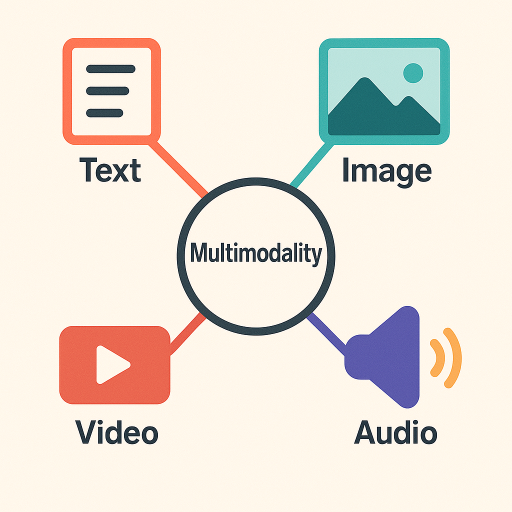

*Fig. 1. Multimodality Data. (Image source: [GPT-4o Image Generation](https://chatgpt.com/s/m_6814c5d31e288191a5409a7420ee30f4))*


**常见模态：**
*   **文本 (Text):** 自然语言文字，是信息传递和知识表达的主要方式。
*   **图像 (Image):** 静态视觉信息，包含丰富的场景、物体和纹理细节。
*   **视频 (Video):** 动态视觉信息，由连续的图像帧组成，通常伴随音频。视频不仅包含空间信息，还包含时间信息。
*   **音频 (Audio):** 声音信息，包括语音、音乐和环境声音。
*   **其他:** 表格数据、[3D 点云](https://zh.wikipedia.org/wiki/%E9%BB%9E%E9%9B%B2)、传感器数据（如雷达、激光雷达）、生物信号（如 [EEG](https://en.wikipedia.org/wiki/Electroencephalography)、[ECG](https://en.wikipedia.org/wiki/Electrocardiography)）等。

### 为什么需要多模态 AI？

1.  **更全面的世界理解:** 现实世界是多模态的。单一模态往往只能提供片面的信息。例如，仅凭文字描述可能难以完全理解一个复杂的场景，而结合图像或视频则能提供更直观、丰富的信息。多模态模型能够整合来自不同来源的信息，形成更全面、准确的理解。
2.  **增强的任务性能:** 在许多任务中，结合多种模态的信息可以显著提升性能。例如，在视觉问答（VQA）中，模型需要同时理解图像内容和文本问题才能给出正确答案。在视频描述生成中，结合视觉帧和音频信息可以生成更生动、准确的描述。
3.  **更自然的交互方式:** 多模态 AI 使得人机交互更加自然和灵活。用户可以通过语音、文字、图像等多种方式与 AI 系统交互，AI 系统也能以多种模态（如生成带有图片的文本回复，或生成语音回答）进行响应。
4.  **解锁新应用场景:** 多模态能力催生了许多新的应用，如自动驾驶（融合摄像头、雷达、激光雷达数据）、医疗诊断（结合医学影像和病历文本）、内容创作（文生图、文生视频）、虚拟助手、机器人交互等。
5.  **促进可访问性:** 多模态技术可以帮助有感官障碍的人士。例如，图像描述可以帮助视障人士理解图片内容，语音识别和合成可以帮助听障或语障人士交流。

### 常见多模态任务

以下表格列举了一些常见的多模态任务，这些任务通常需要结合多种模态的信息进行处理和生成。

| 任务名称 | 说明 |
| :------------------------------------- | :--------------------------------------------------------- |
| [视觉问答 (VQA)](https://huggingface.co/tasks/visual-question-answering) | 根据图像和相关问题生成文本答案。 |
| [图像描述生成 (Image-to-Text)](https://huggingface.co/tasks/image-to-text) | 为图像生成自然语言描述，或从图像中抽取文字。 |
| [视频描述/问答 (Video-Text-to-Text)](https://huggingface.co/tasks/video-text-to-text) | 结合视频和文本提示输出文本，可用于视频描述和视频问答。 |
| [文本到图像生成 (Text-to-Image)](https://huggingface.co/tasks/text-to-image) | 根据文本描述生成图像。 |
| [文本到视频生成 (Text-to-Video)](https://huggingface.co/tasks/text-to-video) | 根据文本描述生成视频序列。 |
| [跨模态检索 (Cross-Modal Retrieval)](https://en.wikipedia.org/wiki/Cross-modal_retrieval) | 使用一种模态（如文本）查询另一种模态（如图像）的相关数据。 |
| [多模态情感分析 (Multimodal Sentiment)](https://en.wikipedia.org/wiki/Multimodal_sentiment_analysis) | 结合文本、音频、视频等多种信息判断情感倾向。 |
| [视觉推理 (Visual Reasoning)](https://openai.com/index/thinking-with-images/) | 结合图像内容、文本问题和工具操作进行多步推理，例如解题、图表分析、空间关系判断等。 |
| [视觉语言动作模型 (VLA)](https://en.wikipedia.org/wiki/Vision-language-action_model) | 根据视觉观测和自然语言指令输出可执行的机器人动作。 |
| [多媒体翻译 (Multimedia Translation)](https://en.wikipedia.org/wiki/Multimedia_translation) | 翻译包含语言、图像、声音等多种符号资源的多媒体内容。 |
| [音视频语音识别 (AVSR)](https://en.wikipedia.org/wiki/Audio-visual_speech_recognition) | 结合音频信号和说话者唇动视觉信息进行语音识别。 |
| [视觉定位 (Visual Grounding)](https://en.wikipedia.org/wiki/Vision-language_model#Visual_grounding) | 将文本中的词语或短语与图像中的对应区域或物体关联起来。 |


## 关键技术

多模态大模型的发展由一系列技术推动。下图直观展示了多模态理解和生成的相关技术，博主介绍其中的一些关键模型和方法。


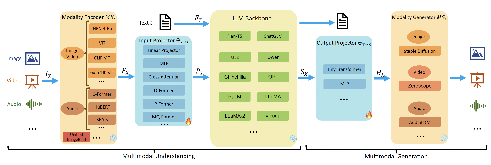

*Fig. 2. The general model architecture of MM-LLMs and the implementation choices for each component. (Image source: [Zhang et al., 2024](https://arxiv.org/pdf/2401.13601))*


### Vision Transformer (ViT)

**Vision Transformer (ViT)** ([Dosovitskiy et al., 2020](https://arxiv.org/abs/2010.11929)) 将 Transformer 架构成功应用于计算机视觉领域，成为当前众多先进 MLLMs 的首选视觉编码器。


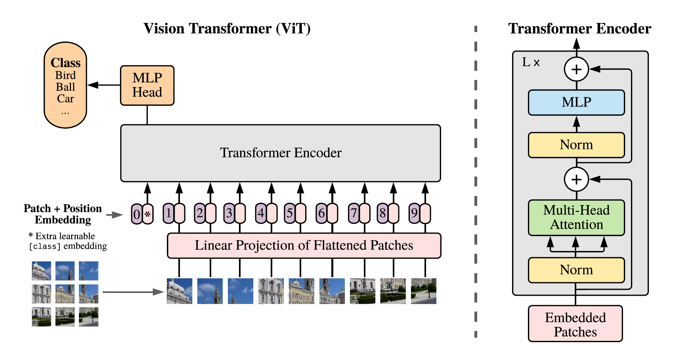

*Fig. 3. ViT model overview. (Image source: [Dosovitskiy et al., 2020](https://arxiv.org/abs/2010.11929))*


**核心思想:** ViT 将图像视为一系列 **图像块 (Patches)** 的序列，然后利用 Transformer 的自注意力机制来处理这些图像块，从而捕捉全局依赖关系。

**工作流程:**

1.  **图像分块:** 将输入图像 \( I \in \mathbb{R}^{H \times W \times C} \) 分割成 \( N_{patches} \) 个固定大小的非重叠图像块 \( x_p \in \mathbb{R}^{P^2 \times C} \)，其中 \( (H, W) \) 是图像分辨率，\( C \) 是通道数，\( P \) 是每个图像块的大小，\( N_{patches} = HW/P^2 \) 是图像块的数量。
2.  **线性投射:** 将每个图像块 \( x_p \) 展平成一维向量，并通过一个可学习的线性投射矩阵 \( E \) 将其映射到 \( D \) 维的嵌入空间，得到图像块嵌入 \( z_p = x_p E \)。
3.  **位置编码:** 为了保留图像块的空间位置信息，ViT 在图像块嵌入的基础上加入了可学习的位置编码 \( E_{pos} \)。
    \[ z_0 = [x_{class}; z_p^1; z_p^2; \dots; z_p^{N_{patches}}] + E_{pos}, \quad E \in \mathbb{R}^{(P^2 \cdot C) \times D}, E_{pos} \in \mathbb{R}^{(N_{patches}+1) \times D} \]
    通常还会添加一个可学习的 `[class]` 标记嵌入 \( x_{class} \)，其在 Transformer 输出端的对应向量用于图像分类任务。
4.  **Transformer 编码器:** 将添加了位置编码的图像块嵌入序列输入到标准的 Transformer 编码器中。编码器由多层 **多头自注意力 (Multi-Head Self-Attention, MSA)** 和 **前馈网络 (Feed Forward Network, FFN)** 组成。
    *   **MSA:** 捕捉图像块之间的全局依赖关系。对于输入序列 \( Z_{l-1} \)，自注意力计算如下：
        \[ \text{Attention}(Q, K, V) = \text{softmax}\left(\frac{QK^T}{\sqrt{d_k}}\right)V \]
        其中 \( Q = Z_{l-1}W_Q, K = Z_{l-1}W_K, V = Z_{l-1}W_V \) 是查询、键、值矩阵，\( d_k \) 是键向量的维度。多头注意力将 \( Q, K, V \) 拆分成多个头并行计算注意力，然后拼接结果。
    *   **FFN:** 通常由两个线性层和一个非线性激活函数（如 GELU）组成。
    每一层的计算可以表示为：
    \[ Z'_l = \text{MSA}(\text{LN}(Z_{l-1})) + Z_{l-1} \]
    \[ Z_l = \text{FFN}(\text{LN}(Z'_l)) + Z'_l \]
    其中 LN 表示层归一化。
5.  **输出:** Transformer 编码器的输出 \( Z_L \) 即为图像的特征表示 \( V \)。


*Fig. 4. Performance versus pre-training compute for different architectures: Vision Transformers, ResNets, and hybrids. Vision Transformers generally outperform ResNets with the same computational budget. Hybrids improve upon pure Transformers for smaller model sizes, but the gap vanishes for larger models. (Image source: [Dosovitskiy et al., 2020](https://arxiv.org/abs/2010.11929))*


ViT 相比于传统的 CNN 具有以下优势：

1.  **全局依赖建模** :自注意力直接连接任意两 patch，可显式捕捉长距离空间关系，比传统 CNN 更擅长整合整幅图像的语义信息。
2.  **大规模预训练迁移能力强** : 在 JFT-300M、ImageNet-22K 等大规模数据上预训练后，ViT 可迁移到 ImageNet、CIFAR、VTAB 等图像识别基准；较大模型和更多预训练数据通常改善迁移性能，具体收益取决于数据、模型和任务配置。检测、分割等应用则由后续工作继续扩展。
3.  **架构简洁、易于扩展与并行**: 纯 Transformer 堆叠便于按深度、宽度和输入分辨率三维扩展；计算由矩阵乘与 Softmax 组成，天然适配 GPU/TPU 的大批量并行和混合精度训练。

随着研究的深入，ViT 本身也在不断优化，以适应 MLLMs 的需求：

1. **原生动态分辨率:** 传统 ViT 通常需要固定输入分辨率。Qwen2-VL 和 Kimi-VL 等模型引入了动态分辨率处理能力。其中 Qwen2-VL 移除原有绝对位置编码并使用 2D-RoPE；Kimi-VL 的 MoonViT 则保留经插值的绝对位置编码，并叠加 2D-RoPE。这使得模型能够处理任意分辨率和长宽比的图像，并将其转换为变长的视觉 token 序列，更好地保留细节信息。Kimi-VL 的 MoonViT 还借鉴了 NaViT 的图像打包技术，将不同分辨率的图像块序列打包输入 Transformer，提高了训练效率。
2. **窗口注意力:** 为了降低处理高分辨率图像时自注意力机制带来的二次方计算复杂度，Qwen2.5-VL 在其 ViT 的大部分层中采用了窗口注意力。在固定窗口大小下，窗口注意力层的计算量随图像块数量近似线性增长；模型同时通过少数全注意力层保持全局交互，这些全局层仍有二次复杂度。
3. **架构对齐 LLM:** Qwen2.5-VL 还在其 ViT 中使用 RMSNorm 进行归一化，并采用 SwiGLU 激活，使视觉组件与语言模型的设计更接近。Kimi-VL 技术报告没有披露 MoonViT 采用相同的这组替换。

### CLIP

**CLIP (Contrastive Language-Image Pre-training)** ([Radford et al., 2021](https://arxiv.org/abs/2103.00020)) 是多模态领域具有里程碑意义的工作，它提出了一种简单而高效的方法来学习图像和文本之间的关联，为后续许多 MLLMs 奠定了基础。

**核心思想:** CLIP 的目标是学习一个 **多模态嵌入空间 (Multimodal Embedding Space)**，使得在该空间中，匹配的图像和文本对具有高相似度，而不匹配的对具有低相似度。它通过 **对比学习 (Contrastive Learning)** 的方式，利用自然语言监督来实现这一目标。

**架构:** CLIP 包含两个主要部分：

1.  **图像编码器:** 可以是 ResNet 或 ViT，负责将输入图像 \( I \) 编码为图像特征 \( V \)。
2.  **文本编码器:** 通常是 Transformer，负责将输入文本 \( T \) 编码为文本特征 \( L \)。
3.  **线性投射层:** 分别将图像特征 \( V \) 和文本特征 \( L \) 投射到共享的多模态嵌入空间，得到 \( I_e = V W_i \) 和 \( T_e = L W_t \)，其中 \( W_i \) 和 \( W_t \) 是可学习的投射矩阵。


*Fig. 5. CLIP Architecture Overview. CLIP jointly trains an image encoder and a text encoder to predict the correct pairings of a batch of (image, text) training examples. At test time the learned text encoder synthesizes a zero-shot linear classifier by embedding the names or descriptions of the target dataset's classes. (Image source: [Radford et al., 2021](https://arxiv.org/abs/2103.00020))*


**训练数据:** CLIP 的成功很大程度上归功于其大规模的预训练数据集 **WIT (WebImageText)**。研究团队从互联网上收集了 4 亿个 (图像, 文本) 对。他们通过搜索约 50 万个查询词（源自维基百科词汇、高频二元组、维基百科文章标题和 WordNet 同义词集）来构建数据集，并对每个查询词限制最多 2 万个样本以平衡数据分布。这种利用网络原生图文对的方式被称为 **自然语言监督**，它避免了昂贵的人工标注，使得数据规模可以轻松扩展。

**对比损失:** CLIP 的核心是对比学习目标。给定一个包含 \( N \) 个 (图像, 文本) 对的批次 \( \{(I_1, T_1), \dots, (I_N, T_N)\} \)，模型的目标是预测 \( N \times N \) 个可能的配对中哪些是真实的配对。

1.  计算所有图像嵌入 \( \{I_{e,1}, \dots, I_{e,N}\} \) 和文本嵌入 \( \{T_{e,1}, \dots, T_{e,N}\} \)。通常会进行 **L2 归一化** 把每个图像或文本嵌入除以它自己的 L2 范数（Euclidean norm）。
2.  计算所有 \( N^2 \) 对 \( (I_{e,i}, T_{e,j}) \) 之间的 **余弦相似度**。
    \[ \text{logits}_{i,j} = \text{sim}(I_{e,i}, T_{e,j}) \cdot \exp(\tau) = \frac{I_{e,i} \cdot T_{e,j}}{\|I_{e,i}\| \|T_{e,j}\|} \cdot \exp(\tau) \]
    其中 \( \tau \) 是可学习的**对数尺度参数**，\( \exp(\tau) \) 是正的 logits 缩放因子；若按传统温度写为 \( \operatorname{sim}/T \)，则 \( T=\exp(-\tau) \)。这与下面伪代码中的 `np.exp(t)` 一致。
3.  计算 **对称交叉熵损失 (Symmetric Cross-Entropy Loss)**。将问题视为两个分类任务：
    *   对于每个图像 \( I_i \)，在 \( N \) 个文本中找到匹配的文本 \( T_i \)。损失为 \( \mathcal{L}_{\text{image}} \)。
    *   对于每个文本 \( T_j \)，在 \( N \) 个图像中找到匹配的图像 \( I_j \)。损失为 \( \mathcal{L}_{\text{text}} \)。
    总损失为：
    \[ \mathcal{L}_{CLIP} = \frac{1}{2} (\mathcal{L}_{\text{image}} + \mathcal{L}_{\text{text}}) \]
    其中，
    \[ \mathcal{L}_{\text{image}} = -\frac{1}{N} \sum_{i=1}^N \log \frac{\exp(\text{sim}(I_{e,i}, T_{e,i}) \cdot \exp(\tau))}{\sum_{j=1}^N \exp(\text{sim}(I_{e,i}, T_{e,j}) \cdot \exp(\tau))} \]
    \[ \mathcal{L}_{\text{text}} = -\frac{1}{N} \sum_{j=1}^N \log \frac{\exp(\text{sim}(I_{e,j}, T_{e,j}) \cdot \exp(\tau))}{\sum_{i=1}^N \exp(\text{sim}(I_{e,i}, T_{e,j}) \cdot \exp(\tau))} \]
    这种损失函数鼓励正样本对（匹配的图文）的相似度高于负样本对（不匹配的图文）。


<details>
<summary><strong>CLIP Core Pseudocode</strong></summary>


```python
# image_encoder - ResNet or Vision Transformer
# text_encoder - CBOW or Text Transformer
# I[n, h, w, c] - minibatch of aligned images
# T[n, l] - minibatch of aligned texts
# W_i[d_i, d_e] - learned proj of image to embed
# W_t[d_t, d_e] - learned proj of text to embed
# t - learned temperature parameter (tau in text)

# extract feature representations of each modality
I_f = image_encoder(I) #[n, d_i]
T_f = text_encoder(T) #[n, d_t]

# joint multimodal embedding [n, d_e]
# l2_normalize projects the embeddings onto the unit hypersphere
I_e = l2_normalize(np.dot(I_f, W_i), axis=1)
T_e = l2_normalize(np.dot(T_f, W_t), axis=1)

# scaled pairwise cosine similarities [n, n]
# The temperature parameter t scales the logits
# Note: using dot product on normalized vectors is equivalent to cosine similarity
logits = np.dot(I_e, T_e.T) * np.exp(t)

# symmetric loss function
# labels are the indices [0, 1, ..., n-1] indicating the correct pairings
labels = np.arange(n)
# Calculate cross-entropy loss for image-to-text classification
# (Predict correct text for each image)
loss_i = cross_entropy_loss(logits, labels, axis=1) # axis=1 for softmax over columns
# Calculate cross-entropy loss for text-to-image classification
# (Predict correct image for each text)
loss_t = cross_entropy_loss(logits, labels, axis=0) # axis=0 for softmax over rows
# Final loss is the average of the two losses
loss = (loss_i + loss_t)/2
```


</details>


**零样本迁移:** CLIP 强大的能力在于其零样本迁移性能。对于一个新的图像分类任务，无需任何微调，CLIP 可以通过以下方式进行预测：

1.  获取任务的所有类别名称（例如，“猫”，“狗”）。
2.  使用 **提示词工程 (Prompt Engineering)** 将类别名称构造成句子，如 "A photo of a {label}."。这有助于弥合预训练数据（通常是句子）和下游任务（通常是单词标签）之间的分布差距。CLIP 论文发现使用提示模板和集成多个提示可以显著提高性能（在 ImageNet 上提升近 5%）。
3.  使用 CLIP 的文本编码器计算每个构造句子的文本嵌入，这些嵌入构成了零样本分类器的 **权重向量**。
4.  对于一张新的待分类图像，使用 CLIP 的图像编码器计算其图像嵌入。
5.  计算该图像嵌入与所有类别文本嵌入之间的余弦相似度。
6.  将相似度最高的类别作为预测结果。


*Fig. 6. Prompt engineering and ensembling improve zero-shot performance. Compared to the baseline of using contextless class names, prompt engineering and ensembling boost zero-shot classification performance by almost 5 points on average across 36 datasets. This improvement is similar to the gain from using 4 times more compute with the baseline zero-shot method but is 'free' when amortized over many predictions. (Image source: [Radford et al., 2021](https://arxiv.org/abs/2103.00020))*


**CLIP 的影响:** CLIP 证明了通过大规模自然语言监督和对比学习可以学到强大的、可迁移的视觉表示。其学习到的多模态嵌入空间和强大的图像编码器被广泛应用于后续的 MLLMs（如 Flamingo, BLIP-2, LLaVA）以及文生图模型（如 DALL-E 2, Stable Diffusion）中。

CLIP 主要关注学习对齐的表示，但在生成任务上能力有限。后续工作开始探索能够同时进行理解和生成的统一模型架构。


### BLIP

**BLIP (Bootstrapping Language-Image Pre-training)** ([Li et al., 2022](https://arxiv.org/abs/2201.12086)) 为了解决现有**视觉语言预训练（Vision-Language Pre-training, VLP）** 方法在模型和数据方面的局限性：模型常只能擅长理解或生成之一；数据则依赖于海量且噪声较大的网络图文对。


BLIP 提出了**多模态编码器-解码器（Multimodal Encoder-Decoder, MED）** 架构，旨在统一理解和生成任务。它结合了 CLIP 的对比学习和自回归生成的优点，能够处理多种模态数据。


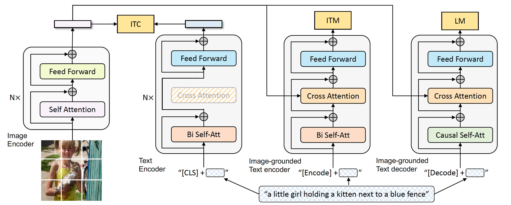

*Fig. 7. BLIP Pre-training Model Architecture and Objectives (same parameters have the same color). We propose multimodal mixture of encoder-decoder (MED), a unified vision-language model which can operate in one of the three functionalities. (Image source: [Li et al., 2022](https://arxiv.org/abs/2201.12086))*


*   **图像编码器:** 采用 ViT。
*   **文本编码器/解码器:** 基于 BERT 架构，但进行了修改以适应多模态任务和不同功能模式。
    *   **单模态编码器:** 标准的 ViT 和 BERT，分别处理图像和文本。
    *   **基于图像的文本编码器:** 在文本编码器的每个 Transformer 块的自注意力 (SA) 层和前馈网络 (FFN) 层之间插入 **交叉注意力 (Cross-Attention, CA)** 层，用于注入视觉信息。文本输入前会添加 [Encode] 标记，其输出嵌入作为图文对的多模态表示。
    *   **基于图像的文本生成解码器:** 将编码器中的双向 SA 层替换为 **因果自注意力 (Causal Self-Attention)** 层，以实现自回归生成。共享编码器的 CA 层和 FFN 层。使用 [Decode] 标记作为序列开始符。

**预训练目标:** BLIP 联合优化三个目标：

1.  **图文对比(Image-Text Contrastive, ITC)损失:** 类似于 CLIP，使用单模态编码器对齐图像和文本的特征空间。BLIP 采用了**ALBEF**([Li et al., 2021](https://arxiv.org/abs/2107.07651))提出的动量编码器 (Momentum Encoder) 和软标签策略来改进对比学习。
    $$L_{ITC} = \frac{1}{2N} \sum_{i=1}^{N} \left( -\log \frac{\exp(s(v_i, t_i)/\tau)}{\sum_{j=1}^{N} \exp(s(v_i, t_j)/\tau)} -\log \frac{\exp(s(v_i, t_i)/\tau)}{\sum_{j=1}^{N} \exp(s(v_j, t_i)/\tau)} \right)$$
    其中 $v_i, t_j$ 为图文特征，$s$ 为相似度函数，$\tau$ 为温度参数。

2.  **图文匹配(Image-Text Matching, ITM)损失:** 使用图像接地文本编码器学习细粒度的图文对齐。这是一个二分类任务，预测图文对是匹配还是不匹配。采用难负例挖掘策略。
    $$L_{ITM} = -\mathbb{E}_{(I,T)\sim D} [y \log p_{match} + (1-y) \log(1 - p_{match})]$$
    其中 $y$ 是标签，$p_{match}$ 是匹配概率。

3.  **语言模型(Language Modeling, LM)损失:** 使用图像接地文本解码器，根据图像生成文本描述。采用标准的交叉熵损失（带标签平滑）。

    $$L_{L M}=-\mathbb{E}_{(I, T) \sim D} \sum_{k=1}^L \log P\left(w_k \mid I, w_{\lt k} ; \theta\right)$$
    其中 $w_k$ 是文本序列中的词，$\theta$ 是模型参数。
    

**总损失函数:** 这三个损失通常被联合优化（例如，等权重相加）：
$$L_{BLIP} = L_{ITC} + L_{ITM} + L_{LM}$$

**参数共享:** 为了效率和多任务学习的好处，文本编码器和解码器共享除 SA 层外的所有参数（嵌入层、CA 层、FFN 层）。


**CapFilt (Captioning and Filtering)** 是一种创新的数据集引导方法，用于从未标注的网络图像中生成高质量的合成标题，并过滤掉噪声数据（包括原始网络文本和合成文本）。


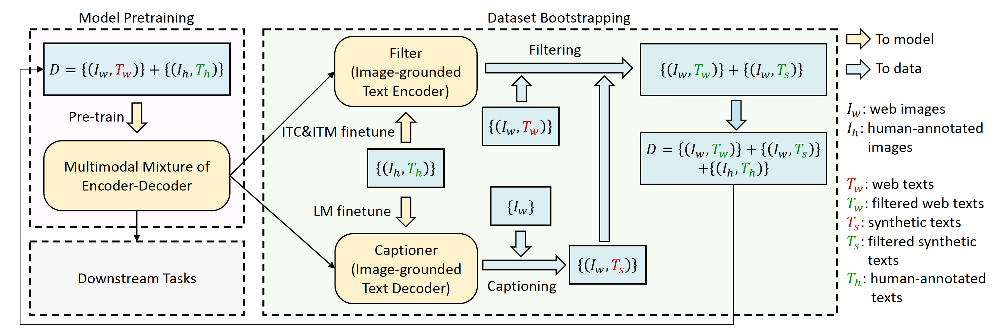

*Fig. 8. BLIP Learning Framework. We introduce a captioner to produce synthetic captions for web images, and a filter to remove noisy image-text pairs. (Image source: [Li et al., 2022](https://arxiv.org/abs/2201.12086))*


1.  **初始化:** 使用预训练好的 MED 模型初始化两个模块：Captioner（图像接地文本解码器）和 Filter（图像接地文本编码器）。
2.  **微调:** 在高质量的人工标注数据集（如 COCO）上分别微调 Captioner (使用 LM 损失) 和 Filter (使用 ITC 和 ITM 损失)。这是一个轻量级过程。
3.  **生成与过滤:**
    *   Captioner 为网络图像 \( I_w \) 生成合成标题 \( T_s \)。
    *   Filter 判断原始网络文本 \( T_w \) 和合成文本 \( T_s \) 是否与图像 \( I_w \) 匹配。预测为不匹配的文本被视为噪声并移除。
4.  **引导数据集:** 将过滤后的高质量图文对（来自原始网络数据和合成数据）与人工标注数据结合，形成新的引导数据集。
5.  **重新预训练:** 使用引导数据集从头预训练一个新的 BLIP 模型。

**效果:** CapFilt 显著提升了模型在各项下游任务（如检索、描述生成、VQA）上的性能，证明了通过引导方式改善噪声数据质量的有效性。BLIP 也展示了统一模型在理解和生成任务上的灵活性。

### BLIP-2

**BLIP-2** ([Li et al., 2023](https://arxiv.org/abs/2301.12597)) 针对高昂 VLP 训练成本，提出**高效**预训练策略：冻结预训练图像编码器与大语言模型，只训练轻量桥接模块 Q‑Former。

**核心贡献:**

1.  **利用冻结模型:** 无需端到端训练整个大型模型，显著降低了计算成本，并利用了强大的预训练单模态模型的能力。
2.  **Q-Former (Querying Transformer):** 提出了一种轻量级的 Transformer 结构作为可训练的桥梁，连接冻结的图像编码器和冻结的 LLM。
3.  **两阶段预训练:** 设计了两阶段策略来有效弥合模态鸿沟：
    *   **阶段一：视觉-语言表示学习 (Vision-Language Representation Learning):** 从冻结的图像编码器引导学习。
    *   **阶段二：视觉到语言生成学习 (Vision-to-Language Generative Learning):** 从冻结的 LLM 引导学习。

**架构 (Q-Former):**

*   Q-Former 是一个轻量级 Transformer，包含 188M 参数。
*   它使用一组 **可学习的查询向量**（例如 32 个 768 维向量）作为输入。
*   这些查询向量通过 **自注意力层** 相互交互。
*   通过 **交叉注意力层** 与冻结的图像编码器输出的图像特征进行交互，提取视觉信息。
*   查询向量的输出 \( Z \) (例如 \( 32 \times 768 \) 维) 维度远小于原始图像特征，充当了信息瓶颈，迫使 Q-Former 提取对语言模型最有用的视觉信息。
*   Q-Former 内部包含图像 Transformer 和文本 Transformer 两个共享自注意力层的子模块。


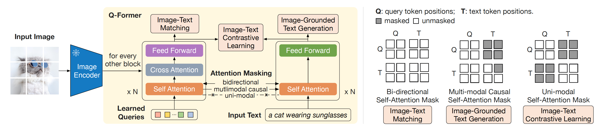

*Fig. 9. (Left) Model architecture of Q-Former and BLIP-2's first-stage vision-language representation learning objectives. (Right) The self-attention masking strategy for each objective to control query-text interaction. (Image source: [Li et al., 2023](https://arxiv.org/abs/2301.12597))*


**两阶段预训练:**

1.  **阶段一 (表示学习):**
    *   将 Q-Former 连接到 **冻结的图像编码器** (如 CLIP ViT-L/14, EVA-CLIP ViT-g/14)。
    *   使用图文对进行预训练，目标是让 Q-Former 的查询向量学会提取与文本最相关的视觉表示。
    *   联合优化三个与 BLIP 类似的目标 (共享输入格式和模型参数，但**冻结图像编码器，只训练 Q-Former**)：
        *   **图文对比(Image-Text Contrastive, ITC)损失:** 对齐 Q-Former 输出的查询表示 \( z \) 和文本表示 \( t \)。使用 In-batch Negatives。
            $$L_{ITC} = \frac{1}{2N} \sum_{i=1}^{N} \left( -\log \frac{\exp(s(z_i, t_i)/\tau)}{\sum_{j=1}^{N} \exp(s(z_i, t_j)/\tau)} -\log \frac{\exp(s(z_i, t_i)/\tau)}{\sum_{j=1}^{N} \exp(s(z_j, t_i)/\tau)} \right)$$
        *   **图文匹配(Image-Text Matching, ITM)损失:** 预测图文对是否匹配。使用 Q-Former 输出的多模态查询表示进行分类。
            $$L_{ITM} = -\mathbb{E}_{(I,T)\sim D} [y \log p_{match} + (1-y) \log(1 - p_{match})]$$
        *   **基于图像的文本生成(Image-grounded Text Generation, ITG)损失:** 训练 Q-Former 生成文本。查询向量需要捕获所有生成文本所需的信息，并通过自注意力层传递给文本 token。
            $$L_{ITG} = -\mathbb{E}_{(I,T)\sim D} \sum_{k=1}^{L} \log P(w_k | Z_q, w_{\lt k}; \theta_{Q-Former})$$
            其中 $Z_q$ 是 Q-Former 的查询输出。
    *   通过不同的自注意力掩码控制查询-文本交互来实现不同目标。
    *   **第一阶段总损失函数:**
        $$L_{Stage1} = L_{ITC} + L_{ITM} + L_{ITG}$$

2.  **阶段二 (生成学习):**
    *   将 **第一阶段预训练好的 Q-Former** (及其连接的冻结图像编码器) 连接到 **冻结的 LLM** (如 OPT 系列, FlanT5 系列)。
    *   使用一个 **全连接层** 将 Q-Former 的输出查询嵌入 \( Z \) 线性投射到与 LLM 文本嵌入相同的维度，得到软视觉提示 $P_Z$。
    *   将投射后的查询嵌入作为 **软视觉提示 (Soft Visual Prompts)**，添加到 LLM 输入文本嵌入的前面。
    *   **训练目标:** 训练 Q-Former (FC 层也训练)，使其输出的视觉表示能够被冻结的 LLM 理解并用于生成文本。
        *   对于 **Decoder-only LLM (如 OPT):** 使用标准的语言建模损失，即根据视觉提示生成后续文本。
        *   对于 **Encoder-Decoder LLM (如 FlanT5):** 使用前缀语言建模损失 (Prefix Language Modeling)，将文本分成前缀和后缀，视觉提示和前缀输入 Encoder，Decoder 生成后缀。
        $$L_{Stage2} = L_{LM} = -\mathbb{E}_{(I, T_{prompt}, T_{gen})\sim D} \sum_{k=1}^{M} \log P_{LLM}(w_k | P_Z, T_{prompt}, w_{\lt k}; \theta_{LLM\_frozen})$$
        其中 $\theta_{L L M_{-} \text {frozen }}$ 是冻结 LLM 的参数, 只用来前向传播，不参与梯度更新。


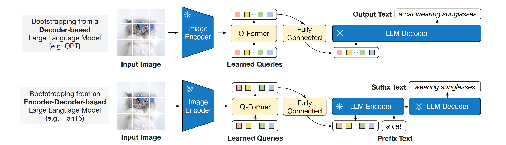

*Fig. 10. BLIP-2's second-stage vision-to-language generative pre-training, which bootstraps from frozen large language models (LLMs). (Top) Bootstrapping a decoder-based LLM (e.g. OPT). (Bottom) Bootstrapping an encoder-decoder-based LLM (e.g. FlanT5). (Image source: [Li et al., 2023](https://arxiv.org/abs/2301.12597))*


**效果与优势:**

*   **高效:** 由于只训练轻量级的 Q-Former，预训练成本远低于端到端训练的大型模型。
*   **高性能:** 在 VQA、Captioning、Retrieval 等任务上达到 SOTA 水平，甚至超越了参数量远大于它的模型（如 Flamingo）。
*   **通用性:** 可以方便地接入不同的冻结图像编码器和 LLMs，利用各自领域的最新进展。
*   **零样本能力:** 借助强大的冻结 LLM（特别是指令微调过的 FlanT5），BLIP-2 展现出令人印象深刻的**零样本指令图像到文本生成**能力，可以根据自然语言指令执行各种视觉语言任务（如视觉对话、视觉知识推理）。


### LLaVA

**LLaVA (Large Language and Vision Assistant)** ([Liu et al., 2023](https://arxiv.org/abs/2304.08485)) 是**视觉指令微调 (Visual Instruction Tuning)** 开源社区领域的重要工作，首次尝试将 NLP 领域的指令微调思想扩展到多模态领域。

**核心贡献:**

1.  **提出视觉指令微调:** 探索将指令微调应用于语言-图像多模态模型，旨在构建通用的视觉助手。
2.  **GPT 辅助数据生成:** 面对视觉指令数据的缺乏，创新性地使用**纯语言模型 GPT-4**来生成包含视觉内容的多模态语言-图像指令遵循数据。
3.  **构建 LLaVA 模型:** 提出了一种连接预训练的视觉编码器 (CLIP ViT-L/14) 和大型语言模型 (LLM, Vicuna) 的端到端训练架构。
4.  **创建评估基准:** 构建了 LLaVA-Bench，包含多样化和具有挑战性的任务，用于评估多模态模型的指令遵循能力。
5.  **开源贡献:** 公开了 GPT-4 生成的视觉指令数据、模型代码和预训练权重，极大地推动了社区在这一方向上的研究。

**GPT 辅助视觉指令数据生成:**

LLaVA 解决的关键挑战是缺乏大规模、高质量的视觉指令遵循数据。研究者提出了一种利用纯语言模型 GPT-4（将图像内容以标注、边界框等文本形式输入）基于现有的图像-文本对来生成此类数据的方法，本质上这是一种对闭源模型 GPT-4 进行**知识蒸馏**的过程。

1.  **面临的挑战:** 简单的将图像-标题对扩展为 (指令：描述图像，图像 -> 回答：标题) 的格式虽然廉价，但缺乏指令和响应的多样性及深度推理。
2.  **解决方案:** 使用 GPT-4 作为“教师模型”。由于这些模型仅接受文本输入，研究者将图像内容通过**符号表示** 传递给它们：
    * **图像描述:** 提供图像场景的整体或多方面描述。
    * **边界框:** 提供图像中对象的类别概念及其空间位置信息 (例如 `person: [0.681, 0.242, 0.774, 0.694]`)。
3.  **提示与上下文学习:** 将图像的符号表示 (描述和边界框) 输入给 GPT-4。为了引导 GPT-4 生成特定格式和内容的输出，研究者手动设计了少量高质量的**种子示例**，利用 GPT-4 的**上下文学习**能力进行 few-shot 推理。
4.  **生成三种类型数据 (基于 COCO 图像):** 通过精心设计的 Prompt 引导 GPT-4 生成了三种类型的指令数据：
    * **对话:** 生成模拟人与助手之间关于图像内容的多轮对话，包含物体识别、计数、定位、动作、关系等问题。
    * **详细描述:** 根据特定指令（如“详细描述下图”）生成对图像全面、细致的描述。
    * **复杂推理:** 生成需要基于图像内容进行逻辑推理或结合背景知识的问题和答案（如“图中人物可能面临什么挑战？”）。


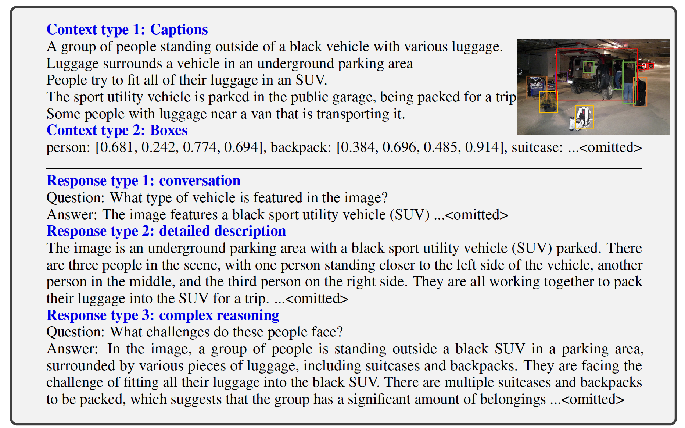

*Fig. 11. One example to illustrate the instruction-following data. (Image source: [Liu et al., 2023](https://arxiv.org/abs/2304.08485))*


5.  **数据集:** 共收集了 **158K** 个独特的语言-图像指令样本，具体包括：**58K** 对话样本，**23K** 详细描述样本，**77K** 复杂推理样本。实验发现，GPT-4 生成的数据质量通常优于 ChatGPT。


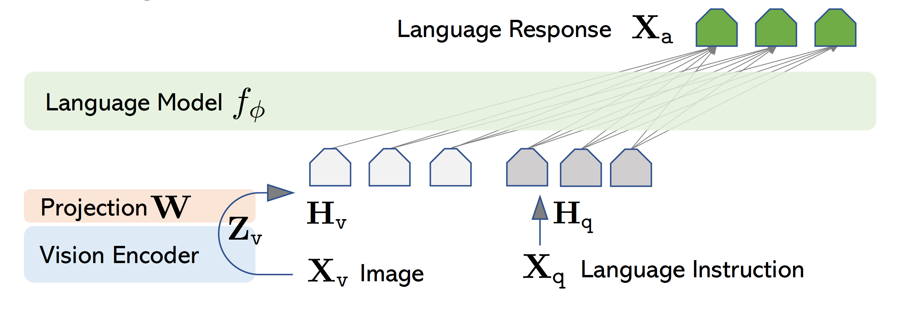

*Fig. 12. LLaVA network architecture. (Image source: [Liu et al., 2023](https://arxiv.org/abs/2304.08485))*


LLaVA 的架构旨在有效结合预训练的视觉模型和 LLM 的能力，如上图所示。

1.  **视觉编码器 \( g(\cdot) \):** 使用**冻结的 CLIP ViT-L/14** 模型。对于输入图像 \( \mathbf{X}_{\mathrm{v}} \)，提取其视觉特征 \( \mathbf{Z}_{\mathrm{v}} = g(\mathbf{X}_{\mathrm{v}}) \)。论文中提到实验考虑了最后一层 Transformer 层之前和之后的网格特征。

2.  **投影层:** 使用一个**可训练的线性投影矩阵 \( \mathbf{W} \)** 将视觉特征 \( \mathbf{Z}_{\mathrm{v}} \) 映射到语言模型的词嵌入空间。

    $$
    \mathbf{H}_{\mathrm{v}} = \mathbf{W} \cdot \mathbf{Z}_{\mathrm{v}}
    $$

其中， \( \mathbf{H}_{\mathrm{v}} \) 是一系列视觉 Token，其维度与 LLM 的词嵌入维度相同。这种简单的线性投影方式轻量且高效，便于快速迭代以数据为中心的实验。更复杂的连接方式（如 Flamingo 中的门控交叉注意力或 BLIP-2 中的 Q-Former）可作为未来工作探索。

3.  **大型语言模型 (LLM) \( f_{\phi}(\cdot) \):** 使用 **Vicuna**，其参数表示为 \( \phi \)。LLM 接收视觉 Token \( \mathbf{H}_{\mathrm{v}} \) 和文本指令 \( \mathbf{X}_{\text{instruct}} \)，并自回归地生成答案 \( \mathbf{X}_{\mathrm{a}} \)。

**两阶段训练:**

LLaVA 采用两阶段指令微调流程。

1.  **阶段一：特征对齐预训练 (Feature Alignment Pre-training):**
    * **目标:** 将视觉特征 \( \mathbf{H}_{\mathrm{v}} \) 与 LLM 的词嵌入空间对齐，可以理解为为冻结的 LLM 训练一个兼容的“视觉 Tokenizer”。
    * **数据:** 使用了 CC3M 数据集的一个经过滤的子集 (约 595K 图文对)。将这些图文对通过简单方式转换为指令数据：对于图像 \( \mathbf{X}_{\mathrm{v}} \)，随机选择一个简单的描述指令 \( \mathbf{X}_{\mathrm{q}} \) (如 "简要描述这张图片")，并将原始标题 \( \mathbf{X}_{\mathrm{c}} \) 作为答案 \( \mathbf{X}_{\mathrm{a}} \)。这可以视为单轮对话。
    * **训练:** **冻结** 视觉编码器 \( g(\cdot) \) 和 LLM \( f_{\phi}(\cdot) \) 的权重，**仅训练** 投影层 \( \mathbf{W} \)。训练目标是最大化答案（即图像标题）的似然概率。

2.  **阶段二：端到端微调 (Fine-tuning End-to-End):**
    * **目标:** 提升模型在多模态任务上的指令遵循和对话能力。
    * **数据:** 使用前述生成的 **158K** 视觉指令数据 (包含对话、详细描述、复杂推理三种类型，训练时均匀采样)。
    * **训练:** **冻结** 视觉编码器 \( g(\cdot) \)，**同时训练** 投影层 \( \mathbf{W} \) 和 **LLM \( f_{\phi}(\cdot) \) 的权重**。

**训练目标:**

对于每张图像 \( \mathbf{X}_{\mathrm{v}} \)，生成包含 \( T_{turns} \) 轮的多轮对话数据 \( \left(\mathbf{X}_{\mathrm{q}}^{1}, \mathbf{X}_{\mathrm{a}}^{1}, \cdots, \mathbf{X}_{\mathrm{q}}^{T_{turns}}, \mathbf{X}_{\mathrm{a}}^{T_{turns}}\right) \)，其中 \( T_{turns} \) 是总对话轮数。我们将这些数据组织成一个序列，并将所有答案 \( \mathbf{X}_{\mathrm{a}} \) 视为模型的回应。其输入序列的组织形式采用了 Vicuna 格式。在第 \( t \) 轮对话中，指令 \( \mathbf{X}_{\text{instruct}}^{t} \) 定义为：


$$
\mathbf{X}_{\text{instruct}}^{t} = \left\{ \begin{array}{ll} \text{Randomly choose } [\mathbf{X}_{\mathrm{q}}^{1}, \mathbf{X}_{\mathrm{v}}] \text{or } [\mathbf{X}_{\mathrm{v}}, \mathbf{X}_{\mathrm{q}}^{1}], & \text{ if } t=1 \text{ (the first turn)} \\ \mathbf{X}_{\mathrm{q}}^{t}, & \text{ if } t>1 \text{ (the remaining turns)} \end{array} \right.
$$

目标是预测答案序列 \( \mathbf{X}_{\mathrm{a}} = (\mathbf{X}_{\mathrm{a}}^{1}, \dots, \mathbf{X}_{\mathrm{a}}^{T_{turns}}) \)。模型需要最大化在给定图像 \( \mathbf{X}_{\mathrm{v}} \) 和所有指令 \( \mathbf{X}_{\text{instruct}} = (\mathbf{X}_{\text{instruct}}^{1}, \dots, \mathbf{X}_{\text{instruct}}^{T_{turns}}) \) 的条件下，生成正确答案序列的概率。对于长度为 \( L_{seq} \) 的完整答案序列（所有轮次的 \( \mathbf{X}_{\mathrm{a}} \) 拼接而成），其概率计算如下：

$$
p\left(\mathbf{X}_{\mathrm{a}} \mid \mathbf{X}_{\mathrm{v}}, \mathbf{X}_{\text {instruct }}\right)=\prod_{i=1}^{L_{seq}} p_{\boldsymbol{\theta}}\left(x_i \mid \mathbf{X}_{\mathrm{v}}, \mathbf{X}_{\text {instruct },\lt i}, \mathbf{X}_{\mathrm{a},\lt i}\right)
$$

其中：
* \( \boldsymbol{\theta} \) 是模型的可训练参数。
    * 在阶段一，\( \boldsymbol{\theta} = \{ \mathbf{W} \} \)。
    * 在阶段二，\( \boldsymbol{\theta} = \{ \mathbf{W}, \phi \} \)。
* \( x_i \) 是答案序列 \( \mathbf{X}_{\mathrm{a}} \) 中的第 \( i \) 个 token。
* \( \mathbf{X}_{\text{instruct},\lt i} \) 和 \( \mathbf{X}_{\mathrm{a},\lt i} \) 分别代表在预测 \( x_i \) 时，模型已接收到的所有指令 token 和已生成的所有答案 token。
* 训练时的损失函数是上述概率的**负对数似然 (Negative Log-Likelihood)**，并且**仅在答案部分的 token (即 \( \mathbf{X}_{\mathrm{a}} \) 中的 token)** 上计算损失。


**效果与影响:**

LLaVA 在多模态对话方面展示了令人印象深刻的能力，有时能在未见过的图像和指令上表现出类似多模态 GPT-4 的行为。在 ScienceQA 基准测试上进行微调后，LLaVA 与 GPT-4 的结合取得了当时最先进的 92.53% 准确率。


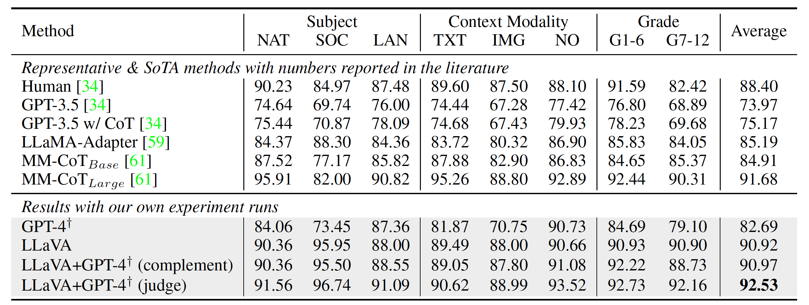

*Fig. 13. Accuracy (%) on Science QA dataset. (Image source: [Liu et al., 2023](https://arxiv.org/abs/2304.08485))*


LLaVA 的成功证明了视觉指令微调的有效性，其开源的数据、代码和模型极大地促进了后续多模态大模型的研究，为构建通用的、能够理解并遵循视觉和语言指令的 AI 助手开辟了新的途径。


### Qwen-VL

**Qwen-VL** ([Bai et al., 2023](https://arxiv.org/abs/2308.12966))模型是 Qwen 团队研发的首个开源大型视觉语言模型，其架构由三大模块组成：

* **大语言模型**：采用预训练的 Qwen-7B 文本模型作为语言解码器。这部分负责理解和生成文本，与标准的 LLM 架构一致。
* **视觉编码器**：使用 Vision Transformer 提取图像特征。具体实现上，Qwen-VL 利用采用 [OpenCLIP](https://github.com/mlfoundations/open_clip) 的 ViT-bigG 模型初始化视觉编码部分。在训练和推理阶段，输入图像都会被调整为特定分辨率。视觉编码器通过以 14 的步幅将图像切分为多个图像块，从而提取出一组图像特征。

* **位置感知视觉-语言适配器(Position-aware Vision-Language Adapter)**：为高效融合长序列图像特征，引入了一个适配器将视觉特征序列压缩至固定长度。具体而言，该适配器包含一组随机初始化的**可学习查询向量**，通过单层的**交叉注意力** 模块与 ViT 输出的图像特征进行计算，将图像特征压缩为长度固定为256的序列。

注意力计算公式如下：

$$
\text{CrossAttn}(Q, K, V) = \mathrm{softmax}\!\left(\frac{QK^T}{\sqrt{d}}\right)V
$$

其中，\(Q\) 为适配器内部定义的可训练查询向量矩阵，而\(K, V\) 均直接使用视觉编码器（ViT）输出的图像特征序列作为键（Key）和值（Value）。

通过这一机制，适配器能够根据学习到的查询向量从众多图像特征中选择并聚合最相关的信息。此外，为缓解图像特征压缩过程中可能引发的空间位置信息损失，在注意力计算的查询-键对中额外融入了**二维绝对位置编码**，强化了对图像空间结构的感知能力。


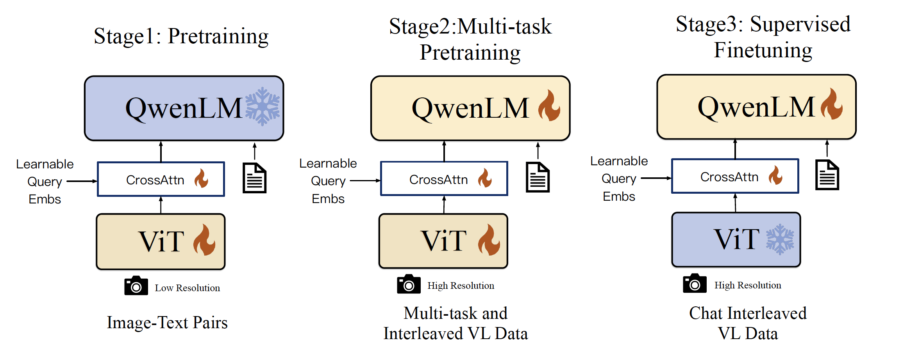

*Fig. 14. The training pipeline of the Qwen-VL series. (Image source: [Bai et al., 2023](https://arxiv.org/abs/2308.12966))*


Qwen-VL 采用“三阶段” 逐步训练策略，将视觉感知能力注入通用大模型。第一阶段冻结 LLM 仅训练视觉模块，第二阶段解冻联合多任务训练，第三阶段指令微调得到聊天模型。上图中雪花 ❄ 表示冻结，火焰 🔥 表示参与训练。

**训练策略：** Qwen-VL 系列采用**分三阶段**的逐步训练流程：

1. **纯图文预训练阶段**：
   * 固定语言模型（7B）参数，仅训练视觉编码器和 VL 适配器；
   * 使用约14亿对弱标注图文数据（英文占77.3%、中文占22.7%）；
   * 图像统一缩放至较低分辨率（如 224×224）以提高效率；
   * 采用自回归方式进行语言建模，训练模型生成图像描述文本；
   * 训练约5万步（15亿样本）后，初步实现图文对齐能力（Qwen-VL）。

2. **多任务联合训练阶段**：
   * 解冻语言模型，与视觉部分端到端共同训练；
   * 提升输入图像分辨率（如448×448以上）；
   * 加入多种细粒度视觉任务（如图像描述、视觉问答、内容定位、OCR 识别等），共涉及7大类任务；
   * 训练数据混合多来源数据集，并加入约 2480 万条 OCR 数据和 780 万条纯文本数据；
   * 所有任务数据随机混合训练，每条样本带任务前缀并填充至 2048 序列长度；
   * 模型显著提升图像理解、跨模态检索、定位、阅读等能力。

3. **监督微调（SFT）阶段**：
   * 在多模态指令数据（约35万条）上进行微调，得到对话增强版 Qwen-VL-Chat；
   * 特别设计复杂的多图推理、细粒度定位、多轮交互任务数据；
   * 微调期间再次冻结视觉编码器，仅微调语言模型和适配器；
   * 最终模型表现出优异的多模态对话、指令跟随和复杂推理能力。


### Qwen2-VL

**Qwen2-VL** ([Wang et al., 2024](https://arxiv.org/abs/2409.12191)) 是 Qwen-VL 的升级版，在处理可变分辨率视觉输入和融合多模态位置信息方面取得了进展。


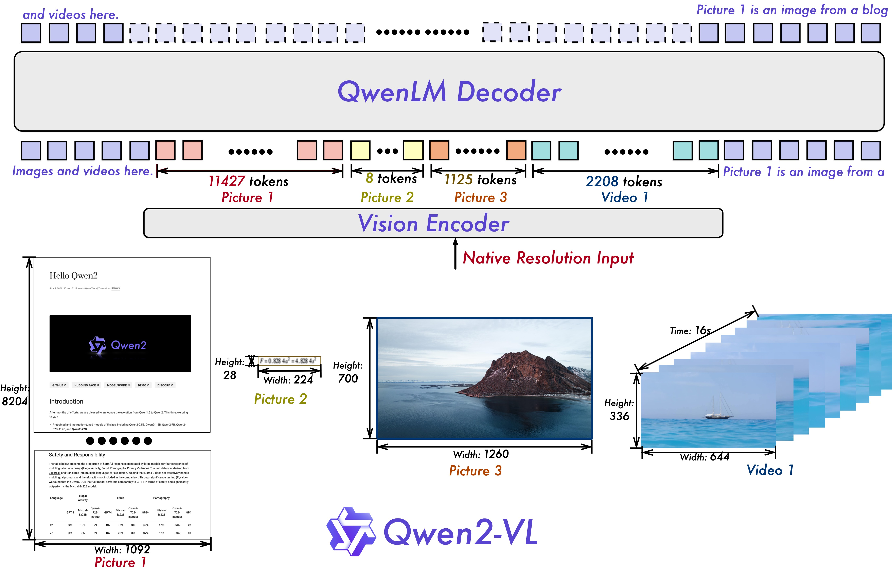

*Fig. 15. Qwen2-VL is capable of accurately identifying and comprehending the content within images, regardless of their clarity, resolution, or extreme aspect ratios. (Image source: [Wang et al., 2024](https://arxiv.org/abs/2409.12191))*


从上图我们可以看出，Qwen2-VL 在处理不同分辨率和长宽比的图像时，能够准确识别和理解图像中的内容。主要采用了以下技术：

*   **朴素动态分辨率 (Naive Dynamic Resolution):** 借鉴 **NaViT** ([Dehghani et al., 2023](https://arxiv.org/abs/2307.06304))，模型能够处理任意分辨率的图像，并将其动态地转换为变长的视觉 token 序列。
    *   移除 ViT 的绝对位置编码，引入 **2D 旋转位置编码 (2D Rotary Position Embedding, 2D-RoPE)** ([Su et al., 2024](https://arxiv.org/abs/2104.09864); [Su, 2021](https://spaces.ac.cn/archives/8397)) 来编码二维空间信息。
    *   推理时，可变分辨率图像被打包处理，限制总 token 长度以控制显存。
    *   ViT 输出后，使用 MLP 压缩相邻 \( 2 \times 2 \) 的 token 为一个，减少输入 LLM 的序列长度。使用 `<|vision_start|>` 和 `<|vision_end|>` 包裹视觉 token。

*   **多模态旋转位置编码 (Multimodal Rotary Position Embedding, M-RoPE):** 提出了一种新的位置编码方法，可以统一处理文本、图像和视频的位置信息。
    *   将 RoPE 分解为 **时间 (Temporal)**、**高度 (Height)**、**宽度 (Width)** 三个分量。
    *   **文本:** 三个分量使用相同的位置 ID，等价于 1D-RoPE。
    *   **图像:** 时间 ID 恒定，高度和宽度 ID 根据 token 在图像中的二维位置赋值。
    *   **视频:** 时间 ID 随帧数递增，高度和宽度 ID 同图像。
    *   **多模态输入:** 不同模态的位置 ID 依次递增。
    *   **优势:** 统一编码多模态位置信息，降低了图像/视频的位置 ID 值，有利于推理时外插到更长序列。


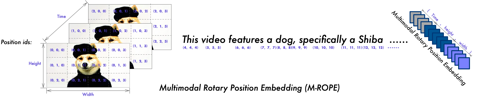

*Fig. 16. Illustration of M-RoPE. By decomposing rotary embedding into temporal, height, and width components, M-RoPE can explicitly model the positional information of text, images, and video in LLM. (Image source: [Wang et al., 2024](https://arxiv.org/abs/2409.12191))*


*   **统一图像与视频理解:** 采用混合训练范式和特定架构设计（如 3D 卷积处理视频）来同时处理图像和视频。
    *   混合图像和视频数据进行训练。
    *   视频以 2 FPS 采样。
    *   ViT 中集成 **3D 卷积** 处理视频输入 (处理 \( 2 \times 14 \times 14 \) 的 3D 块)，减少 token 数量。
    *   图像被视为两帧相同的视频帧。
    *   动态调整视频帧分辨率，限制每段视频的总 token 数（如 16384）。

**训练:** 沿用 Qwen-VL 的三阶段训练：ViT 预训练 -> 全模型预训练 -> LLM 指令微调。预训练数据包含图文对、OCR、图文交错文章、VQA、视频对话、图像知识等。指令微调使用 ChatML 格式。发布的模型名称为 Qwen2-VL-2B、Qwen2-VL-7B 和 Qwen2-VL-72B，探索了 MLLMs 的 scaling law。中间版本的语言部分约 7.6B，视觉编码器另约 675M；论文摘要按总参数口径近似称为 8B，需与发布名称区分。

**效果:** Qwen2-VL 在多种分辨率和长宽比的图像理解、长视频理解（超过 20 分钟）以及视觉 Agent 能力方面表现出色。

### Qwen2.5-VL

**Qwen2.5-VL** ([Bai et al., 2025](https://arxiv.org/abs/2502.13923)) 在 Qwen2-VL 的基础上进一步优化了效率和时序建模能力。


*Fig. 17. The Qwen2.5-VL framework demonstrates the integration of a vision encoder and a language model decoder to process multimodal inputs. The vision encoder is designed to handle inputs at their native resolution and supports dynamic FPS sampling. TMRoPE aligns time IDs with absolute time along the temporal dimension. (Image source: [Bai et al., 2025](https://arxiv.org/abs/2502.13923))*


**模型优化：**

Qwen2.5-VL 在 Qwen2-VL 的基础上进行了多项优化，主要包括：

1. **高效 ViT 架构：** 在 Vision Transformer 中引入**窗口注意力(Window Attention)** 机制，将大部分层的注意力计算限制在局部窗口（如 $8 \times 8$ patch），使得计算复杂度随图像块数量呈线性增长，显著提升对高分辨率图像的处理效率。同时，仅在少数层（如每隔 8 层）执行全局注意力以保留整体上下文信息。

2. **动态 FPS 采样与视频处理：** 引入**动态帧率（Dynamic FPS）采样**机制，将动态分辨率思想拓展至时间维度，提升模型对不同速率视频的适应能力。在视频处理上，保持3D 块结构（$2 \times 14 \times 14$）设计，并结合动态 FPS 和时间感知编码优化整体时序建模效果。

3. **更强的数据与任务能力支持：** 模型在大规模（4.1T tokens）、高质量数据集上进行预训练与微调，重点提升了**文档解析**（表格、图表、公式、乐谱等）、**对象定位**（支持点和框标注）、**长视频理解（小时级）**，以及 **Agent 多任务能力**，拓宽了多模态理解的应用边界。

**数据增强:**
*   **文档全解析数据:** 构建了包含表格、图表、公式、图片、乐谱、化学式的 HTML 格式数据，包含布局框信息和坐标。
*   **定位数据:** 扩展了边界框和点的定位数据，覆盖超过 1 万个类别，并合成了包含不存在对象和多实例对象的难例。使用了 Grounding DINO 和 SAM 等工具合成数据。
*   **OCR 数据:** 增加了多语言 OCR 数据（覆盖欧洲主要语言及日韩阿越等），并包含手写体、密集文本、网页、公式、图表、表格等多种场景。
*   **视频数据:** 增加了长视频（超过半小时）的密集描述数据，并采用动态 FPS 采样训练。时间戳标注包含秒和 HMSF 两种格式。
*   **Agent 数据:** 收集了移动端、Web 端、桌面端的截图和操作轨迹，统一为函数调用格式，并合成了 CoT 推理过程。

**效果:** Qwen2.5-VL 在文档理解、细粒度定位、长视频理解和 Agent 任务上取得了 SOTA 性能，72B 版本在多个基准上媲美甚至超越 GPT-4o 和 Claude 3.5 Sonnet。

### Qwen2.5-Omni


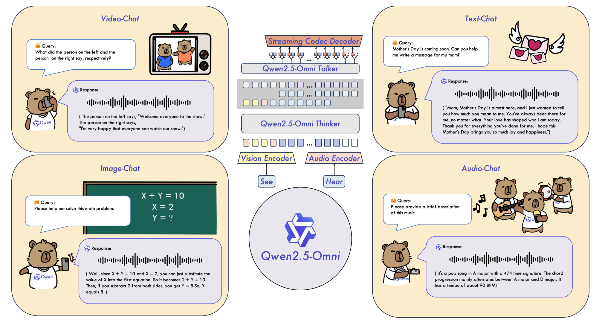

*Fig. 18. Qwen2.5-Omni is an end-to-end multimodal model designed to perceive diverse modalities, including text, images, audio, and video, while simultaneously generating text and natural speech responses in a streaming manner. (Image source: [Qwen Team, 2025](https://arxiv.org/abs/2503.20215))*


**Qwen2.5-Omni** ([Qwen Team, 2025](https://arxiv.org/abs/2503.20215)) 是一个类似于 GPT-4o([OpenAI, 2024](https://openai.com/index/hello-gpt-4o/)) 的端到端多模态模型，支持处理包括文本、图像、音频和视频全模态的输入，并能同时 **流式生成文本和自然语音** 输出。

从下图可以看出，Qwen2.5-Omni 采用了**Thinker-Talker**架构，其主要特点包括：


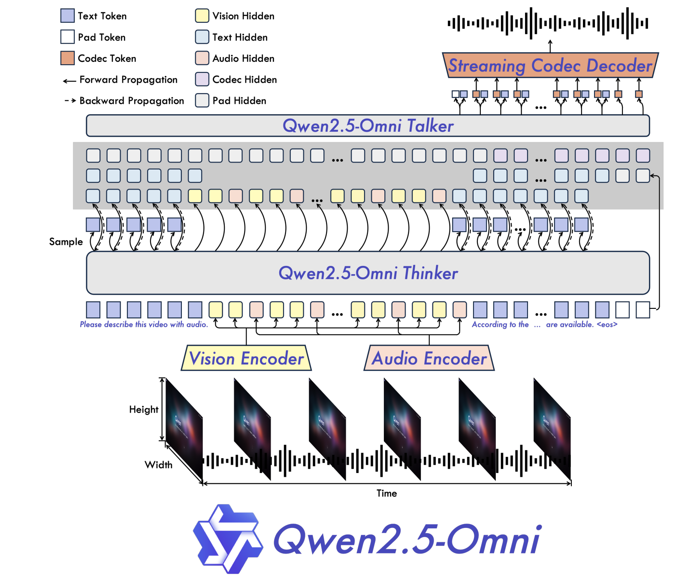

*Fig. 19. Qwen2.5-Omni Overview. Adopts Thinker-Talker architecture. Thinker is tasked with text generation while Talker focuses on generating streaming speech tokens by receiving high-level representations directly from Thinker. (Image source: [Qwen Team, 2025](https://arxiv.org/abs/2503.20215))*


1. **统一多模态处理与时序建模：**

   * **全模态感知:** 单一模型能够同时处理文本、图像、音频、视频四种模态输入，实现多模态统一理解。


    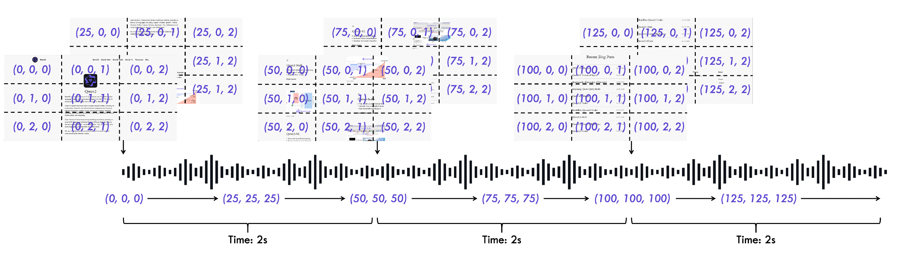

    *Fig. 20. An illustration of Time-aligned Multimodal RoPE (TMRoPE). (Image source: [Qwen Team, 2025](https://arxiv.org/abs/2503.20215))*


   * **时序对齐多模态旋转位置编码（Time-aligned Multimodal RoPE，TMRoPE）:** 在Qwen2.5-VL基础上进一步优化 TMRoPE，通过**时间交错 (Time-interleaving)** 结构，将视频帧和音频帧每2秒切块后按时间顺序排列，块内先视频后音频。所有模态使用绝对时间戳（40ms粒度）与位置编码（TMRoPE）对齐，实现精准的音视频同步。

   * **输入处理细节:** 文本使用Qwen tokenizer；音频为16kHz采样、128通道梅尔频谱图（25ms窗长，10ms步长），每帧约40ms，通过Qwen2-Audio编码器处理；图像/视频通过Qwen2.5-VL的ViT架构处理，视频支持动态FPS采样。

2. **Thinker-Talker 架构设计与功能解耦：**

   * 提出创新的Thinker-Talker架构，将文本生成和语音生成解耦，避免相互干扰，同时允许端到端联合训练。
   * **Thinker:** 基于Qwen2.5的Transformer解码器，处理多模态输入，生成高级隐层表示（包含语义和韵律信息）及文本token输出。
   * **Talker:** 双轨自回归Transformer解码器，接收Thinker输出的隐层表示和文本token，结合消除语音歧义的能力，自回归地生成离散语音token。
   * Thinker与Talker共享历史上下文，支持端到端训练，提升语音生成一致性与上下文保持能力。

3. **高效流式处理能力：**

   * **输入流式处理:** 音频和视觉编码器采用**分块处理 (Block-wise Processing)**，支持流式输入及预填充 (Prefilling)。
   * **输出流式处理:**

     * Talker生成的离散语音token实时送入**流式音频解码器 (Streaming Audio Codec)**。
     * 解码器采用基于**Diffusion Transformer (DiT)** 的 **滑动窗口块注意力 (Sliding Window Block Attention)**（回看2个块，前看1个块），控制感受野，实现流式生成。
     * 使用 **Flow Matching** ([Lipman et al., 2022](https://arxiv.org/abs/2210.02747)) 将离散 token 转换为梅尔频谱图，再通过改进版 **BigVGAN**([Lee et al., 2022](https://arxiv.org/abs/2206.04658)) 将频谱图流式转换为音频波形，有效降低首包延迟，提升生成实时性。

**训练:** 包含三个阶段：编码器与 LLM 对齐 -> 全模型多模态预训练 -> 长上下文预训练 (32k)。Talker 单独进行三阶段训练：上下文学习 -> DPO (优化稳定性) -> 多说话人指令微调 (提升自然度)。

**效果:** Qwen2.5-Omni 在各项单模态基准上与同规模的 Qwen2.5-VL (视觉) 和 Qwen2-Audio (音频) 表现相当或更好。在 OmniBench 等多模态融合基准上达到 SOTA。语音指令遵循能力接近文本指令。语音生成在鲁棒性和自然度上优于多数现有模型。

### Kimi-VL

**Kimi-VL** ([Kimi Team, 2025](https://arxiv.org/pdf/2504.07491)) 是一款开源的 **高效混合专家 (Mixture-of-Experts, MoE)** 视觉语言模型。


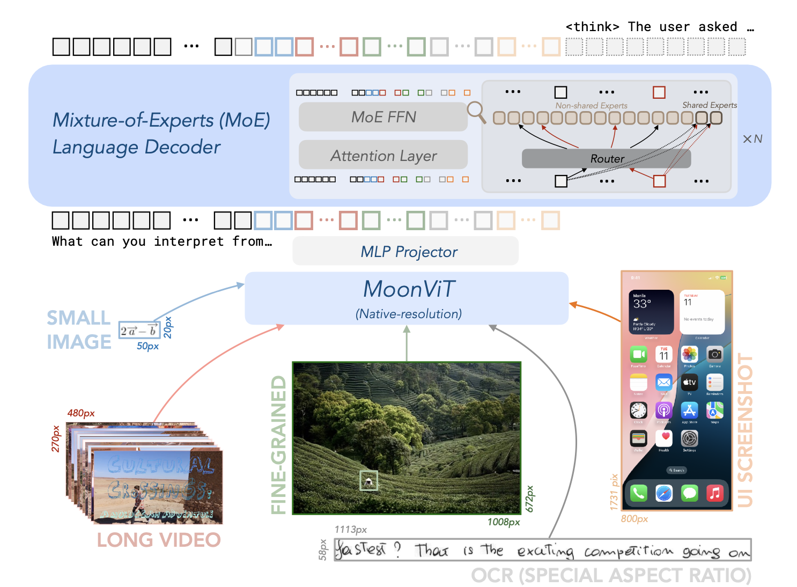

*Fig. 21. Model architecture of Kimi-VL and Kimi-VL-Thinking, consisting of a MoonViT that allows native-resolution images, an MLP projector, and a Mixture-of-Experts (MoE) language decoder. (Image source: [Kimi Team, 2025](https://arxiv.org/abs/2504.07491))*


**架构细节:**

1.  **高效 MoE 架构:**
    语言模型部分采用 MoE 架构（基于 Moonlight，类 DeepSeek-V3 架构），语言解码器总参数约 **16B**，每个 token 激活约 **2.8B** 参数（公开配置的 MoE 层含 **64 个路由专家，每个 token 选择 6 个，另有 2 个共享专家**；视觉编码器约 400M 参数另计），在保证模型性能的同时显著降低计算成本。支持最大 **128K token** 的上下文窗口，适用于长文档、长视频等输入场景。

2.  **原生分辨率视觉编码器:**
    提出参数为 **400M** 的视觉编码器 **MoonViT**，支持图像**原生分辨率处理**，减少把不同长宽比图像强制压缩到统一尺寸造成的细节损失；实际输入仍需满足 patch 切分和像素预算等约束。架构基于 ViT，融合了以下技术：
    *   **NaViT 图像打包 (Patch n' Pack) 策略**：实现对变长图像序列的高效 batch 处理；
    *   **插值式绝对位置编码**：从 **SigLIP**([Zhai et al. 2023](https://arxiv.org/abs/2303.15343)) 初始化而来，提升位置感知；
    *   **二维旋转位置编码（2D-RoPE）**：增强空间结构理解；
    *   **动态分辨率训练**：训练阶段采样不同尺寸图像，提升泛化能力。

3.  **多模态融合模块:**
    MoonViT 输出的图像特征通过一个包含 **Pixel Shuffle 操作** 的 **两层 MLP Projector** 进行空间压缩和格式转换，之后与文本 token 级特征拼接输入 MoE LLM，完成图文融合处理。

4.  **长思维链推理:**
    基于主模型，通过长链思维训练流程，包括 **长思维链监督微调** 和 **强化学习优化**，提升模型在多轮、多步骤推理任务中的表现，支持复杂逻辑问答与场景理解。

**训练:**


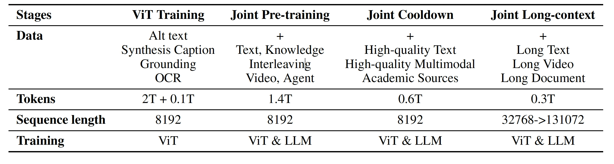

*Fig. 22. The pre-training stages of Kimi-VL and Kimi-VL-Thinking, including ViT pre-training, joint pre-training, joint cooling, and joint long-context activation. (Image source: [Kimi Team, 2025](https://arxiv.org/abs/2504.07491))*


*   **预训练 (4 阶段, 共 4.4T tokens):**
    1.  **ViT 训练 (2.1T):** 单独训练 MoonViT (从 SigLIP 初始化)，使用对比损失 SigLIP 和交叉熵 caption 生成。
        $$
        \mathcal{L}=\mathcal{L}_{\text {siglip }}+\lambda \mathcal{L}_{\text {caption }}, \text { where } \lambda=2
        $$
    2.  **联合预训练 (1.4T):** 联合训练 ViT, Projector, LLM (从 Moonlight 5.2T checkpoint 初始化)，混合文本和多模态数据。
    3.  **联合冷却 (0.6T):** 使用高质量文本和多模态数据继续联合训练。
    4.  **联合长上下文激活 (0.3T):** 将上下文从 8K 扩展到 128K，使用长文本、长视频、长文档数据。


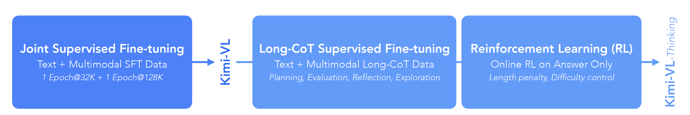

*Fig. 23. The post-training stages of Kimi-VL and Kimi-VL-Thinking, including two stages of joint SFT in 32K and 128K context, and further long-CoT SFT and RL stages to activate and enhance long thinking abilities. (Image source: [Kimi Team, 2025](https://arxiv.org/abs/2504.07491))*


*   **后训练:**
    1.  **联合 SFT:** 使用 ChatML 格式，在混合文本和多模态指令数据上进行微调 (先 32K 再 128K 上下文)。
    2.  **Long CoT SFT:** 使用少量高质量长 CoT 数据进行 SFT，激活长链推理能力。
    3.  **强化学习:** 采用与 **Kimi k1.5** 模型([Kimi Team, 2025](https://arxiv.org/abs/2501.12599)) 相同的**在线策略镜像下降（Online Policy Mirror Descent）** 算法进行训练。此阶段旨在通过强化学习进一步提升模型的复杂推理和规划能力（如错误识别、回溯、解决方案优化），使其能利用长思维链上下文进行隐式搜索，从而逼近显式规划算法的效果，同时保持自回归生成的简洁性。
        *   **核心目标:** 优化策略模型 $\pi_{\theta}$，使其针对问题 $x \in \mathcal{D}$ 生成的思维链 $z$ 和最终答案 $y$ 能够最大化基于基准答案 $y^*$ 的奖励期望：

            $$
            \max _{\theta} \mathbb{E}_{\left(x, y^{*}\right) \sim \mathcal{D},(y, z) \sim \pi_{\theta}}\left[r\left(x, y, y^{*}\right)\right]
            $$
            其中 $r(x, y, y^*)$ 通常为 0 或 1 的正确性奖励。

        *   **奖励机制:**
            *   **正确性奖励 ($r$):** 主要基于最终答案 $y$ 的正确性，判断方式依据任务类型：
                *   对于**编程**问题：通过运行自动生成的测试用例来判断。
                *   对于**数学**问题：使用高精度的思维链奖励模型（Chain-of-Thought RM, 其准确率达 98.5%）来评估。
                *   对于**视觉**问题：利用真实世界图像、合成视觉推理数据和文本渲染图像等多种数据源，根据任务目标定义奖励。
            *   **长度惩罚 (Length Penalty):** 为解决“过度思考”并提升 token 效率，引入额外的长度奖励 $\text{len\_reward}(i)$。对于问题 $x$ 从当前策略采样 $k$ 个回答 $(y_i, z_i)$（$i=1, \dots, k$），令 $\text{len}(i)$ 为回答 $i$ 的 token 长度，$\text{min\_len} = \min_i \text{len}(i)$ 和 $\text{max\_len} = \max_i \text{len}(i)$。若 $\text{max\_len} > \text{min\_len}$，则长度奖励为：

                $$
                \text{len_reward}(i) = \begin{cases} \lambda & \text{若 } r(x, y_i, y^*) = 1 \\ \min(0, \lambda) & \text{若 } r(x, y_i, y^*) = 0 \end{cases}
                $$
                其中，长度调节因子 $\lambda = 0.5 - \frac{\text{len}(i) - \text{min\_len}}{\text{max\_len} - \text{min\_len}}$。最终用于优化的总奖励是正确性奖励和长度奖励的加权和。此惩罚采用逐步（warm-up）引入的方式。

        *   **训练特点:**
            *   **算法:** 基于在线策略镜像下降，训练过程是迭代的。在第 $i$ 轮迭代中，使用当前模型 $\pi_{\theta_i}$ 作为参考策略，优化以下带相对熵（KL散度）正则化的目标：
                $$
                \max _{\theta} \mathbb{E}_{\left(x, y^{*}\right) \sim \mathcal{D}}\left[\mathbb{E}_{(y, z) \sim \pi_{\theta}}\left[r\left(x, y, y^{*}\right)\right]-\tau \operatorname{KL}\left(\pi_{\theta}(x) \| \pi_{\theta_{i}}(x)\right)\right]
                $$
                其中 $\tau > 0$ 是控制正则化强度的参数。
            *   **优化:** 实际更新使用离策略（off-policy）数据（即从参考策略 $\pi_{\theta_i}$ 采样）和近似梯度。对于每个问题 $x$，从 $\pi_{\theta_i}$ 采样 $k$ 个回答 $(y_j, z_j)$，计算经验平均奖励 $\bar{r} = \frac{1}{k}\sum_{j=1}^{k} r(x, y_j, y^*)$ 作为基准（baseline）。模型参数 $\theta$ 的梯度近似为：
                $$
                \frac{1}{k} \sum_{j=1}^{k}\left(\nabla_{\theta} \log \pi_{\theta}\left(y_{j}, z_{j} \mid x\right)\left(r\left(x, y_{j}, y^{*}\right)-\bar{r}\right)-\frac{\tau}{2} \nabla_{\theta}\left(\log \frac{\pi_{\theta}\left(y_{j}, z_{j} \mid x\right)}{\pi_{\theta_{i}}\left(y_{j}, z_{j} \mid x\right)}\right)^{2}\right)
                $$
                该梯度形式类似于带基准的策略梯度，但加入了 $l_2$ 正则化项（最后一项的梯度）并使用离策略样本。训练中 **舍弃了价值网络（value network）** 以鼓励探索。
            *   **采样策略:** 为提高训练效率，结合使用：
                *   **课程学习 (Curriculum Sampling):** 从易到难逐步增加训练问题的难度。
                *   **优先采样 (Prioritized Sampling):** 根据模型在各问题上的历史成功率 $s_i$，以 $1-s_i$ 的比例优先采样成功率较低的问题。


### o3 & o4-mini

OpenAI 的 **o3** 和 **o4-mini** ([OpenAI, 2025](https://openai.com/index/introducing-o3-and-o4-mini/)) 是其 o 系列推理模型的最新迭代，核心特点是 **更长的思考时间 (Longer Thinking Time)** 和 **全面的工具接入 (Full Tool Access)**。

**核心贡献:**
1.  **增强推理:** 模型被训练成在响应前进行更长时间、更深入的思考（类似于 CoT 或更复杂的推理过程），显著提升了在编码、数学、科学、视觉感知等复杂任务上的性能。o3 在 Codeforces, SWE-bench, MMMU 等基准上达到 SOTA。

2.  **全工具接入:** 模型可以无缝调用各种工具，如[Web Search](https://openai.com/index/introducing-chatgpt-search/)、[Code Interpreter](https://platform.openai.com/docs/assistants/tools/code-interpreter)、[GPT‑4o Image Generation](https://openai.com/index/introducing-4o-image-generation/)，以及通过 API 实现的 [Function Calling](https://platform.openai.com/docs/guides/function-calling)。模型经过训练，能够自主判断何时以及如何使用这些工具来解决问题。

3.  **多模态推理:** 模型可以将 **图像直接整合进其思维链**，实现视觉和文本的深度融合推理，而不仅仅是将图像作为输入。这使其在分析图表、图示等方面表现优异。

4.  **效率与性能权衡:** 截至 2025 年 5 月，o3 是 OpenAI o 系列中面向复杂查询的最强模型；o4-mini 则面向速度、成本和吞吐进行优化。其与 o3 的参数量均未公开；它在数学、编码和视觉任务上仍表现出色，尤其擅长利用工具（如在 AIME 竞赛中使用 Python 解释器）。

5.  **大规模强化学习:** o 系列模型的性能提升很大程度上归功于大规模强化学习 (RL) 的应用，验证了 RL 在提升推理能力方面的潜力，且性能随计算量增加而提升。


*Fig. 24. o3 model demonstrates its multimodal CoT capability by analyzing a user-uploaded image, identifying the ship, and using tools (web search) to find information, ultimately answering the ship's name and its next port of call. (Image source: [OpenAI, 2025](https://openai.com/index/introducing-o3-and-o4-mini/))*


**工作机制:**

*   **长时间思考:** 借鉴了“计算换性能”的思想 ([Snell et al., 2024](https://arxiv.org/abs/2408.03314))，通过在推理时增加计算量来提升复杂任务性能，这可能比单纯增加模型参数更有效。公开研究探索了更长推理链、采样和搜索等途径，但 o3/o4-mini 的发布资料仅确认强化学习、更长思考和工具使用，未公开是否采用 MCTS 等具体内部搜索算法，用户可以通过选择不同的 **推理努力程度 (reasoning effort)** 设置（如 o4-mini-high）来调整模型的思考时间。

*   **工具使用:** 模型通过 RL 或指令微调学习工具使用的策略。当面对一个问题时，模型会：
    *   **规划:** 分析问题，判断是否需要以及需要哪些工具。
    *   **执行:** 调用选定的工具（如进行网络搜索获取最新信息，运行代码进行计算）。
    *   **整合:** 将工具返回的结果整合到其推理过程中，生成最终答案。
    这个过程可以是多轮迭代的，模型可以根据工具返回的信息调整策略（如进行二次搜索）。
*   **多模态思维链 (Multimodal Chain-of-Thought, MCoT)** 模型可以直接在其内部推理步骤中引用和分析图像内容，例如识别图表中的数据点，理解流程图的步骤，或解释照片中的细节。感兴趣的读者可以阅读 **MCoT 综述**([Wang et al., 2025](https://arxiv.org/abs/2503.12605)) 介绍其扩展到包含图像、视频、音频、3D、表格/图表等多种模态场景。

**效果:**


*Fig. 25. To highlight visual reasoning improvement versus our previous multimodal models, OpenAI tested o3 and o4-mini on a diverse set of human exams and ML benchmarks. These new visual reasoning models significantly outperform their predecessors on all multimodal tasks we tested. (Image source: [OpenAI, 2025](https://openai.com/index/thinking-with-images/))*


o3 和 o4-mini 在多项基准测试中展现了 SOTA 或接近 SOTA 的性能，尤其是在需要深度推理和工具辅助的任务上。专家评估显示，它们相比前代 o1/o3-mini 产生的严重错误更少，回答更实用、可验证，并且交互更自然。

### InternVL2.5

InternVL2.5 的技术报告 [Expanding Performance Boundaries of Open-Source Multimodal Models with Model, Data, and Test-Time Scaling](https://arxiv.org/abs/2412.05271) 于 2024 年 12 月公开，提供 1B、2B、4B、8B、26B、38B、78B 等规模的模型。其核心思想是同时扩展**模型规模、训练数据质量和测试时计算**：扩大视觉编码器与语言模型的能力，改进多模态数据和损失设计，并用思维链改善复杂视觉推理。模型名称表示近似规模，视觉塔与连接器也计入总参数；例如报告列出的 8B、78B 版本实际约为 8.1B、78.4B。

**模型结构**

InternVL2.5 沿用 InternVL 的 **ViT–MLP–LLM** 结构：InternViT 编码图像，pixel unshuffle 压缩空间 token，随机初始化的两层 MLP 将视觉特征映射到语言模型的嵌入空间，随后把视觉 token 与文本 token 拼入同一自回归序列。不同规模搭配 InternViT-300M 或 InternViT-6B，以及 InternLM2.5、Qwen2.5 系列的指令微调语言模型。这里的两层 MLP 是跨模态连接器，不是另一个语言模型；视觉编码器并不直接生成回答。

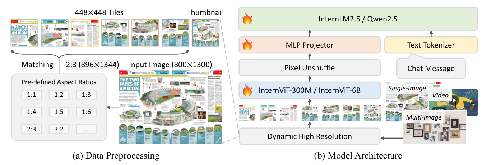

*InternVL2.5 论文 Figure 2 原图。左侧展示高分辨率图像的切块与缩略图，右侧展示 InternViT、pixel unshuffle、MLP 和语言模型的连接。[论文图与上下文](https://arxiv.org/html/2412.05271v1#S2.F2)*

高分辨率处理采取**动态切块**：根据原图宽高比选择网格，将图像转换为若干 448×448 的 tile；存在多个 tile 时还可加入全局缩略图，让模型同时获得局部文字与整体布局。每个 tile 采用 14×14 patch，初始得到 32×32＝1024 个视觉 token；通过 2×2 pixel unshuffle，将相邻空间位置的特征移入通道维，变为 16×16＝256 个视觉 token，再经 MLP 投影。这保留了细节输入，同时减少语言解码器需要处理的视觉序列长度。

单图、多图、视频采用不同预算。单图可使用完整切块上限；多图在各图之间分配总预算，避免图片数量增加后每张仍占满预算；视频以 448×448 的帧输入处理，每帧的切块上限为 1。按每帧 256 个视觉 token 计算，32 帧、64 帧分别对应 8192、16384 个视觉 token，尚未计入提示文本及分隔符。增加 tile 或视频帧有助于感知细节，也会增加注意力计算、KV cache 与推理延迟；这不是免费扩展分辨率。

**训练**

报告采用分阶段训练，并通过 **progressive scaling** 复用已经学好的视觉组件：先让较小语言模型帮助训练视觉塔，再把视觉塔迁移到更大的语言模型进行对齐与指令微调，从而减少每个大模型都重新执行视觉预训练的成本。

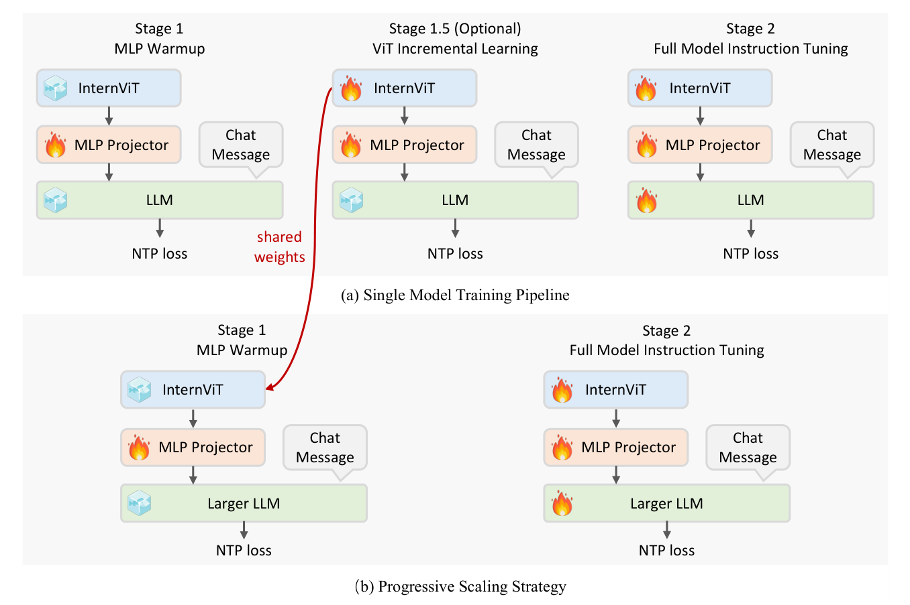

*InternVL2.5 论文 Figure 4 原图。上半部分为训练阶段，冰块与火焰分别表示冻结和更新；下半部分为视觉编码器在不同语言模型规模间的复用。[论文图与上下文](https://arxiv.org/html/2412.05271v1#S3.F4)*

| 阶段 | 更新的模块 | 冻结的模块 | 主要作用 |
| --- | --- | --- | --- |
| Stage 1：MLP warmup | 两层 MLP | InternViT、LLM | 将视觉输出初步对齐到语言嵌入空间 |
| Stage 1.5：ViT incremental learning，可选 | InternViT、MLP | LLM | 通过生成式多模态目标改善视觉表征 |
| Stage 2：全模型指令微调 | InternViT、MLP、LLM | 无 | 学习图文指令、跨图关系、视频理解与回答格式 |

Stage 1.5 并非每个发布版本都执行。例如报告的训练配置中，8B、26B 使用该阶段，而部分其他版本复用已有视觉权重。因此，理解训练流程时应同时关注阶段说明和各规模的配置，不能把三个阶段当成所有权重的固定训练记录。

数据侧同时使用单图、多图、视频与纯文本样本，进行异常格式、重复内容等过滤，并结合模型辅助评分提高样本质量。图像训练采用随机 JPEG 压缩，质量参数范围为 75–100，以提升对网页、扫描件及有损压缩输入的适应能力。该增强针对图像，不应理解为视频和纯文本也执行同样操作。

损失侧提出 **square averaging**，折中 token averaging 与 sample averaging。设第 b 个样本有 L_b 个参与监督的回答 token，其每个 token 的交叉熵为 ℓ_b,t，则可将归一化后的加权目标写为：

$$
\mathcal{L}_{\mathrm{square}}=
\frac{\sum_b L_b^{-1/2}\sum_{t=1}^{L_b}\ell_{b,t}}
{\sum_b L_b^{1/2}}.
$$

这里是对论文权重规则的等价展开：每个回答 token 的样本权重为 L_b 的负二分之一次方。token averaging 使长回答总权重近似与长度成正比；sample averaging 让各样本总权重相同；square averaging 则让总权重随回答长度的平方根增长，减轻超长答案对训练的支配，同时保留较长推理样本的贡献。长度按有效监督 token 计算，提示词与视觉输入不算作回答损失。

**效果**

报告在 OCR、文档、图表、多图、视频、数学及综合视觉推理等任务上评估模型。测试时扩展主要展示思维链的收益：让模型先解释观察与推理过程，再给出答案，在 MMMU 上改善了 78B 版本的结果。

| 模型与测试条件 | MMMU validation | 含义 |
| --- | --- | --- |
| InternVL2.5-78B，直接回答 | 66.4 | 不要求展开思维链的结果 |
| InternVL2.5-78B，CoT 提示 | 70.1 | 相同模型改用思维链，提升 3.7 个百分点 |

上述数字来自报告摘要及推理实验。CoT 增加输出 token 与延迟，收益依赖题目和提示；70.1 不能当成所有提示条件下的固定成绩。报告还讨论采样与投票等测试时扩展，但其中部分例子使用其他 InternVL 权重，需要保留对应模型名称，不能统一归入 InternVL2.5-78B。

这一代的价值在于：保持较清晰的视觉编码器与语言模型接口，通过视觉能力扩展、数据治理、合理的损失权重和测试时推理，共同提升开源模型的综合表现。其实际使用仍受输入 tile/帧数、语言骨干规模和推理预算影响；在小字 OCR、多步图表推理等任务中应分别核对感知与推理错误。[技术报告](https://arxiv.org/html/2412.05271v1)、[官方发布说明](https://internvl.github.io/blog/2024-12-05-InternVL-2.5/)

### InternVL3

InternVL3 于 2025 年 4 月 11 日发布，随后公开 [InternVL3: Exploring Advanced Training and Test-Time Recipes for Open-Source Multimodal Models](https://arxiv.org/abs/2504.10479)。模型家族覆盖 1B、2B、8B、9B、14B、38B、78B。它的主要变化是**原生多模态预训练（native multimodal pre-training）**：把语言预训练与视觉语言对齐放入同一阶段，再通过高质量监督微调、混合偏好优化和测试时选优提升能力。这里的“原生”指训练过程中的图文联合优化，模型仍以预训练视觉塔和语言 base 权重初始化。

**模型结构**

整体仍为 **InternViT → pixel unshuffle → 两层 MLP → LLM**，保留 448×448 动态图像切块和每个 tile 256 个视觉 token 的设计。1B、2B、8B、9B、14B 使用 InternViT-300M，38B、78B 使用 InternViT-6B；语言骨干主要来自 Qwen2.5 base，9B 使用 InternLM3-8B base。相比 InternVL2.5 主要连接指令微调语言模型，InternVL3 从 base LLM 开始联合预训练，让图文与纯文本能力在同一过程中形成。

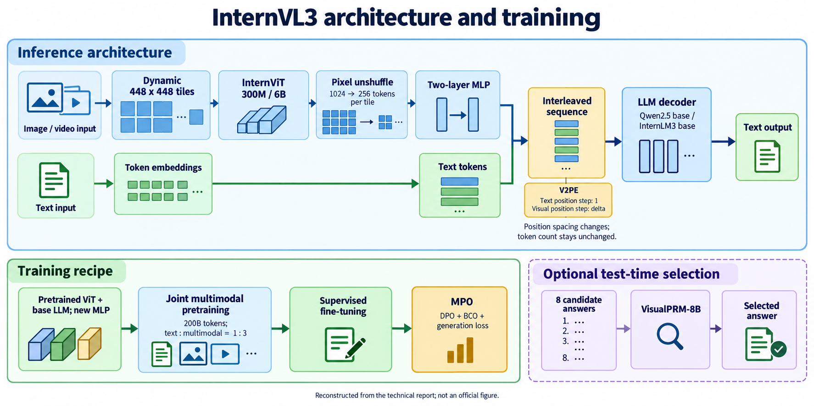

*根据 InternVL3 技术报告第 2 节生成的教学重建图，非论文原图。上方为视觉与文本进入统一序列的流程；下方左侧为训练顺序，右侧为可选的测试时 Best-of-8。图中 Dynamic 448×448 tiles 概括视觉预处理，不表示每个视频帧都采用多 tile。论文 Figure 1、2 为性能图，未提供这样的整体架构图；此处不将重建图冒充论文图。[公开依据](https://arxiv.org/html/2504.10479v3#S2)*

针对较长的视觉序列，报告引入 **V2PE（Variable Visual Position Encoding）**。传统文本与视觉 token 都以 1 为步长递增位置编号，很多 tile 或视频帧会快速拉大位置范围；V2PE 让文本保持整数步长，而视觉 token 使用可变的分数步长：

$$
p_i=p_{i-1}+\begin{cases}
1,&\text{第 }i\text{ 个 token 为文本},\\
\delta,&\text{第 }i\text{ 个 token 为视觉输入}.
\end{cases}
$$

训练时，每张图的 δ 从 1、1/2、1/4、…、1/256 中采样，同一张图内部使用相同步长；推理时可根据序列情况设置。当 δ＝1 时，退化为常规位置递增。V2PE 缩小的是**视觉 token 占用的位置编号跨度**，视觉 token 本身仍保留，因此不会自动缩短注意力序列或等比例减少 KV cache。另一个重要评测条件是：报告除 V2PE 专项消融外，其余结果固定 δ＝1，主榜提升不能直接归因于测试时启用分数步长。

**训练**

训练路线由联合预训练、监督微调和 MPO 构成，重点是在保留语言能力的同时让视觉条件更早进入语言学习，再对复杂回答进行偏好优化。

| 阶段 | 训练内容 | 关键机制 |
| --- | --- | --- |
| 原生多模态预训练 | 预训练 ViT、base LLM 与新 MLP 共同优化 | 纯文本与多模态混合；所有层联合更新 |
| 监督微调（SFT） | 高质量、多样化图文与文本指令 | 强化推理、长视频、文档、GUI、空间与工具相关任务 |
| 混合偏好优化（MPO） | 偏好回答与非偏好回答的对比训练 | 同时使用偏好、绝对质量与生成三个目标 |

联合预训练总量约 **200B token**，其中纯文本约 50B、多模态约 150B，比例约为 1:3。损失计算在文本 token 上，视觉输入作为回答的条件；“只对文本计算损失”不表示冻结视觉塔，因为文本预测误差仍会经连接器向视觉编码器反向传播。该阶段联合更新 ViT、MLP 和 LLM，有别于仅训练连接器的对齐方式。上述 200B 是这一阶段的训练 token 总量，不代表从随机权重开始训练，也不等于 200B 张图片或所有位置都被当作预测目标。

SFT 在更丰富、高质量的数据上学习指令遵循，沿用随机 JPEG 压缩、square averaging 等训练策略，并扩展多图、长视频、科学图表、GUI 操作与三维空间理解相关任务。训练这些任务表示模型学习了相应输入与输出形式，部署完整智能体仍需结合工具接口与环境反馈。

随后进行 **MPO（Mixed Preference Optimization）**。报告使用约 300K 偏好样本，包含通过 SFT 模型生成并筛选的回答。其目标可以概括为：

$$
\mathcal{L}_{\mathrm{MPO}}=
w_p\mathcal{L}_{\mathrm{DPO}}+
w_q\mathcal{L}_{\mathrm{BCO}}+
w_g\mathcal{L}_{\mathrm{generation}}.
$$

DPO 项提高偏好回答相对于非偏好回答的概率；BCO 项学习回答的绝对质量，补充只看成对差异的信息；generation 项对偏好回答保留语言建模监督，帮助维持正确答案的生成能力。MPO 属于后训练中的混合偏好目标，不能直接等同于在线 PPO。三项结合的效果应通过消融实验判断，而不只是按目标数量推断更强。

**效果**

报告覆盖视觉数学与推理、OCR/图表/文档、多图、真实场景、视频、GUI 和空间理解等任务。下面摘录同一报告 Table 2 的 78B 结果，比较默认生成与额外测试时选优，避免跨报告混用提示及评测条件。

| 模型与条件 | MMMU | MathVista | MathVision | MathVerse（Vision-Only） |
| --- | --- | --- | --- | --- |
| InternVL3-78B，报告默认生成 | 72.2 | 79.0 | 43.1 | 51.0 |
| InternVL3-78B + VisualPRM-Bo8 | 72.2 | 80.5 | 40.8 | 54.2 |

**VisualPRM-Bo8** 指生成 8 个候选回答，由外部 VisualPRM-8B 对推理步骤评分，并依据步骤分数的平均值选出回答。它增加生成和评分开销，不是 InternVL3 解码器内部新增的模块，也不能将其成绩当成单次回答效果。表中 MathVerse 提升 3.2 个百分点，而 MathVision 下降 2.3 个百分点，说明选优策略也会受评分器与任务匹配程度影响。

训练消融进一步显示，78B 在七项推理任务上的平均分经 MPO 从 50.5 提升至 54.6，其中 MathVista 从 74.0 提升至 79.0，MMMU 保持 72.2；这些数字体现该报告条件下的后训练收益，不能推广为所有任务都同幅改善。加入 Best-of-8 后，Table 2 的七项平均分为 56.5，可见训练与测试时计算提供了不同来源的增益。

InternVL3 的技术演进可以概括为：保持成熟的视觉与语言模块接口，用图文混合预训练改善能力形成过程，用 V2PE 研究长视觉上下文的位置表示，再通过 SFT、MPO 和可选的外部评分器完善回答。应用时应根据部署规模、图像与帧数、是否使用 MPO 权重和测试时采样预算选择配置，并在目标任务上核验准确率与延迟。[技术报告 v3](https://arxiv.org/html/2504.10479v3)、[官方发布说明](https://internvl.github.io/blog/2025-04-11-InternVL-3.0/)

## 2025 年 5 月之后的代表性多模态模型

从原文最后的 o3/o4-mini 往后看，公开技术报告呈现出几条并行路线：视觉语言模型加强高分辨率感知、长视频和视觉推理；全模态模型推进音视频同步与实时语音交互；部分模型进一步把视觉理解接入工具和智能体任务，也有模型面向视频生成与对话编辑。下面按模型家族和技术路线介绍。每节依次介绍核心思想、模型结构、训练和效果，并解释图中的关键连接；评测注明版本与运行条件，不能将不同任务的分数拼成统一排名。公开配置能核验的细节写到模块和参数；闭源部分将已公开事实与教学分析分开。

### GLM-4.1V-Thinking、GLM-4.5V 与 GLM-4.6V

**简介：** GLM-V 系列把多模态模型从图片问答推进到基于视觉证据的推理与行动。GLM-4.1V-9B-Thinking 于 2025 年 7 月公开；GLM-4.5V 扩展到 106B 总参数、12B 激活参数的 MoE；GLM-4.6V 随后加强长文档和原生多模态工具调用，并提供 9B Flash。三代有共同骨干，但语言容量、训练长度和交互能力不同。[官方模型家族](https://github.com/zai-org/GLM-V#model-overview)

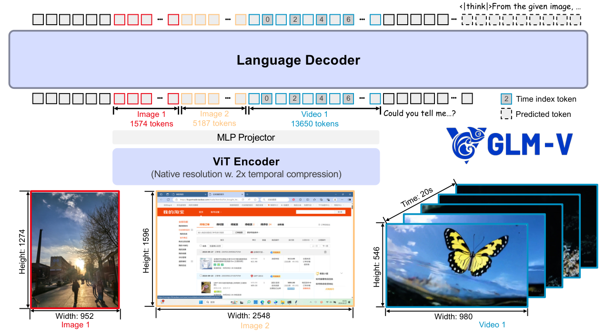

*图：技术报告 v6 Figure 2，明确覆盖 GLM-4.1V-Thinking、GLM-4.5V、GLM-4.6V。本图不描述后面的 GLM-5.3-Flash。 [原图与论文上下文](https://arxiv.org/html/2507.01006v6)*

**核心思想与贡献：** 重点是把通用视觉基础、长思维链和跨领域 RL 组织成完整流程。图表题需要先读数值、再选择关系、最后推导；GUI 任务需要定位控件、理解状态、预测操作。只奖励数学答案正确，很难覆盖这些能力。RLCS 因此同时考虑领域与样本难度，减少已稳定掌握的问题，优先选择能产生有效学习信号的题。它不是给每幅图加上更长解释，而是改进模型利用视觉证据解决任务的策略。

**模型结构：**

- **视觉编码：AIMv2-Huge → 可变网格 ViT。** 图片按自身宽高形成 patch 网格，视觉注意力采用 2D-RoPE，同时保留经插值调整的绝对位置嵌入。两者分别帮助表达空间关系与继承预训练视觉能力。“原生分辨率”表示可接受可变网格，实际像素仍受预处理预算约束。
- **统一视频入口：3D patch embedding → 共享 ViT。** 三维卷积在时间维下采样两倍；单图复制成两帧以复用入口。视频帧后加入字符串时间戳，显式表达真实间隔，而不只告诉模型第几帧。
- **连接器与解码：MLP Adapter → GLM Decoder。** 视觉通道投影到语言隐藏空间，与问题形成混合序列；语言侧使用 3D-RoPE。9B 版本采用 GLM-4-9B-0414，大版本采用 GLM-4.5-Air，自回归生成答案、坐标或工具调用。[结构报告 §2](https://arxiv.org/html/2507.01006v6#S2)

多页文档在这个流程中由各页视觉 token 表达，不必先压成一句文字摘要，因此页内布局与跨页关系可以共同参与推理。代价是页数、分辨率、问题长度和输出推理共享上下文预算。定位任务输出归一化框坐标，后处理再映射回像素位置；它没有额外输出检测器特征图。GLM-4.6V 的工具闭环位于模型外：预测调用、执行工具、返回截图或渲染结果、重新编码视觉反馈，再判断下一步。[工具与坐标接口](https://github.com/zai-org/GLM-V#using-case)

从三个版本的数据流看，变化主要发生在共享视觉端之后：9B 稠密语言端处理所有 token，106B MoE 端只激活部分专家；4.6V 再让图片直接成为工具参数或工具反馈。以“根据产品照片搜索相似物品”为例，模型可以把相关视觉输入交给工具，结果图片回到会话后再比较，不必先用容易丢失细节的文字描述替代所有图像。这改善跨工具的视觉证据保留，实际检索仍由搜索服务完成。

| 版本 | 骨干与规模 | 训练/交互差别 | 代表方向 |
| --- | --- | --- | --- |
| 4.1V-9B-Thinking | 稠密 9B 级；共享视觉端 | 长 CoT SFT 与 RLCS；以 Thinking 为主 | 小型视觉推理、OCR、定位 |
| 4.5V | GLM-4.5-Air；106B-A12B | 扩大跨领域训练，支持 Thinking 开关 | 视觉编程、复杂图表、GUI |
| 4.6V / Flash | 106B-A12B / 9B | 128K 续训、原生多模态 Function Calling | 长文档与视觉工具反馈 |

**训练：** 第一阶段混合图片描述、图文交错知识、OCR、定位和纯文本。图片描述提供可见物体与属性，交错文档提供图表和段落关系，纯文本维持语言知识。第二阶段引入视频与长序列；报告设置从 8,192 扩展到 32,768，并对 4.6V 增加 131,072 阶段。长上下文能力需要在训练中形成，不能仅靠调大推理参数获得。

具体训练设置中，8K 阶段为 120K 步、全局 batch 1,536，初始混合不包含视频；32K 续训增加 10K 步，引入视频与超过 8K 的图文交错样本；4.6V 的 128K 阶段再训练 2K 步，batch 128。初始阶段用 packing 将多个变长样本装进同一序列，提高有效 token 利用；长阶段改用上下文并行分摊序列。MoE 版本还有专家负载平衡，解决某些专家过载、其余空闲的问题，它与奖励采样课程分别作用于参数路由和任务选择。[报告训练设置](https://arxiv.org/html/2507.01006v6#S3.SS2)

第三阶段长 CoT SFT 建立推理和最终答案的格式。用一般条件生成目标解释：

$$
\mathcal L_{\mathrm{SFT}}
=-\sum_{t\in\text{回答位置}}\log p_\theta(y_t\mid V,x,y_{<t}).
$$

视觉表示 \(V\) 与问题 \(x\) 是条件；模型监督的是回答 token，而不是逐像素重建。SFT 给出良好的初始解题方式，RL 随后比较实际生成的候选。思考与最终答案使用专门格式分隔，使在线验证器可以稳定抽取结果，区分中间尝试和模型最终选择。报告没有给出经典 LLaVA 式的完整冻结表，因此不能将所有阶段描述为只更新连接器。

第四阶段 RLCS 采用 GRPO，结合可验证奖励和模型判断。数学检验答案，OCR 检查编辑距离，定位检查 IoU，开放问答检验语义。OCR 的一个具体奖励为：

$$
r_{\mathrm{OCR}}=1-
\frac{d_{\mathrm{edit}}(a,g)}{\max(|a|,|g|)}.
$$

它给部分正确文本连续分数，避免一个字符错误就完全没有学习信号。定位奖励则计算超过 IoU 阈值的框比例。课程采样解决组内候选全对或全错时缺少相对优势的问题；格式和重复文本另外检查。不同领域需要不同验证器，统一 RL 并不意味着所有任务使用一个答案匹配规则。[报告预训练、SFT 与 RL](https://arxiv.org/html/2507.01006v6#S3)

**效果：** 下表使用报告 v6 的 Thinking 结果，分数采用基准原有口径。

| 基准 | 4.1V-9B | 4.5V | 4.6V |
| --- | ---: | ---: | ---: |
| MMMU validation | 68.0 | 75.4 | 76.0 |
| MathVista | 80.7 | 84.6 | 85.2 |
| MMLongBench-Doc | 42.4 | 44.7 | 54.9 |
| Design2Code | 64.7 | 82.2 | 88.6 |
| VideoMME，无字幕 | 68.2 | 74.6 | 74.8 |

4.6V 的明显变化集中于长文档和视觉编程，不能概括为每项指标都单调上涨。主要评测设置是回答最多 8,192 tokens、图像期望视觉长度上限 6,144、视频视觉预算 48,000；部分 GUI 结果给定 100 步操作预算。因此代理成功率包含多轮观察与执行成本，不能与一次问答混用。[评测协议与结果](https://arxiv.org/html/2507.01006v6#S6)

这些任务还能分成三层检查：先确认感知是否读对标签、单位和图例，再确认推理是否选择正确关系，最后确认行动是否产生预期状态。例如跨页财报题可能把百分数读对，却错误连接不同年份；网页编程题可能代码可运行，却遗漏截图中的排版要求。表中的文档与编程评测分别验证这些能力组合，解释了为什么扩上下文、增加容量和训练工具反馈会带来不同幅度的收益。

实践中，长思考对图表推导有帮助，简单 OCR 则应控制响应长度。官方剩余问题仍包括重复推理、计数与人物辨认误差：推理能力增强不自动补回看漏的证据，重要小字和坐标仍需要足够输入分辨率与结果校验。[官方已知问题](https://github.com/zai-org/GLM-V#remaining-issues)

### InternVL3.5

**简介：** InternVL3.5 于 2025 年 8 月 26 日发布，承接 InternVL3 的原生图文联合训练，覆盖小型稠密模型至 241B-A28B MoE。它同时优化推理与输入成本：Cascade RL 改进训练后的回答分布，Flash 版本的视觉分辨率路由器 ViR 压缩视觉 token，DvD 优化视觉与语言模块的 GPU 调度。[官方发布](https://internvl.github.io/blog/2025-08-26-InternVL-3.5/)


*图：论文 Figure 2。普通模型与 Flash 分开；ViR 和 64-token 路径属于 Flash 设计。 [原图与论文上下文](https://arxiv.org/html/2508.18265v1)*

**核心思想与贡献：** 一张图不同区域的信息密度不同：空白页边与密集表格不需要相同表示长度，但简单丢弃 patch 可能损伤识字和空间关系。Flash 先让压缩路径尽量保持答案语义，再学习哪些块值得使用更多 token。推理训练则先离线学习较好的候选，再在线探索，使昂贵 rollout 从更可靠的策略开始。

**模型结构：** 主干为 **InternViT → Pixel Shuffle → MLP → LLM**。中小模型用 InternViT-300M，大型版本可用 InternViT-6B；语言骨干主要为 Qwen3，20B-A4B 使用 GPT-OSS。动态分辨率预处理将图片划分为 448×448 图块并保留缩略图：局部块负责细节，缩略图提供全局语境。每块 1,024 个视觉特征由 Pixel Shuffle 重组邻域信息并经 MLP 压为 256 tokens。[模型结构与对应骨干](https://huggingface.co/OpenGVLab/InternVL3_5-8B#model-architecture)

这里包含两个不同尺度的压缩。图块划分决定原图有多少像素真正进入视觉网络，Pixel Shuffle 决定视觉网络输出多少表示进入 LLM。后者把相邻特征的空间结构重新组织到通道，再通过投影减小序列长度，不能把它解释为简单把原图降为低清图片。

对一张宽表格，可以先按宽高切分若干局部块，再加入全图缩略图。局部块让列名和数值保持足够像素，全图帮助判断它们属于同一张表；文本的问题决定模型需要比较哪些列。进入语言端以后，块间关系需要由 LLM 建立，不能把“动态分辨率”理解为视觉编码器已经自动完成所有跨块推理。Flash 的路由还要在保留小字与减少 token 之间选择，因此内容复杂度比原图文件大小更有意义。

普通模型的视觉预算约为 \(256K\)，其中 \(K\) 含局部块和缩略图。Flash 额外增加 64-token 路径；如果 \(K_h\) 个块保留高 token、\(K_l\) 个块压缩，则：

$$
N_{\mathrm{vis}}=256K_h+64K_l.
$$

这是从公开路径得到的预算计算式，不能推出每次请求固定减少一半。密集 OCR 可能保留更多高分辨率块，天空等简单区域更容易压缩。两条路径汇入同一 LLM；ViR 负责选择表示粒度，不直接负责生成答案。[Flash 架构](https://arxiv.org/html/2508.18265v1#S2.SS1)

DvD 把视觉编码与语言网络分配到不同 GPU，分别按编码、prefill、解码负载配置资源。多图请求增加视觉计算，长回答增加语言解码；解耦可缓解资源利用不均。它是服务系统的吞吐优化，不是新的训练网络层，单请求的收益还要考虑传输与调度开销。

**训练：** 原生预训练同时更新视觉、连接器和语言参数，混合纯文本与多模态数据，文本位置使用 next-token prediction，并用平方根长度权重减轻长短样本偏置。SFT 再加入长推理、高质量指令、GUI、具身和 SVG 数据。模型卡开放不同阶段的检查点，便于观察 SFT、MPO、完整 RL 的变化。[训练与检查点](https://huggingface.co/OpenGVLab/InternVL3_5-8B#training-and-deployment-strategy)

预训练报告共使用约 116M 样本、250B tokens，纯文本与多模态数据混合约为 1:2.5，最大长度 32K。平方根归一化让长回答仍贡献更多总信号，却不按长度线性放大；如果一个简短定位回答只有几个坐标，它不会因文字少就完全被长描述淹没。全参数训练同时改变 InternViT 对细节的编码、MLP 对齐和 LLM 对视觉条件的使用，延续 InternVL3 的原生图文路线。[预训练规模与配方](https://arxiv.org/html/2508.18265v1#S2.SS2)

Cascade RL 第一阶段是离线 MPO，组合：

$$
\mathcal L_{\mathrm{MPO}}=
w_p\mathcal L_{\mathrm{DPO}}+
w_q\mathcal L_{\mathrm{BCO}}+
w_g\mathcal L_{\mathrm{LM}}.
$$

偏好损失比较好坏答案，质量损失评价单个候选，生成损失保留正常语言分布。在线阶段使用 GSPO，同题生成多个回答，以组内归一化奖励构成优势，重要性比率按整段回答概率比的几何平均计算：

$$
s_i(\theta)=
\exp\left[\frac1{|y_i|}
\sum_t\log\frac{\pi_\theta(y_{i,t}\mid x,y_{i,<t})}
{\pi_{\mathrm{old}}(y_{i,t}\mid x,y_{i,<t})}\right].
$$

然后用裁剪目标限制策略更新。这个定义突出序列级变化，不能写成每个 token 独立采用同一未归一化比率。论文该阶段不使用参考模型约束。[Cascade RL 公式](https://arxiv.org/html/2508.18265v1#S2.SS3)

离线阶段能利用既有好坏样本迅速调整分布，在线阶段则检验当前策略新产生的回答。后者必要的原因是模型经过偏好训练后，原始候选集不再代表它现在容易犯的错误；重新采样可以发现更细的推理或感知缺口。数学答案可自动验证，开放描述则需要质量判断，奖励的可靠性决定模型学到的是正确证据使用还是表面回答风格。

Flash 的 ViCO 又分两步。第一步冻结普通模型作为教师，训练压缩模型，使 64/256-token 条件下的输出分布接近教师；第二步冻结 ViT、MLP 和 LLM，只训练二分类路由器。路由标签取决于压缩引起的相对损失变化：影响小则走 64 tokens，影响大则保留 256。KL 一致性和路由交叉熵分别解决“压缩后怎么回答”和“哪个块适合压缩”，不是单一操作。路由训练利用实际损失差形成标签：同一图块走较短路径后，如果答案分布变化很小，就适合作为低 token 样本；若变化明显则保留更长表示。模型学习的是对最终生成有影响的信息密度，而不是预先把所有照片归为简单、所有文本图归为复杂。

**效果：** 8B 在 MMMU validation / MathVista mini 上为 73.4 / 78.4，241B-A28B 为 77.7 / 82.7。七项推理消融中，8B SFT 平均 53.6，MPO 后 56.3，完整 Cascade RL 后 60.3，表明增益不只来自更大骨干。8B-Flash 九项视觉平均从 80.2 变为 79.8，展示压缩的精度代价。[结果与消融](https://arxiv.org/html/2508.18265v1#S3)

效率评估可以按三个阶段拆开：视觉编码主要随图块增长，语言 prefill 受视觉序列长度影响，生成阶段主要受输出 tokens 影响。ViR 首先节省后两者的输入与缓存负担，DvD 再改善编码与语言 GPU 的排队和并发。若请求只是一个简单问题、输出很短，token 压缩较容易转化为收益；若要生成很长推理，解码成本可能占主要部分。按阶段测量比只报整体每秒 token 更能解释 Flash 和部署优化的贡献。

最高 4.05 倍推理加速综合了指定模型和部署设置，不能直接套用到单 GPU 单张图片。Parallel Thinking 使用额外采样，也应与单次推理成绩分开。它提供的是可组合选择：普通模型保留预算，Flash 动态节约 token，DvD 改善多 GPU 吞吐；OCR 密度、图块上限、输出长度与并发共同决定实际收益。[官方效率介绍](https://internvl.github.io/blog/2025-08-26-InternVL-3.5/)

### MiniCPM-V 4.5

**简介：** OpenBMB 于 2025 年 8 月推出 MiniCPM-V 4.5，采用 Qwen3-8B 和 SigLIP2-400M，总权重约 8.7B。它面向图片、文档、多图与视频，在较小语言模型的上下文预算内容纳更多视觉证据，并支持短推理、长推理两种回答模式。[官方模型卡](https://huggingface.co/openbmb/MiniCPM-V-4_5)

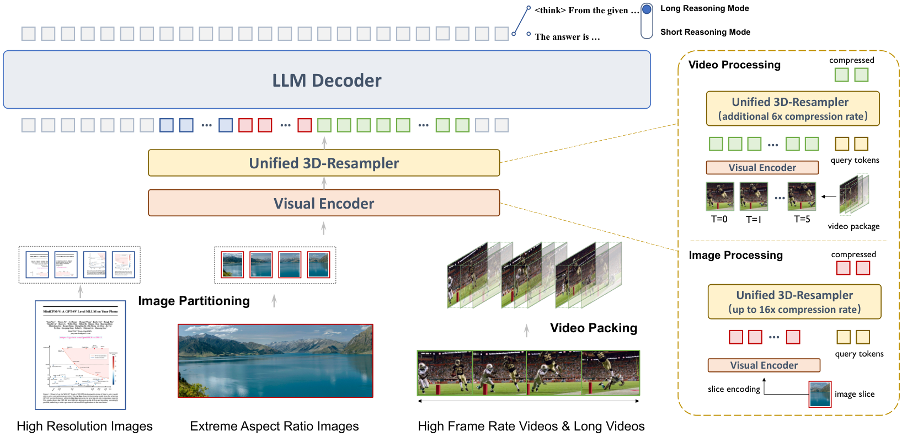

*图：论文 Figure 1。Unified 3D-Resampler 位于视觉编码器之后，图像与视频共享压缩模块；两个响应分支不是两个独立 LLM。 [原图与论文上下文](https://arxiv.org/html/2509.18154v1)*

**核心思想与贡献：** 架构上，连续视频帧共享查询槽位，利用时间冗余控制语言输入；数据上，用不同程度的视觉扰动统一 OCR 和文档知识学习；后训练上，共同优化长短推理。三者分别处理输入成本、视觉与语言知识融合、输出成本，不能用单一“更强压缩”解释所有改进。

**模型结构：** 高分辨率图片按照 LLaVA-UHD 路线切分为适合编码器的块，SigLIP2 提取 patch 特征。连接器使用可学习查询做交叉注意力重采样：带空间位置的查询作为 \(Q\)，视觉特征作为 \(K,V\)，形成紧凑表示。其一般运算可写为：

$$
Z=\operatorname{softmax}\left(\frac{QK^\top}{\sqrt d}\right)V.
$$

这是解释 Resampler 信息聚合的通用式：每个查询从多个 patch 提取相关证据，不是 4.5 独有的损失。图块切分保证小字在进入 ViT 前仍然可见，重采样保证进入 LLM 的序列长度可控。后处理无法恢复编码器根本没有看到的像素，两者都要保留适当预算。

视频将连续帧打包，加入时间位置后在整个时空组上重采样。典型六帧、每帧 448×448 的组可压为 64 tokens；每帧 1,024 patch 时，空间为 16 倍压缩，时间额外 6 倍。这个比例作用于语言输入，视觉编码器仍需处理所有帧，因此不等于总计算减少 96 倍。报告讨论了最高 10 FPS、最多 1,080 帧的配置，实际可调整帧数与分组大小。[架构 §2.1](https://arxiv.org/html/2509.18154v1#S2.SS1)

语言端将重采样结果与文本交错输入 Qwen3。高帧率降低瞬间动作被漏采的概率，时间压缩帮助容纳更长视频；二者结合尤其适合细粒度动作。若任务要求读取只出现一帧的小字，仍应提高局部视觉预算并验证压缩效果，不能仅根据视频总时长决定配置。

视频的查询槽位还提供一个统一接口：无论上游有多少连续帧，下游先得到固定长度的时空摘要，再配合时间和文本推理。若场景变化缓慢，多帧重复背景可以共同压缩；若人物突然交换位置，摘要必须保留动作与身份变化。这个设计使“提高采样频率”成为可行选项，但要求训练数据中也有足够细的时序监督，不能只用静态图片描述教会视频动作。例如“把红杯放到蓝杯左边”不仅要求识别两只杯子，还要定位运动起点、辨认放置后的相对关系，并在压缩后的时空槽位保留对象身份。查询交叉注意力把这一组相关证据收集到少量表示；语言端再按问题选择如何组合。这样的监督把视频摘要与任务相关细节连接起来，解释了视频阶段需要升级连接器和训练任务。

**训练：** 预训练采用逐步解冻，保持视觉和语言模块的学习目标协调。

| 阶段 | 可训练参数 | 主要目的 |
| --- | --- | --- |
| 预训练 1 | 仅 2D-Resampler | 图片描述对齐；视觉与 LLM 冻结 |
| 预训练 2 | 视觉端与 Resampler；LLM 冻结 | OCR 与图文强化感知 |
| 预训练 3 | 全参数 | 纯文本、交错图文、多图和视频联合学习 |
| 通用 SFT | 指令微调 | 多任务交互，保留约 10% 高质量纯文本 |
| 长 CoT / 视频 SFT | 长推理并升级 3D-Resampler | 高帧率与长视频理解 |

第二阶段冻结 LLM 的意义是避免 OCR 或描述中的较差语言质量损伤已有语言分布；第三阶段再用高质量混合数据共同优化。文档学习对文字区域动态加噪：轻扰动仍可辨认，偏向鲁棒 OCR；重扰动需要周边上下文，偏向知识补全；中扰动联合视觉线索和语义。它让同一模型学习不同证据强度下的任务，推理时仍应明确区分可见内容与推断内容。[预训练与文档任务](https://arxiv.org/html/2509.18154v1#S2.SS2)

RL 混合两类 rollout。短而明确的答案用规则验证，复杂自然语言答案采用 RLPR 概率奖励，另加偏好信号。长推理的偏好奖励只评价最终答案，减少奖励模型对长 CoT 分布不适应；RLAIF-V 用于降低视觉幻觉。正确性奖励、偏好奖励、视觉可信度分别承担不同职责，不能把偏好分高等同于图片事实一定正确。[官方关键技术](https://huggingface.co/openbmb/MiniCPM-V-4_5#key-techniques)

论文明确使用 GRPO 联合优化两种模式，rollout 随机切换长短推理，并移除 KL 与 entropy 项。复合奖励为：

$$
R=R_{\mathrm{acc}}+R_{\mathrm{format}}
+R_{\mathrm{rep}}+\tfrac12\widetilde R_{\mathrm{rm}}.
$$

其中偏好分在同题候选内标准化；规则奖励检验简短确定答案，RLPR 处理难以严格匹配的自然语言，格式与重复惩罚帮助稳定生成。RLAIF-V 进一步将回答拆成可验证的原子声明，以事实错误更少者建立偏好对，用 DPO 学习。它检查“说出的每项是否有视觉依据”，补充数学最终答案奖励无法覆盖的可信度。[混合 RL 及事实对齐](https://arxiv.org/html/2509.18154v1#S2.SS4)

同一模型学习简洁答复与展开推导，使使用者能按任务控制思考成本。简单物体描述不需要总是消耗很长输出，科学图表与数学题可以显式开启长模式。模式可控不代表模型已经在所有场景可靠自动判断任务难度，仍应查看接口的具体设置。

**效果：** OpenCompass 八项平均 77.0。官方 Video-MME 效率表中，4.5 得分 73.5、总推理 0.26 小时；GLM-4.1V-9B-Thinking 为 73.6、2.63 小时。更准确的结论是这组评测在接近分数下大幅降低模型推理时间；OCR、文档解析和动态视频任务也是其重点评测方向。[效果与效率表](https://huggingface.co/openbmb/MiniCPM-V-4_5#inference-efficiency)

单项结果还包括 MMMU 67.7、MathVista 79.9、OCRBench 89.0、DocVQA 94.7、MotionBench 59.7。OpenCompass 平均采用混合模式，其中五项启用长推理；它不是统一全短模式的平均。论文 Video-MME 无字幕为 67.9、有字幕为 73.5，后者多了语言证据。视频时序、静态文档、幻觉各有专门指标，结果支持联合改进的设计，而不是所有任务都由同一种压缩机制获益。[单项评测与模式](https://arxiv.org/html/2509.18154v1#S3)

速度对比使用 8 张 A100，视频解码与抽帧成本未计入模型推理时间。手机部署还受到量化实现、预处理和散热影响。它主要进行图像/视频输入与文本输出，语音能力应看 MiniCPM-o；后面的 1.3B 4.6 又采用新的视觉压缩路线，不能把 4.5 的重采样图套到 4.6。[论文效率条件](https://arxiv.org/html/2509.18154v1#S3)


### Qwen3-VL

**简介：** Qwen3-VL 的旗舰 235B-A22B 于 2025 年 9 月发布，随后补齐 2B、4B、8B、32B 稠密模型和 30B-A3B MoE；技术报告在 11 月公开。它继承 Qwen2.5-VL 的动态视觉输入，改进跨层视觉融合、时空位置与视频时间表达，原生支持 256K 图文交错上下文。Instruct 与 Thinking 对应不同后训练方式，应按具体检查点比较。[官方项目与版本](https://github.com/QwenLM/Qwen3-VL)

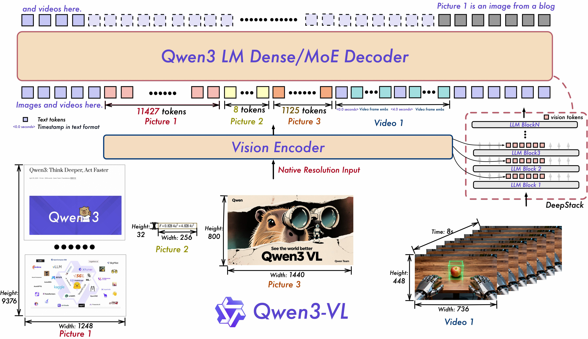

*图：技术报告 Figure 1。DeepStack 把中间视觉特征注入语言层；时间戳作为文本进入输入序列。 [原图与论文上下文](https://arxiv.org/html/2511.21631v1)*

**核心思想与贡献：** 视觉信息容易在单次投影后成为模型难以重新检查的条件。DeepStack 提供多层视觉证据，位置编码使远近空间与时间关系都有适当频率表示，文本时间戳让“相隔几秒”直接进入语言推理。这三项分别改变信息流、坐标表示和时间语义；长上下文训练则让它们在较长输入中真正发挥作用。

**模型结构：** 主干仍是 **动态 ViT → 2×2 Merger → Qwen3 Decoder**。默认视觉骨干为 SigLIP2-SO-400M，2B/4B 使用约 300M 的 Large。ViT 续训时引入动态网格、2D-RoPE 和插值绝对位置，使输入不必统一成固定正方形。两层 MLP 将相邻 2×2 特征合并为一个语言 token；若经过预处理的网格是 \(H_p\times W_p\)，忽略填充时，主视觉序列约有 \(H_pW_p/4\) 个 token。合并减少 LLM 计算，却仍需要先在 ViT 中编码这些 patch。[官方模型结构](https://arxiv.org/html/2511.21631v1#S2)

DeepStack 选择三个 ViT 层级，各自通过专用 Merger 对齐语言维度，然后加到 LLM 前三层相应视觉位置的隐藏状态。可用下式解释这个残差入口：

$$
h_{\mathrm{vis}}^{(\ell)}
\leftarrow h_{\mathrm{vis}}^{(\ell)}
+P_\ell\!\left(V^{(k_\ell)}\right),\qquad \ell=1,2,3.
$$

这是一种按论文数据流写出的示意式；\(P_\ell\) 包括对应投影。它让不同深度的视觉表示参与语言计算，不是在输入末尾追加三份图像 token，因而不增加序列长度。细节与高级语义能通过不同入口保留，收益还取决于视觉训练与跨层对齐质量。

Interleaved MRoPE 将时间、高度、宽度轴交错分配到低频和高频维度。早期连续分块可能让一个轴主要占据某段频率，长视频的位置表示因此不均衡；交错分配改善这个问题。视频每个 temporal patch 前插入可读时间，如“3.0 seconds”，训练同时使用秒和时分秒格式。序列顺序告诉模型先后，时间戳告诉模型间隔；仅知道第十帧，不足以判断它发生于第十秒还是第一分钟。[视频表示与接口](https://huggingface.co/Qwen/Qwen3-VL-235B-A22B-Thinking#key-enhancements)

定位输出使用 0–1000 归一化坐标，便于在不同分辨率间映射。GUI 动作、图片裁剪和代码执行仍由外部环境完成，模型读回工具图像继续生成；位置编码本身不能保证每个坐标都准确。原生 256K 与约 1M 外推应分开：扩大配置可以增加可接收长度，可靠跨页推理还需要长上下文验证。

以科学实验视频为例，画面可能先展示刻度，再展示设备位置，最后出现数值变化。ViT 识别局部物体和文字，跨层注入给语言端保留更丰富特征，MRoPE 表达空间与帧顺序，时间戳说明实际间隔。回答“变化发生在何时”需要后两者，回答“读数是多少”需要足够局部像素，回答“变化意味着什么”还依赖语言知识与推理。实际阅读时可沿着这条链检查误差出现在哪个环节。架构改进彼此配合，各模块的职责仍然不同。

**训练：** 预训练明确包含四阶段，只有初始连接器对齐冻结视觉端和 LLM。

| 阶段 | 可训练部分 | 数据 token 预算 | 序列长度 |
| --- | --- | ---: | ---: |
| S0 对齐 | Merger | 67B | 8,192 |
| S1 联合预训练 | 全参数 | 约 1T | 8,192 |
| S2 长上下文 | 全参数 | 约 1T | 32,768 |
| S3 超长适配 | 全参数 | 100B | 262,144 |

S0 学会把视觉特征送入既有语言空间；解冻后，视觉表示和语言使用方式共同调整。长阶段增加视频、文档与代理序列，并保留纯文本，避免视觉能力增长时削弱语言基础。平方根长度归一化改变样本对损失的贡献，缓解纯文本和多模态样本长度差异造成的偏置。[预训练阶段表](https://arxiv.org/html/2511.21631v1#S3)

数据不只是图片问答，还包括重描述图文、图文交错书籍、多语种 OCR、带布局的 HTML/Markdown、目标定位、3D 框、视觉代码和 GUI 交互。把多页文档直接连成训练序列，使答案需要引用远处页面；只把短问题填充到 256K 并不会教会跨页证据整合。视觉编程则让截图、源代码与渲染结果形成对应关系，模型学习从视觉目标提出可执行方案。[官方功能与训练概览](https://github.com/QwenLM/Qwen3-VL#introduction)

文档标注同时提供面向布局的 QwenVL-HTML 和面向阅读的 Markdown 表达：HTML 可含细粒度元素框，Markdown 主要定位图表等对象。前者帮助模型理解阅读顺序与区域，后者帮助生成可继续处理的文本。定位框和点的数据又支持计数与指代；从“识别对象”推进到“找出用户指的那个对象”，需要空间关系和文本条件共同参与监督。

后训练先进行指令与长 CoT SFT，并区分 Thinking 和非 Thinking 数据；SFT 从 32K 推进到 256K。强到弱蒸馏用于增强小模型的纯文本能力，不能据此宣称所有视觉标签都来自旗舰模型。推理 RL 用正确性反馈，通用 RL 提升对齐与交互。对于“Thinking with Images”，工具选择和最终答案都需要检验：若只奖励裁剪行为，模型可能频繁调用工具却没有改善答案；应让图像观察为任务成功服务。[后训练与视觉工具](https://arxiv.org/html/2511.21631v1#S4)

**效果：** 报告中旗舰 Thinking 的 MMStar 为 78.7；旗舰 Instruct 的 MMBench 英文/中文为 89.3/88.9，RealWorldQA 为 79.2。后续 Qwen3.5 官方对比表列出其 Thinking 的 MMMU 80.6、MathVista 85.8、MathVision 74.6、OmniDocBench 84.5。这里分别注明版本与来源，不能把不同模式最高分拼成某个单一检查点的成绩。[报告视觉评测](https://arxiv.org/html/2511.21631v1#S5)、[官方跨代对比](https://huggingface.co/Qwen/Qwen3.5-397B-A17B#evaluation)

比较版本时还应根据瓶颈选择任务。DeepStack 的消融主要检查多层视觉融合是否有效，视频定位检查时间表示，长上下文检索检查远处证据是否保留；某一数学分数不能单独证明三者全部改进。应用中可构建小型成组样本，例如同一张表以不同裁剪、分辨率和问题形式输入，观察识字、关系与计算各自是否稳定。这种按模块职责检查的方式能把论文设计与实际错误连接起来。

它的实际变化是从单图问答转向长文档、跨帧定位与视觉代理。输入像素上限、视频帧率、字幕、思考预算和工具权限都会改变结果；需要裁剪器的成绩也包含外部工具帮助。模型尺寸跨度较大，235B-A22B 的长推理成绩不能直接代表 8B，短响应场景则应同时检查 Instruct 的质量与延迟。

### Molmo2

**简介：** Ai2 于 2025 年 12 月发布 Molmo2，2026 年 1 月公开报告。家族包括基于 Qwen3 的 4B/8B，以及基于 OLMo3-7B 的 O-7B。它重点推进视频理解、时空指点与目标跟踪，并开放模型、训练代码及新数据，让研究者能追踪能力来自哪些监督。[发布介绍](https://allenai.org/blog/molmo2)、[训练仓库](https://github.com/allenai/molmo2)

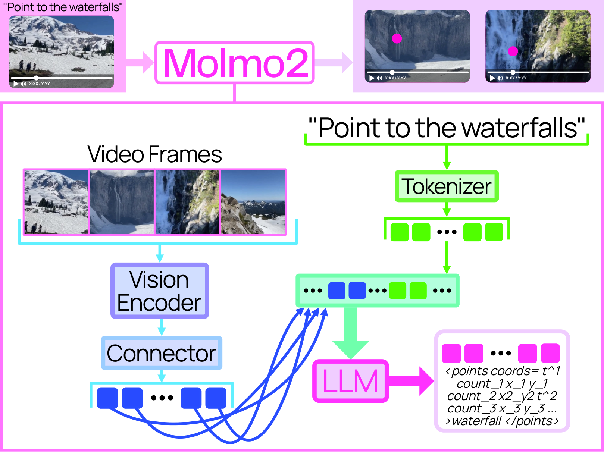

*图：论文模型示意。图片和视频共享视觉编码器，池化粒度不同；坐标、时间和对象编号作为文本生成。 [原图与论文上下文](https://arxiv.org/html/2601.10611v1)*

**核心思想与贡献：** 只会描述“有人走过房间”无法回答“哪一个人、什么时候、位于哪里”。Molmo2 将对象指点扩展到视频，使用人类标注的事件描述、问答、计数和轨迹，建立可检查的空间证据。它把多个同图问题组织为共享前缀的消息树，既增加训练问题数量，也避免重复编码同一视觉输入。

**模型结构：** 视觉端使用 SigLIP2-SO-400M、14 像素 patch，拼接选定中间层特征，再进行注意力池化与 MLP 投影。图片以 2×2 patch 为池化邻域，视频以 3×3 为邻域，共享池化参数。查询由邻域特征平均值构造，关注邻域中的关键信息；它与固定丢掉某些 patch 或直接平均成一个向量不同，仍允许内容决定聚合权重。[模型卡](https://huggingface.co/allenai/Molmo2-8B)

高分辨率图片同时保留缩小后的全图和有重叠的局部裁剪。训练通常限制到八个裁剪，推理可增到二十四；全图提供对象关系，裁剪保留小字和局部细节。裁剪数变化也改变视觉 token 与成本，推理增加裁剪不会无条件提升所有任务，特别是需要完整场景关系时不能丢掉全图。

视频采用较小的单帧表示，默认按 2 FPS 抽取，普通训练最多 128 帧，长阶段最多 384 帧。较长视频超过预算时均匀采样，并保留末帧。时间戳、帧起始标记、图像索引、网格列标记和可选字幕组织为序列，再送入语言模型；不同宽高的 patch 网格不会只靠一长串无标记向量表达。[视频输入设计](https://arxiv.org/html/2601.10611v1#S3)

视觉前缀内使用跨帧可见的注意力，回答保持自回归。前缀能联合比较先前和后续帧，适合视频理解；这不表示模型能在实时因果控制中提前看到未来，在线部署应按已经观测到的帧构建输入。输出包括归一化 \((x,y)\)、时间或图像索引与整数对象 ID。连续帧相同 ID 表示同一目标，使跟踪成为可训练的序列任务，而不是附带一句自然语言描述。

例如“指出拿杯子的人”可以对应多个带时间的位置；“跟踪左侧车辆”需要维持 ID 并按时间排列坐标。模型生成的是离散文本表示，若应用要求像素级掩码，需要额外分割模块或后处理，不能把指点坐标当成原生分割图。

时空输出的监督价值在于可逐项比对。自然语言说“车一直在左边”很难检查是否有一段跟错目标；带时间的位置序列可以分别评价点是否落在目标内、数量是否正确、ID 是否连贯。排序约束则把多个等价位置输出规范化，减少模型因排列不同受到不必要惩罚。这样的接口也便于后续应用：把坐标叠加到原帧、请求人工核验，或将某一时刻的点作为外部分割器提示。

**训练：** 团队新建七个视频数据集和两个多图数据集。视觉描述、问答与跟踪大量依赖人类标注，减少把闭源视觉模型输出直接当作训练事实的依赖；部分语言加工仍使用文本 LLM，SigLIP2 预训练语料也不是全部开放。开放程度应逐组件理解，而不是把所有上游数据统称为完全可复现。[数据发布](https://allenai.org/blog/molmo2)

预训练为 32K 步、batch 128，混合约 60% 图片描述、30% 指点、10% 纯文本，同时更新模型各模块并设置不同学习率。初始目标以语言 token 预测为主，学习如何从图像回答和生成坐标。随后 SFT 为 30K 步，最大序列 16,384，按数据集规模平方根混合，避免最大数据集淹没小但关键的定位任务。额外 2K 步长视频训练把长度提高至 36,864，并用上下文并行容纳更多帧。[公开训练流程](https://arxiv.org/html/2601.10611v1#S4)

损失权重随任务和回答长度变化：视频描述权重 0.1、视频指点 0.2，其他任务使用 \(4/\sqrt{L}\)。描述通常较长，若按原始 token 总和混合，长描述会占据过多梯度；长度调节帮助平衡。跟踪还加入首尾帧与从指定点开始的辅助任务，让模型学会目标的起止和身份保持。这里的关键增益来自数据与监督任务，不能额外宣称采用未报告的 GRPO 或 RL。

消息树把一组同视觉输入的问答共享前缀，各回答分支不能看到另一分支答案。若有 \(m\) 个问题，普通训练会将同一视频前缀重复 \(m\) 次；树式组织保留一份视觉条件，再建立隔离的回答分支。它主要节省重复计算、增加有效监督密度，推理仍可正常进行单轮或多轮对话。[训练优化与数据消融](https://arxiv.org/html/2601.10611v1#S4)

**效果：** Molmo2-8B 在视频指点基准 Molmo2-VP 上 F1 为 38.4，报告中的 Gemini 3 Pro 为 20.0；4B 为 39.9，说明小模型在专门监督下也可胜过更大模型。视频计数 Molmo2-VC 准确率为 35.5，所比较 Qwen3-VL 为 29.6；视频跟踪报告 \(\mathcal J\&\mathcal F\) 为 56.2，对照 Gemini 3 Pro 为 41.1。指点、计数、掩码跟踪指标分别评价不同输出，不能当作通用视频问答分数。[时空定位结果](https://arxiv.org/html/2601.10611v1#S5)

4B 在专门视频指点任务略高于 8B，并不说明小模型全面超过大模型；监督分布、训练收敛、采样和指标误差均可能影响单项结果。更有意义的是同类模型在通用问答与精细定位之间的差异：若任务要求可检查的位置，专门标注比仅增加语言容量更直接。选择数据开放的模型还可重新训练特定领域轨迹，例如仓储目标或实验器具，验证身份保持和数量监督的贡献。

视频指点默认使用 2 FPS、最多 384 帧，基线按报告说明适配坐标和帧输入。跟踪评测将预测点输入 SAM 2 转成掩码，报告的掩码指标包含这一外部处理；Molmo2 本身生成的是坐标轨迹。新视频训练样本约 9.19M，发布比较为 PLM 72.5M 的不到八分之一，但样本数量并不直接衡量 annotation 信息量。论文观察到较长、拥挤或重复对象视频仍容易出现身份切换，因此它适合研究细粒度 grounding，也仍需按任务评估采样密度和持续跟踪能力。[数据规模与局限](https://allenai.org/blog/molmo2)

### Kimi K2.5

**简介：** Moonshot AI 于 2026 年 1 月 27 日公开 Kimi K2.5，技术报告随后发表。模型约 1T 总参数、32B 每 token 激活，支持 256K 上下文，将图片、视频与文本联合输入，面向视觉推理、视觉编程和代理任务。Agent Swarm 是其外部调度能力，应与 MoE 计算和视觉骨干分开理解。[官方模型卡](https://huggingface.co/moonshotai/Kimi-K2.5)

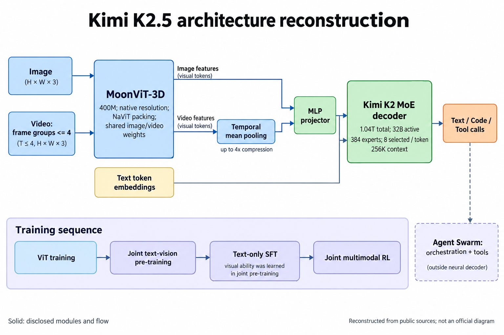

*图：依据技术报告 §4.2 和官方配置重建。实线表示已公开的视觉—语言数据流；外部 Agent Swarm 不属于单 token 的专家路由。*

**核心思想与贡献：** 大量视觉任务的终点是行动：读图后写网页，观察软件界面后完成流程，比较视频证据后调用工具。K2.5 因此强调图文从预训练起共同学习，并探索纯文本代理指令如何激活已经形成的视觉基础。训练让“观察—推理—调用—再观察”跨模态衔接，服务系统进一步把可并行子任务交给多个代理。

**模型结构：** 图片和视频由约 400M 的 MoonViT-3D 编码，视觉端从 SigLIP-SO 初始化，采用 NaViT 式 patch packing 接受可变尺寸输入。不同图片按网格组织并通过注意力边界区分，不必都缩为同一固定方图；图片细节预算由输入尺寸和 patch 数决定。[论文模型结构](https://arxiv.org/html/2602.02276v1#S4.SS2)

视频最多把连续四帧作为时空组，在编码过程中进行时空信息交互，然后对时间维池化，减少进入连接器的 token。MLP 将视觉表示映射到 Kimi K2 语言隐藏空间；语言骨干为大型 MoE，路由专家用于分摊语言侧参数计算。四帧时间池化对的是视觉输出，不能据此认为视频预处理与 ViT 成本也降为四分之一。

MoE 的典型数据流可以解释为：

$$
h' = E_{\mathrm{shared}}(h)
+\sum_{i\in\operatorname{TopK}(g(h))}w_iE_i(h).
$$

这里用于解释官方公开的共享/路由专家结构，不是额外的训练损失。视觉表示和文本一同经过语言层，路由器选择处理当前 token 的 FFN 专家；它不会为每张图自动建立数百个独立聊天代理。总参数决定权重存储，激活参数影响每 token 计算，两者都关系到部署成本，32B 激活不意味着模型只需加载 32B 权重。

模型原生生成文字、结构化工具参数和代码。GUI 执行或代码运行发生于外部环境，截图再回到 MoonViT；这个闭环使视觉编程能够检查渲染结果。输出网页截图不等于模型内有图片生成扩散网络，调用外部媒体工具也不能作为原生像素生成证据。

图片与视频共享参数尤其影响迁移：单图教会杯子的形状与文字，视频在同一表示空间学习移动和交互，不必通过两个独立视觉模型再对齐。时空组里的联合注意力保留短动作关系，时间池化再控制长度。对比“先抽少量独立帧再让 LLM 猜动作”，它在视觉编码过程中就能结合邻近时刻的信息；整段视频的长期事件关系仍主要由语言端处理。

**训练：** 视觉编码器先通过图片描述的自回归监督形成可用于生成的表示，再与较小 Moonlight-16B-A3B 对齐。后续短阶段只训练投影以接入 K2，然后开放视觉与语言参数共同学习约 15T 额外混合 token。中期从 4K 推进到 32K，再到 256K，长阶段分别约 500B 和 200B tokens，并采用 YaRN 等上下文适配。[训练流程](https://arxiv.org/html/2602.02276v1#S4.SS3)

这条流程与“把视觉编码器接上已完成训练的 LLM，只训练小投影”不同：前期对齐建立接口，后续大量联合训练让语言策略在视觉条件下重新学习。报告关于早期少量视觉混合与后期再大比例混合的实验支持早点引入视觉，但实验配比不能当作最终所有阶段的固定生产配方。

后训练的一个关键实验是 Zero-Vision SFT：仅用文本 SFT 数据也可增强视觉代理行为，因为预训练已经提供视觉识别与图文对应，SFT 强化的问题拆解、调用格式和操作策略可迁移到视觉任务。它证明某些行为能跨模态迁移，不能推出完全不需要视觉数据；随后联合视觉和文本 RL 继续优化实际任务结果。[跨模态训练与官方介绍](https://www.kimi.com/blog/kimi-k2-5.html)

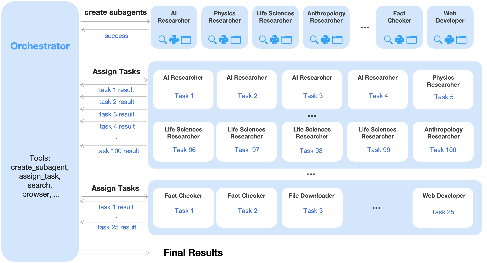

*图：论文 Figure 3 的 Agent Swarm。该图补充外部代理系统，骨干结构见上图。 [原图与论文上下文](https://arxiv.org/html/2602.02276v1)*

PARL 训练编排代理如何拆解任务、启动子代理与汇总结果；该阶段冻结子代理，主要训练 orchestrator。奖励考虑任务质量与关键路径成本，避免只靠增加代理数量获得虚假“并行”收益。关键路径由最慢的依赖链决定：十个独立网页可并行搜索，有前后依赖的代码步骤不能随意同时执行。官方系统支持最多 100 个子代理、约 1,500 次工具调用；这是系统上限，不能在架构图中画成 100 个新增神经网络层。[PARL 与 Swarm](https://arxiv.org/html/2602.02276v1#S3)

PARL 的资源约束可以写成报告定义的关键步数：

$$
S_{\mathrm{critical}}
=\sum_t\left(S_{\mathrm{main}}^{(t)}
+\max_i S_{\mathrm{sub},i}^{(t)}\right).
$$

同一阶段多个子代理同时工作，耗时近似由最长分支决定；下一阶段又等待依赖完成。训练前期以代理启动和子任务完成奖励鼓励探索，之后将辅助权重退火至零，使最终目标回到任务成功。它把“能开很多代理”与“能有效并行”区分开，也解释为何任务划分要兼顾负载和依赖。冻结子代理让编排者面对相对稳定的执行环境，把学习重点放在任务划分、资源分配与汇总，而不是同时改变每个子代理的行为。

**效果：** 报告列出 MMMU 84.3、MMMU-Pro 78.5、MathVista 90.1、MathVision 84.2、OCRBench 92.3、Video-MME 有字幕 87.4、Video-MMMU 86.6；OSWorld 63.3 则是多步计算机任务成功率。多个指标共同说明其从感知识别推进到复杂视觉推理，不能仅以参数规模解释。[视觉结果](https://arxiv.org/html/2602.02276v1#S4)

视觉数学分数上升可以来自更好的图形读取，也可能来自更强的语言推导；OCRBench 和图表理解因此提供补充证据。GUI 与视觉编程还要检查多轮反馈：模型第一次代码生成未必正确，但能否根据截图诊断尺寸、位置与样式差异，决定最终交付质量。报告同时考查多种输出和交互形式，比仅把视觉 token 接入大型 LLM 更完整地验证目标能力。

视觉问答设置通常最大输出 64K，并取多次运行平均；工具题有单独预算和环境。BrowseComp 在带上下文管理的单代理设置为 74.9，Agent Swarm 为 78.4；增益包含并行系统和额外执行资源，不是把相同单次预算下的模型能力直接提升到 78.4。复杂代理仍可能在某一截图理解、工具参数或长流程中出错，最终结果应按可观察环境状态验证。[工具评测与协议](https://github.com/MoonshotAI/Kimi-K2.5#evaluation)

### Qwen3.5

**简介：** Qwen3.5 自 2026 年 2 月开始发布，旗舰为 397B 总参数、17B 激活的 MoE，之后提供中小规模版本。它将视觉语言联合训练与混合注意力放在同一基础模型内，强调长上下文成本、代理能力与多语言覆盖。以下架构数字对应 397B-A17B；不同尺寸应查各自配置。[官方发布记录](https://github.com/QwenLM/Qwen3.8#news)、[397B 模型卡](https://huggingface.co/Qwen/Qwen3.5-397B-A17B)

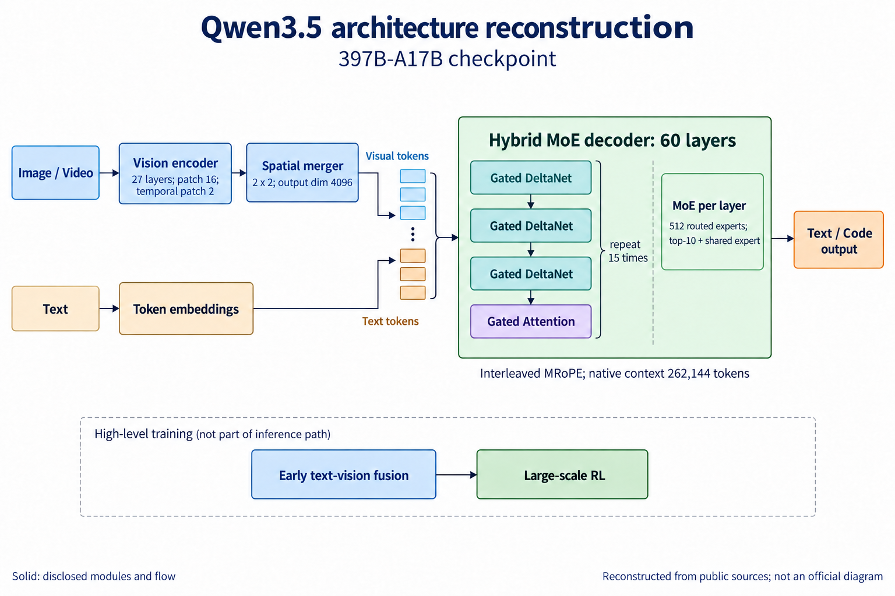

*图：依据官方配置、模型卡和 Transformers 实现重建，非论文原图。公开资料可以确认模块和层数，不能确认未披露的训练数据比例。*

**核心思想与贡献：** Qwen3-VL 已改善视觉表示，3.5 进一步改变语言骨干处理长序列的方式。大多数层用递归状态降低历史维护成本，少量完整注意力层保留直接访问上下文的能力；稀疏专家扩大容量而控制每 token 激活。原生早期图文融合让视觉参与基础训练，代理 RL 则强化任务完成。这些设计分别作用于推理资源、参数容量、跨模态学习和行为优化。

**模型结构：** 视觉端为 27 层 ViT，隐藏维度 1,152。入口以空间 patch 16、时间 patch 2 处理图像/帧，空间 2×2 合并后投影到语言维度 4,096。图片与视频的视觉表示连同文本进入统一解码器；MRoPE 配置采用交错轴分配。动态网格意味着语言输入长度随实际像素变化，不是每幅图固定同样数量的视觉 token。[公开完整配置](https://huggingface.co/Qwen/Qwen3.5-397B-A17B/raw/main/config.json)

从配置解释预算：若预处理后单图网格为 \(H_p\times W_p\)，合并后约有 \(H_pW_p/4\) tokens；视频还受到时间分组、采样帧数和附加文本影响。扩大输入像素增加读小字机会，也会同时增加 ViT 与 LLM prefill；混合注意力改善后者，不能消除前者。配置中的 DeepStack 层索引为空，因此本图不沿用 Qwen3-VL 的三层注入路径。

语言端 60 层组成 15 个单元，每个单元为三个 **Gated DeltaNet → MoE**，再一个 **Gated Attention → MoE**。Gated DeltaNet 用带门控的状态更新汇总前缀，通过新键值修正记忆，并让旧信息按门控衰减；它不保存每个历史 token 的完整 K/V。Gated Attention 则对显式历史进行查询，便于读取具体证据。前者形成紧凑持续记忆，后者保留直接检索，交替构成混合骨干。[官方结构说明](https://huggingface.co/Qwen/Qwen3.5-397B-A17B#model-overview)

完整注意力仍会产生随长度增长的缓存，不能因为四分之三层是线性注意力，就把全模型写成恒定内存。长文档任务中，递归记忆可以持续整合段落趋势，完整注意力帮助重新访问某页数字；两条机制承担互补作用。实际吞吐还受到状态更新 kernel、注意力 kernel、MoE 通信、batch 和输出长度影响。

每层 MoE 有 512 个路由专家，每 token 选择 10 个，再加一个共享专家。共享路径提供共用变换，稀疏路径按 token 选择不同容量；路由处理的是融合后的语言隐藏状态，不能解释为“十个视觉专家分别看十张图片”。低激活量减少计算，但全部专家权重仍需存储或分布部署。模型还训练多步 MTP；这提供预测后续 token 的辅助机制，是否用于推理加速取决于服务端实现。

原生上下文为 262,144，可经外推配置到约 1,010,000；托管 Qwen3.5-Plus 默认 1M 并含工具功能。原生权重、外推设置和托管产品应分别理解：接口默认值不等于下载权重在所有任务都经过同样长度训练，也不证明长文档准确率在长度增加时保持不变。

**训练：** 官方确认早期融合的多模态预训练和后训练，并提出扩大 RL 环境规模。视觉 token 在基础学习早期与文本共存，让语言参数在视觉条件下形成任务分布；它不是仅在训练完成后为纯文本模型添加一个视觉接口。一个通用条件目标为：

$$
\mathcal L_{\mathrm{NTP}}
=-\sum_{t\in\mathcal T}
\log p_\theta(y_t\mid y_{<t},V),
$$

\(\mathcal T\) 表示受监督的文本位置。该式解释视觉语言 next-token 学习，不代表官方披露了全部 mask、权重或采样配比。视觉输入作为条件，语言生成受到监督；理解图片并不要求模型逐像素生成同一图片。[官方训练概览](https://huggingface.co/docs/transformers/model_doc/qwen3_5)

联合训练需要同时维持感知、知识和指令能力。OCR 让字符与视觉布局对应，图文交错样本让文本解释图表，多步代理轨迹让截图、动作和反馈相互约束。官方尚未给出 3.5 的完整阶段 token 表、冻结/解冻日程及数据清单，因此不把 Qwen3-VL 的 67B 对齐和两次 1T 训练表当作 3.5 的配方。可以确认的“早期融合”与可核查的后训练能力，足以解释设计方向；具体训练实现仍应留给公开证据。

RL 描述强调大量代理环境和逐渐复杂的任务分布。环境奖励的作用是评价实际结果：代码是否通过测试，网页是否达到目标布局，工具是否完成用户要求。图像里的按钮位置只是中间信息，最终操作成功还取决于执行顺序与状态变化。长轨迹带来延迟与环境资源压力，官方提出异步 RL 基础设施；公开资料未给出可照搬的 GRPO/PPO 公式、奖励权重或各能力冻结范围。[官方训练与代理说明](https://huggingface.co/Qwen/Qwen3.5-397B-A17B#qwen35-highlights)

201 种语言和方言覆盖是另一方向。多语种视觉任务既要认出字形，也要理解对应语言和版式；纯文本多语能力不能代替 OCR，单个英文图片分数也不能代表所有语言。实践评估可同时使用目标语言文档、表格和图表，检查模型是否把视觉识别与语言知识组合起来。

从方法上看，这一代把容量、输入成本和代理反馈一起考虑。视觉编码继续保留动态细节，语言混合层减少长序列负担，稀疏专家扩展可用容量，环境奖励检查执行结果；任何单项模块都不足以解释最终分数。因此性能比较应注明具体尺寸，并同时观察感知、推理、工具和成本。

**效果：** 官方同表对比中，3.5-397B-A17B 相对 Qwen3-VL-235B-A22B 的变化如下：

| 基准 | Qwen3-VL-235B-A22B | Qwen3.5-397B-A17B |
| --- | ---: | ---: |
| MMMU | 80.6 | 85.0 |
| MMMU-Pro | 69.3 | 79.0 |
| MathVision | 74.6 | 88.6 |
| MathVista mini | 85.8 | 90.3 |
| OmniDocBench 1.5 | 84.5 | 90.8 |
| OCRBench | 87.5 | 93.1 |
| Video-MME，有字幕 | 83.8 | 87.5 |
| Video-MME，无字幕 | 79.0 | 83.7 |

数学视觉和文档提升较大，视频有字幕与无字幕都应保留，避免字幕提供额外信息后误认为纯视觉能力同幅增长。Video-MMMU 为 84.7，OSWorld-Verified 为 62.2，它们仍不能与只做一次问答的准确率直接平均。[完整视觉评测表](https://huggingface.co/Qwen/Qwen3.5-397B-A17B#vision-language)

搜索代理成绩还受上下文管理影响：同模型 BrowseComp 在简单折叠和 discard-all 策略下分别为 69.0 和 78.6。这个实例说明骨干、工具和管理策略共同形成代理结果。选择模型时应同步固定思考开关、像素预算、上下文策略与工具资源，并测 prefill 和输出阶段；“17B 激活”不是跨硬件的统一延迟保证。

### Qwen3.6

**简介：** [Qwen3.6-35B-A3B](https://huggingface.co/Qwen/Qwen3.6-35B-A3B) 于 2026 年 4 月开放权重，延续 Qwen3.5 的原生视觉语言架构，以 35B 总参数、每 token 约 3B 激活参数承担图像、视频、代码和工具使用任务。它的变化尤其体现在多步编码和前端工作流：模型需要读懂需求、修改仓库、调用工具，并根据文本或截图反馈继续修正。这里以公开资料最完整的 35B-A3B 为例，不能把同系列稠密 27B 的层数与专家配置混入本节。[官方发布仓库](https://github.com/AlibabaCloud-Official/Qwen3.6)

**核心思想与贡献：**

1. **混合注意力承担长上下文。** 大部分层采用 Gated DeltaNet，以递归状态保存历史信息；间隔出现的门控全注意力层保留按内容检索完整上下文的能力。这样，长截图序列、代码和工具记录可以共用语言骨干。
2. **MoE 降低每步激活量。** 每层从较大的专家库中选择少量专家，兼顾知识容量与计算成本。3B 激活量表示本次前向实际调用的参数规模，完整权重的存储需求仍取决于 35B 总参数。
3. **延续推理上下文。** Thinking Preservation 允许在多轮工具交互中保留历史推理，帮助模型接着已有计划工作。它属于对话模板与上下文管理机制，不能画成额外神经网络层。

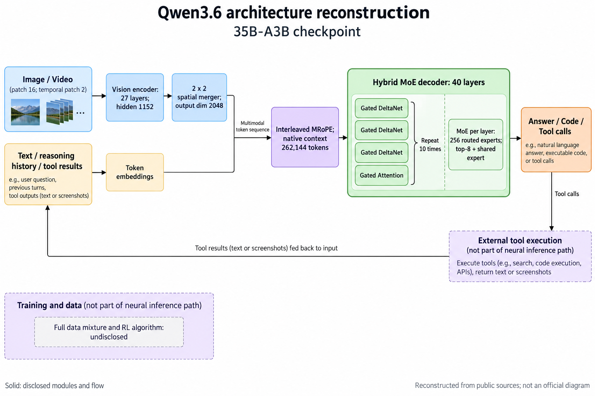

*图：依据 [官方 config](https://huggingface.co/Qwen/Qwen3.6-35B-A3B/raw/main/config.json) 与模型卡重建的结构示意，并非论文原图。工具执行及历史处理位于模型骨干之外；下方回线简写系统反馈，文字结果进入文本上下文，截图经上方视觉编码器，不是把像素送入文字嵌入。*

**模型结构：**

视觉入口是 27 层、隐藏维度 1152、16 个注意力头的 ViT。图像使用 16×16 空间 patch；视频配置的 temporal patch size 为 2，将相邻帧作为时空 patch 输入。编码后，2×2 空间 Merger 把四个相邻特征合成一个视觉 token，并投影到语言模型的 2048 维隐藏空间。只看空间维度，若进入合并器前有 $N$ 个 patch，输出约为 $N/4$ 个视觉 token；视频总预算还取决于抽帧数量和时空分块。

图像、视频特征替换相应占位 token，与文本 embedding 构成统一序列。配置采用 interleaved MRoPE，时间、高度、宽度位置分组为 11、11、10，使视觉位置与文本顺序进入同一位置编码体系。该版本的 DeepStack 列表为空，因此图中只画末端视觉特征接入，不额外添加 Qwen3-VL 的多层视觉注入支路。

语言骨干共 40 层，按十组“3 层 Gated DeltaNet + 1 层 Gated Attention”排列，每个注意力模块后接 MoE。DeltaNet 配置为 16 个 key head、32 个 value head，维度均为 128；全注意力使用 16 个 query head、2 个 KV head，head dimension 为 256。每层有 256 个路由专家，每 token 选择 8 个，另有一个共享专家；路由专家与共享专家的中间维度均为 512。稀疏专家负责按 token 分配计算，混合注意力负责历史信息访问，两者是不同维度的设计。

可以从一次屏幕任务理解三种压缩：空间 Merger 减少送进语言模型的图像 token；DeltaNet 把已读上下文写入固定形状的状态；MoE 让当前 token 只计算部分专家。第一种影响可见细节的表达密度，第二种改变历史保存方式，第三种改变 FFN 的激活成本。它们没有把原始图像简单替换成一句描述，因此模型仍可依据局部视觉特征定位对象；但细小字符能否读清也取决于预处理后的 patch 数量。

输出仍是自回归文本、代码或工具调用。工具返回的测试结果、网页截图再次作为输入，形成“观察—行动—反馈—修正”的外部循环。原生上下文为 262,144 token，模型卡列出的外推长度可达约 1.01M；长度外推需要相应推理配置，不能由此推出所有长视频任务都保持短输入精度。[结构与长度配置](https://huggingface.co/Qwen/Qwen3.6-35B-A3B/raw/main/config.json)

**训练：**

官方把该权重标为经过预训练和后训练的模型，并明确它建立在 Qwen3.5 架构之上，发布重点是编码可靠性、前端生成和仓库工作流。理解训练目标时，应分别看基础生成能力、多个未来 token 的预测能力和交互任务能力。

基础视觉语言生成可用条件自回归目标表示：

$$
\mathcal L_{\mathrm{AR}}
=-\sum_t \log p_\theta(y_t\mid y_{<t},x_{\mathrm{text}},x_{\mathrm{vision}}).
$$

这是解释其因果生成机制的通用写法：图像特征作为条件，目标是描述、解题或代码序列，不能把图像占位符当成需要模型复原的像素。模型卡还明确 MTP 采用多步预测训练，config 保留一个 MTP 隐藏层，使训练信号覆盖后续位置，并为推测解码提供基础。MTP 不负责压缩视觉 token，也不意味着服务端一定启用了同样的解码策略。

MoE 配置给出路由辅助损失系数 0.001，这说明实现具有专家负载约束的接口；完整训练是否还加入其他路由稳定化项，需要以训练报告为准。发布资料没有逐阶段数据数量、视觉模块冻结表和具体 RL 算法，因而不能直接套用 Qwen3 的四阶段后训练流程。已公开的后训练方向是让模型在代码修改、工具反馈和多轮推理中完成完整任务，评测也相应从短答扩展到仓库级与终端级任务。[训练与 MTP 说明](https://huggingface.co/Qwen/Qwen3.6-35B-A3B)

在学习机制上，生成损失首先让视觉和文本特征支持正确的下一步输出；MTP 要求中间表示对更远的后续位置也具有预测价值；专家路由则分配每个 token 的 FFN 计算。三者共同优化同一骨干，却不会自动产生外部工具反馈。反馈是否进入下一轮取决于训练样本和执行循环如何组织，因此编码代理的可靠性需要通过真正运行测试来衡量，不能只凭预训练困惑度判断。

**效果：**

同一官方模型卡中，Qwen3.6-35B-A3B 与 Qwen3.5-35B-A3B 的对比如下。分数按模型卡口径列示，均为越高越好；其中 OmniDocBench 的发布得分不应与其他报告中的原始错误率直接混用。

| 基准 | Qwen3.5-35B-A3B | Qwen3.6-35B-A3B |
|---|---:|---:|
| SWE-bench Verified | 70.0 | 73.4 |
| SWE-bench Multilingual | 60.3 | 67.2 |
| Terminal-Bench 2.0 | 40.5 | 51.5 |
| NL2Repo | 20.5 | 29.4 |
| MMMU | 81.4 | 81.7 |
| RealWorldQA | 84.1 | 85.3 |
| OmniDocBench 1.5 | 89.3 | 89.9 |
| RefCOCO 平均 | 89.2 | 92.0 |
| ODInW13 | 42.6 | 50.8 |
| VideoMMMU | 80.4 | 83.7 |

改进幅度最大的部分是长流程编码、定位和检测，通用视觉学科问答的提升较小。Video-MME 有字幕/无字幕分别为 86.6/82.5，与对应前代相同；MVBench 从 74.8 到 74.6，也提示更新并非所有视觉任务同时上升。

更细分地看，MMBench 英文 DEV v1.1 从 91.5 到 92.8，HallusionBench 从 67.9 到 69.8，CC-OCR 从 80.7 到 81.9，分别对应通用视觉问答、幻觉控制和字符识别。MathVista mini 从 86.2 到 86.4，说明该版本保留视觉数学能力，但发布重点带来的主要增量更集中在任务执行。LiveCodeBench v6 从 74.6 到 80.4 则是独立的代码解题改善，不能当作截图理解成绩。[分项结果](https://huggingface.co/Qwen/Qwen3.6-35B-A3B#benchmark-results)

条件同样重要：SWE 系列使用官方内部 bash/file-edit scaffold；Terminal-Bench 2.0 使用 Harbor/Terminus 2，3 小时超时、32 CPU 与 48GB 内存，temperature=1、top_p=0.95、最高 80K 输出和 256K 上下文，平均五次运行。QwenWebBench 的 Elo 从 978 到 1397 属于官方内部前端测试，采用自动渲染、模型裁判和 Bradley–Terry 统计，不能当作公共用户偏好榜。[完整指标与评测设置](https://huggingface.co/Qwen/Qwen3.6-35B-A3B#benchmark-results)

### Qwen3.8-27B

**简介：** [Qwen3.8-27B](https://huggingface.co/Qwen/Qwen3.8-27B) 延续 Qwen3.5 基础架构，以原生图像、视频输入支持软件工程、办公与长流程代理任务。它的代表性场景从“回答这张图里的问题”延伸为“观察应用、修改实现、再观察结果”，使视觉信息成为行动依据和检查依据。官方开放的这个 27B 权重是稠密视觉语言模型；同系列 [Qwen3.8-2.4T-A95B 的 config](https://huggingface.co/Qwen/Qwen3.8-2.4T-A95B/raw/main/config.json) 只有文本配置，因此本节不把 2.4T 参数和 95B 激活量当作视觉版本的结构。[官方仓库](https://github.com/AlibabaCloud-Official/Qwen3.8-27B)

**核心思想与贡献：**

1. **视觉与工具执行共同参与任务。** 同一个模型能够读截图、生成代码或操作指令，并把工具返回的截图和结果用于下一轮判断。
2. **稠密 FFN 与混合注意力配合。** 全部 token 使用相同 FFN 参数，注意力部分则在 DeltaNet 状态更新和门控全注意力之间交替，提供长上下文计算与细节检索的互补性。
3. **可控推理与历史保留。** 默认开启 thinking，可按请求关闭或用 reasoning_effort 调整深度；preserve_thinking 让多轮任务保留历史推理，以减少重复规划。

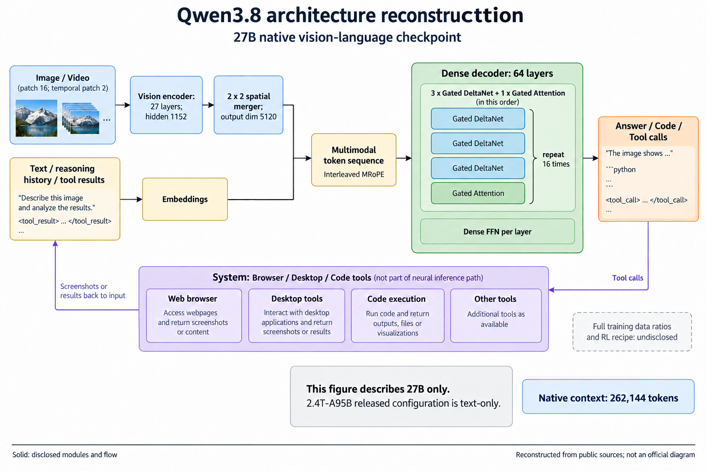

*图：依据 [27B config](https://huggingface.co/Qwen/Qwen3.8-27B/raw/main/config.json) 和模型卡重建，非论文原图，仅对应该原生视觉语言权重。工具回线表示系统回注的简化：文字结果进入文本上下文，截图经上方视觉支路，再与文字表示合流。*

**模型结构：**

视觉模块为 27 层 ViT，hidden size 1152、16 个注意力头，采用 16×16 空间 patch 与 temporal patch size 2。末端空间 Merger 以 2×2 区域聚合，输出 5120 维特征，与语言 embedding 宽度一致。对单幅图像，空间合并使 token 数约缩为四分之一；视频则将多个时空片段的结果送入同一序列，抽帧和分辨率仍决定最终 token 数。

配置中的图像、视频起止标记和占位 token 让模型区分文本与视觉内容；interleaved MRoPE 负责把时空位置纳入注意力的位置关系。DeepStack 配置为空，公开结构没有多层视觉特征注入路径。输入可同时包含用户指令、屏幕图像、工具调用记录和历史推理，输出端使用语言头生成文本、代码与工具调用；截图执行器和浏览器是外部系统组件，不是 27B 网络内部模块。[视觉与位置配置](https://huggingface.co/Qwen/Qwen3.8-27B/raw/main/config.json)

例如截图到网页的工作流，第一轮可以从视觉特征提取布局、字号和组件关系，再产生 HTML/CSS；渲染工具返回第二张截图，模型把它与任务要求结合判断差异，继续输出补丁。每轮真正进入模型的都是文本和视觉 embedding，浏览器如何执行、是否允许访问网络则由 scaffold 决定。因此能够读图不自动等于能够成功操作，后者还需要动作选择和对反馈的持续利用。

语言模型隐藏维度为 5120，共 64 层，即 16 组“3×Gated DeltaNet→FFN + 1×Gated Attention→FFN”。DeltaNet 使用 16 个 QK head、48 个 value head，head dimension 为 128；全注意力有 24 个 query head、4 个 KV head，head dimension 为 256。FFN 中间维度为 17,408，词表填充后为 248,320。这里没有 MoE 路由选择，不能以“少量激活专家”解释它的推理成本。

连续的 DeltaNet 层把历史压入状态，间隔的全注意力层保留直接检查上下文位置的机会；这有助于理解它为何适合长仓库和多轮反馈，但具体速度依赖 kernels、序列长度和硬件。原生长度为 262,144 token，官方仓库说明可经 YaRN 扩到 1M。后者是长度扩展能力，不等于每个具体服务当前都提供相同窗口，也不等于完整视觉细节在无限帧数下不受损。[官方长度说明](https://github.com/AlibabaCloud-Official/Qwen3.8-27B)

**训练：**

模型卡明确列出预训练与后训练，以及“multiple steps”MTP 训练；config 的 MTP 隐藏层数为 1。预训练负责建立文本与视觉的共同表示和因果生成能力，MTP 为后续多个位置添加预测信号。用于解释这种训练的通用分解是

$$
\mathcal L=\mathcal L_{\mathrm{AR}}
+\lambda_{\mathrm{MTP}}\sum_{j=1}^{K}\mathcal L_{\mathrm{future},j},
$$

其中第二项表示未来位置预测，而 $K$ 与权重的精确取值需以训练报告为准；该式不构成官方完整损失函数。公开模型卡未给出视觉预训练 token 总量、SFT 配比、逐阶段冻结表或所用 RL 算法，不能把同系列其他版本的论文配方直接移植到 27B。

可以确认的后训练目标是提高自主计划、利用环境反馈和端到端完成任务的可靠性，并同时强化编码、专业工作与研究任务。视觉工具循环中的学习问题也更明确：对界面任务，答案既包括“当前画面是什么”，也包括“下一步操作后是否达到目标”；对截图到网页任务，生成代码还需要被渲染并检查。前者和后者分别在电脑使用、视觉开发评测中接受验证。它们是对已公布能力目标和输入输出关系的解释，不能由此推断官方一定采用了某种固定奖励函数。

推理模式与训练模式还需分开：关闭 thinking 改变生成行为，reasoning_effort 调整推理预算，preserve_thinking 调整历史内容；这些运行设置不是额外训练阶段。复现榜单必须保留对应模式、上下文和工具 scaffold，否则同一个模型也可能得到不同结果。[训练与推理控制说明](https://huggingface.co/Qwen/Qwen3.8-27B)

与稀疏专家版本相比，27B 的 FFN 更新覆盖固定稠密参数集合，而每轮收到的视觉 token 数会随输入改变。训练需要让同一模型处理纯文本、图文和视频条件；推理时的实际开销也受这些模态组合影响。公开结果同时报告无工具视觉推理与视觉代理任务，有助于分清模型感知、推理和执行系统各自贡献。

**效果：**

官方模型卡以 Qwen3.6-27B 为同尺寸前代对照，主要视觉成绩如下；CI 表示代码解释器辅助，不能把带工具和不带工具的成绩混成一项。

| 基准/条件 | Qwen3.6-27B | Qwen3.8-27B |
|---|---:|---:|
| OSWorld-Verified | 63.9 | 84.3 |
| WebArena-Verified | 48.8 | 64.8 |
| AndroidWorld | 70.3 | 81.9 |
| SWE-MM | 25.7 | 38.6 |
| Vision2Web | 45.0 | 62.9 |
| MathVision，不使用 CI | 85.1 | 90.0 |
| BabyVision，不使用 CI | 28.9 | 65.7 |
| CharXiv RQ，不使用 CI | 78.4 | 83.7 |
| OmniDocBench 1.5 | 89.4 | 91.1 |
| RealWorldQA | 84.1 | 85.9 |

Qwen3.8-27B 使用 CI 时，MathVision、BabyVision、CharXiv RQ 分别为 94.6、85.6、90.2；这些提高同时包含工具带来的计算和视觉处理能力。ClawEval-MM 列出的 57.4 是 Pass@3，56.9 才是三次的平均得分，指标含义不同。模型卡还报告 Terminal-Bench 2.1 从 63.4 到 73.0、SWE-bench Pro 从 53.5 到 61.7，使视觉观察与软件工程进步形成互补。

长流程应用复刻的 RecreationBench 从 29.8 到 47.1，覆盖 Ubuntu、macOS、Windows、Android 和网页五类平台；它属于官方内部任务集合。ERQA 从 62.5 到 65.5，对应具身环境的视觉判断。办公 CoWorkBench 从 61.0 到 70.7，专业任务 JobBench 从 21.8 到 33.4，进一步反映工具任务的进步；这些结果与单张图问答分属不同测量对象，适合分别观察，而不合成一个没有定义的“多模态总分”。[分项与任务定义](https://huggingface.co/Qwen/Qwen3.8-27B#benchmark-results)

评测采用的设置并不完全统一：WebArena 用官方 grader 和 OSWorld scaffold；Vision2Web 在 Claude Code 中执行，对前端、网页与网站三类取平均，由指定的 gpt-5.4 版本裁判；SWE-MM 使用公开 dev split 与文档所述修订。MathVision 和 CharXiv 的部分错误标注经人工修正，MathVision 对 27B 使用固定逐步推理及 boxed 答案提示。QwenSWEBench 属于内部基准，且是 avg@3、8 小时超时；因此该发布表最适合在同一评测条件下观察前代变化。[完整结果与条件](https://huggingface.co/Qwen/Qwen3.8-27B#vl-performance)

### MiniCPM-V 4.6

**简介：** [MiniCPM-V 4.6](https://huggingface.co/openbmb/MiniCPM-V-4.6) 以 SigLIP2-400M 和 Qwen3.5-0.8B 为基础，面向手机等边端设备提供单图、多图与视频理解。与以往只在 ViT 之后缩短视觉序列的方式相比，它把一部分压缩提前到视觉编码器中间，使后续视觉层也减少计算；同时提供 4×和 16×两条路径，让精度与效率可以按任务切换。它借鉴 [LLaVA-UHD v4](https://arxiv.org/abs/2605.08985) 的方法，但语言骨干和发布规模不同，不能把论文的 Qwen3-8B 实验结果直接写成 MiniCPM-V 4.6 的得分。

官方评测表将整体模型规模列为 **1.3B**，其中还包含视觉连接与内部压缩模块；不能仅把两个骨干名称中的约数相加后当成完整参数统计。

**核心思想与贡献：**

1. **ViT 内提前压缩。** 对视觉 token 的削减发生在浅层之后，后面的多数 ViT 层处理较短序列，既减轻视觉编码，也减轻语言模型输入负担。
2. **先局部交互，再空间合并。** 内部 Merger 先让同一 2×2 窗口内的 patch 交换信息，再拼接和融合特征，降低简单平均池化对细节的破坏。
3. **同一模型提供两档预算。** 4×保留更多视觉 token，16×走完整压缩链；它们是视觉 token 压缩倍率，不是端到端速度的固定倍数。

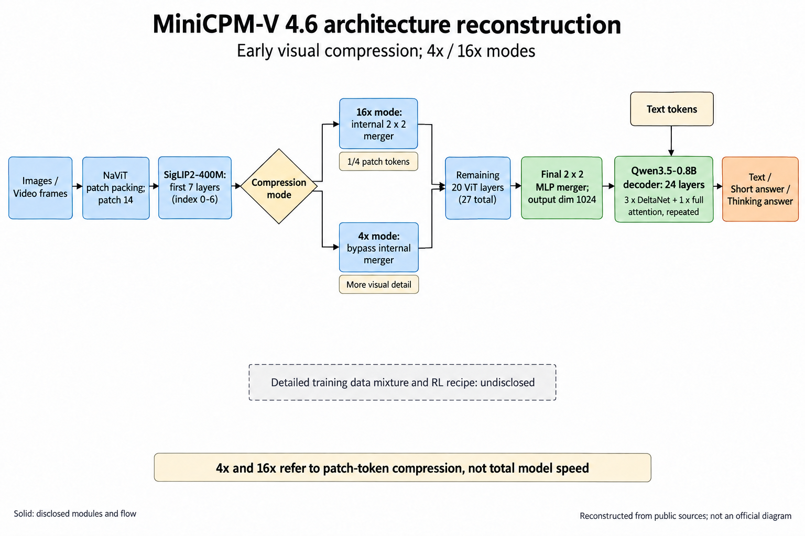

*图：依据 [官方 config](https://huggingface.co/openbmb/MiniCPM-V-4.6/raw/main/config.json) 与 [Transformers 实现](https://raw.githubusercontent.com/huggingface/transformers/main/src/transformers/models/minicpmv4_6/modeling_minicpmv4_6.py) 重建，非论文原图。编码器层号按代码索引计数，压缩发生在 index=6 后，即前七层之后。*

**模型结构：**

图像与视频帧以 NaViT 格式打包 patch，并记录各视觉单元的高宽。SigLIP2 视觉编码器共有 27 层，隐藏维度 1152、16 个注意力头，patch size 为 14。不同视觉单元分别由序列边界和尺寸信息管理，避免把不同图片的 patch 无条件混成一张图。

在 16×模式下，先运行 index 0—6 的七层编码，再经过窗口注意力 Merger。设局部输入为 $X\in\mathbb R^{N\times d}$，先作非重叠 2×2 窗口注意力，再把四个 token 拼成 $N/4\times4d$ 特征，经过归一化与两层 MLP 映回 $d$ 维；实现还加入相应窗口平均的残差。此时剩余二十层处理原来四分之一的 token。ViT 末端的第二个 2×2 MLP Merger 再缩四倍，并投影到 1024 维语言空间，最终约为 $N/16$ 个视觉 token。

4×模式跳过内部 Merger，让全部 27 层仍处理较密的视觉序列，只执行末端四倍空间合并，输出约 $N/4$ token。因此它保留的视觉 token 是 16×模式的四倍，而视觉编码器计算不会相应变成简单四倍。两条路径共享主体权重，区别在调用时的 downsample_mode。

语言端是 24 层 Qwen3.5-0.8B，hidden size 1024，每四层包含三层线性注意力和一层全注意力，FFN 中间维度 3584。视觉特征替换图像或视频占位 embedding 后进入语言模型，最终生成文本。视频帧重新打包后调用同一视觉特征提取路径；这里不能沿用 MiniCPM-V 4.5 的 3D-Resampler 图，也没有公开证据表明它增加独立音频生成模块。[可执行结构与两档切换](https://raw.githubusercontent.com/huggingface/transformers/main/src/transformers/models/minicpmv4_6/modeling_minicpmv4_6.py)

**训练：**

这项设计的训练难点是：已预训练的 ViT 原来接收较密序列，突然在中间删掉四分之三 token，后续层的输入分布会改变。LLaVA-UHD v4 方法论文通过复用邻近 ViT 层参数初始化窗口注意力和融合 MLP，使新模块从已有视觉表示附近开始优化。其论文还比较了平均池化、随机 MLP、局部交叉注意力等方案，说明“压缩发生在哪”和“压缩前是否完成局部交互”均影响精度。

方法论文介绍四阶段训练：图文对齐、OCR/文档/图表知识注入、交错图文序列训练，以及综合 VQA、数学和对话的监督指令微调。对齐阶段首先让压缩后视觉表征能够被语言模型使用；知识注入强化小字与结构信息；交错训练让多个视觉单元共同参与上下文；指令阶段统一任务输出。论文附录的后两阶段为全模型更新，但这些具体冻结和数据规模描述属于该方法实验，不是 4.6 官方已经逐项公开的配方。[方法训练与消融](https://arxiv.org/html/2605.08985v1#S4.SS1)

MiniCPM-V 4.6 的公开实现提供带 labels 的因果语言损失接口，支持图像或视频条件下的 token 监督。其通用目标可写为 $-\sum_{t\in\mathcal A}\log p_\theta(y_t\mid y_{<t},V)$，其中 $\mathcal A$ 为需要监督的回答位置；训练数据可以对提示位置设置忽略标签。该式解释接口如何学习条件回答，不能据此声称发布训练采用了未公开的 RL 或蒸馏算法。官方确认混合 4×/16×压缩和 Instruct/Thinking 两种评测行为，但没有完整披露每档训练混合概率、逐阶段样本量和后训练算法。[模型卡与训练接口](https://huggingface.co/openbmb/MiniCPM-V-4.6)

**效果：**

官方报告 Artificial Analysis Intelligence Index 为 13，对照 Qwen3.5-0.8B 为 10、其 Thinking 版本为 11，Ministral 3 3B 为 11。对应发布比较中，4.6 的生成 token 成本分别少约 19 倍、43 倍；这是指定综合测试中的输出成本比较，不能解读为任意问题都会少生成同样倍率的 token。

在视觉侧，官方评测覆盖 OpenCompass、RefCOCO、HallusionBench、MUIRBench 和 OCRBench，报告多个任务达到 Qwen3.5-2B 水平。视觉编码 FLOPs 减少超过 50%，对 Qwen3.5-0.8B 的 token throughput 约为 1.5 倍。吞吐和首 token 时延是不同指标：前者看持续生成/批处理效率，后者还受图像编码与 prefill 影响，压缩位置的收益会随输入视觉量和并发改变。[官方评测图与说明](https://huggingface.co/openbmb/MiniCPM-V-4.6#evaluation)

以下摘录官方 **Instruct 模式**结果，来源同时包括公开报告和对官方 checkpoint 的本地评测。OCRBench 使用原始得分，其余项目按发布表口径；两档压缩必须分别保留。

| 基准 | Qwen3.5-0.8B | MiniCPM-V 4.6，4× | MiniCPM-V 4.6，16× |
|---|---:|---:|---:|
| MMBench EN v1.1 | 68.0 | 82.2 | 80.9 |
| MathVista | 58.6 | 75.5 | 73.4 |
| OCRBench | 791 | 838 | 824 |
| OmniDocBench 1.5 | 70.6 | 84.6 | 82.4 |
| RefCOCO | 77.8 | 86.7 | 84.0 |
| MUIRBench | 41.8 | 60.2 | 60.0 |
| HallusionBench | 46.7 | 58.1 | 55.2 |
| Video-MME，无字幕 | 48.9 | 59.7 | 59.3 |

4×通常在精细感知上更高，16×仍保留相当部分能力；但 MMMU 的 16×为 53.6、4×为 52.6，说明压缩与评分并非严格单调。Thinking 模式又是另一组结果，MathVista 为 75.6/75.0，OCRBench 为 857/831，不能取两张表各项最高值拼成一个统一配置。[Instruct 原表](https://raw.githubusercontent.com/openbmb/MiniCPM-V/main/assets/minicpmv4.6/instruct.png)、[Thinking 原表](https://raw.githubusercontent.com/openbmb/MiniCPM-V/main/assets/minicpmv4.6/thinking.png)

官方高并发测试图把这种收益具体化：固定 1344×1344 输入图像、256 个同时请求，调度器达到 KV cache 预算上限，在 RTX 4090 上用 vLLM，4.6 采用默认 16×压缩，平均三次运行。

| 输出长度 | Qwen3.5-0.8B，总 token/s | MiniCPM-V 4.6，总 token/s | 对应 prefill 图像/s，前者→后者 |
|---|---:|---:|---:|
| 50 | 461 | 756 | 10.5→14.8 |
| 100 | 931 | 1425 | 9.2→15.1 |
| 200 | 1906 | 2624 | 9.3→14.3 |

因此“约 1.5 倍”来自具体负载，而非对任意手机的保证。单请求 TTFT 图也使用 RTX 4090/vLLM/16×，显示输入从 448² 增至 3136² 时，高分辨率区间的差距逐渐扩大；这与后续 ViT 层提前缩短序列的结构一致。两张图分别观察并发吞吐与首 token 等待，不能互换。[吞吐条件原图](https://raw.githubusercontent.com/openbmb/MiniCPM-V/main/assets/minicpmv4.6/throughput.png)、[TTFT 原图](https://raw.githubusercontent.com/openbmb/MiniCPM-V/main/assets/minicpmv4.6/ttft.png)

方法论文提供了更严格的机制对照：相同 SigLIP2、Qwen3-8B、训练设置和最终 16×预算下，把四倍压缩从 ViT 末端移到内部，单 slice 编码 FLOPs 从 3555G 降到 1573G，减少 55.75%；4M—64M 数据规模中，八项基准平均偏差仅 −0.29 分，最大绝对差不超过 0.8 分。这个实验支持提前压缩的因果解释，分数仍属于 UHD v4 实验模型。4.6 的边端演示覆盖 iPhone、Android 与 HarmonyOS，证明已有可运行适配；实际速度仍应依具体设备、量化和视觉预算判断。[受控质量—计算实验](https://arxiv.org/html/2605.08985v1#S4.SS2)

### GLM-5.3-Flash

**简介：** [GLM-5.3-Flash](https://huggingface.co/zai-org/GLM-5.3-Flash) 是 GLM-5 系列首个原生多模态模型，具有 320B 总参数、每 token 约 18B 激活参数。它从重新训练的基础模型出发，将视觉能力、线性/稀疏混合注意力、MoE 与 mHC 超连接结合，面向代码、电脑使用、前端制作和专业工作。官方同时公布了权重配置与训练方向；此前 GLM-5 的技术报告可提供系列背景，不能直接当作这版视觉结构的逐模块证据。[模型卡](https://huggingface.co/zai-org/GLM-5.3-Flash)

**核心思想与贡献：**

1. **本地状态与全局检索结合。** 多数线性注意力层维护状态，少量稀疏注意力层通过索引器访问相关历史，控制长序列的注意力计算和 KV 成本。
2. **在索引侧进一步压缩。** IndexPool 对四个 indexer key 做加权合并，缩小长上下文检索的索引规模；它与视觉 token 的空间合并发生在不同模块。
3. **把视觉检查纳入编码闭环。** 模型需要观察自己生成的界面、游戏或三维结果，发现问题后继续修改。训练与评测因而同时关注代码执行、渲染结果和真实交互流程。

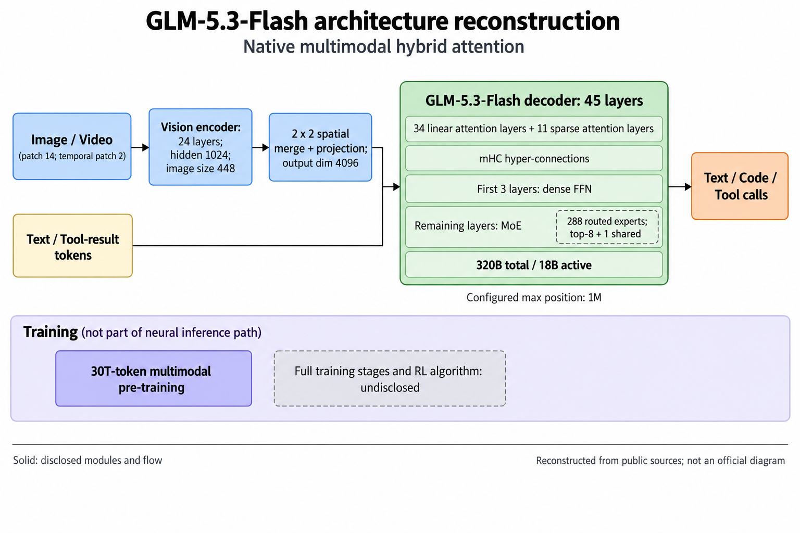

*图：依据 [公开 config](https://huggingface.co/zai-org/GLM-5.3-Flash/raw/main/config.json) 和 [官方发布说明](https://docs.z.ai/guides/vlm/glm-5.3-flash) 重建，非论文原图。不能用较早 GLM-V 的 AIMv2 图代替本版架构。*

**模型结构：**

视觉入口为 24 层编码器，hidden size 1024、16 个注意力头，空间 patch 为 14，temporal patch size 为 2。配置给出 image_size=448，这是默认尺寸参数，实际输入是否切块或放大还要结合处理器。视觉特征经 2×2 空间合并和投影进入 4096 维语言空间，投影中间维度为 10,240。文本 embedding、图像/视频标记和视觉特征共同组成模型输入，输出为答案、代码或工具调用。

语言骨干有 45 层：34 层为线性注意力，11 层为 DeepSeek-style sparse attention，后者位于 index 3、7、11……43。线性路径配置为 64 个 head、head dimension 128，并带宽度为 4 的短卷积；稀疏路径设置 32 个索引头、索引维度 128、top-k 2048，通过轻量检索选择相关历史。IndexPool 的四合一压缩作用于索引 key，而不是声称整个 KV 或输入 token 一律被四倍压缩。[注意力配置](https://huggingface.co/zai-org/GLM-5.3-Flash/raw/main/config.json)

前三层采用稠密 FFN，其余层为 MoE：288 个路由专家中为每 token 选择 8 个，另有 1 个共享专家；专家中间维度 2048。mHC 以多路残差连接改善跨层信息传递，config 给出 hc_mult=4 与 20 次 Sinkhorn 迭代。注意力检索、专家选择和超连接分别影响历史访问、计算分配和跨层传播，不能把它们合并描述成同一种路由。

稀疏注意力还采用低秩查询与 KV 表示，config 给出 Q LoRA rank 1536、KV LoRA rank 512。索引器先用较小表示估计哪些历史位置相关，再让选中的上下文参与后续注意力；线性层则以状态传播补充当前附近的连续信息。视觉文档可以包含大量 patch，工具过程又持续累积记录，因此二者同时增加的序列长度，正是该混合架构试图降低成本的负载。

最大位置长度为 1,048,576，官方服务说明支持 1M 上下文。权重采用带排除列表的 FP8 配置，视觉、归一化和连接等敏感模块并非全部转换成 FP8。部署系统还可分离 Encode、Prefill、Decode 工作池：这是服务调度优化，和网络中的线性/稀疏混合层需要分开理解。

**训练：**

官方明确披露使用最新的 **30T-token 多模态预训练语料**，并强调该版本从新的 base 模型开始，而不是只在 GLM-5.2 后面补一个视觉头。预训练同时要建立文本生成、视觉表示与长上下文访问能力；MoE、索引池化和 mHC 从这一基础阶段参与模型计算。这里的 30T 是公布的多模态语料 token 规模，不能再拆成没有依据的图片数、视频小时数或各领域比例。[预训练披露](https://huggingface.co/zai-org/GLM-5.3-Flash#introduction)

视觉后训练的细节比很多仅公布能力的服务更具体。官方构建视觉编码的数据合成流水线，产生“与环境交互—检查自己输出—继续修正”的轨迹，训练模型自主决定何时观察以及如何用视觉反馈改变动作。对于前端代码，又探索了基于环境反馈的 RL，并通过 agent-based verification 沿真实用户流程核验 GUI。其监督对象因此涵盖任务过程和可见产物，不能只用编译是否成功作为质量代理。

例如按钮可以正常运行，却可能被错误布局遮住；游戏代码没有报错，却可能缺少必要交互。渲染与操作产生新的观察，模型必须把这些信息接回任务计划。这是对官方训练设计的功能解释；公开资料没有完整列出 SFT 样本数、视觉冻结阶段、奖励权重及 RL 优化算法，不能把“使用环境反馈”扩写成已确认的 GRPO 或 PPO。

这一训练方向还改变了视觉数据的组织方式：单幅“截图—描述”训练主要监督辨认；交互轨迹会包含初始要求、操作或代码、执行产物、对产物的观察以及后续修正。模型不仅要识别页面元素，也要把可见差异关联到修改动作。官方将专业工作中的文档、电子表格、演示稿和仪表盘纳入能力讨论，要求同时利用文本、视觉和结构上下文；已有披露足以解释为何强调真实工作流检查，尚不足以给每一类素材写固定训练占比。[视觉闭环与专业任务](https://docs.z.ai/guides/vlm/glm-5.3-flash)

实现还保留 next-token 及一个 next-n 预测层，支持基础自回归学习和多步预测机制；MoE 路由配置不能替代完整损失函数。发布模型的推理预算分为 low、high、max，默认 max；复现发布榜单应保持 max。clear_thinking 是聊天模板中历史思维内容处理开关，并非一个独立训练阶段。[视觉训练说明](https://docs.z.ai/guides/vlm/glm-5.3-flash#visual-intelligence-in-the-coding-loop)、[复现模式](https://huggingface.co/zai-org/GLM-5.3-Flash#note)

**效果：**

官方发布比较中，以下是 GLM-5.3-Flash 与 GLM-5.2 的结果。HLE 列示带工具设定，GDPval 列示对应版本的指数，不能把这几项解释为同一个百分比。

| 基准 | GLM-5.2 | GLM-5.3-Flash |
|---|---:|---:|
| Terminal-Bench 2.1 | 81.0 | 84.3 |
| DeepSWE v1.1 | 46.2 | 63.4 |
| Agents' Last Exam | 20.4 | 26.3 |
| AutomationBench v1.0.6 | 26.2 | 48.8 |
| HLE with Tools | 54.7 | 55.3 |
| GDPval-AA v2 | 1504 | 1773 |

Artificial Analysis Intelligence Index v4.1.1 为 57；官方内部 Z.ai Code Bench v1.0 中，max effort 得分 29.0，与发布表中的 Opus 4.8 的 29.5 接近。内部基准有自身任务分布，宜与公开表分开解释。[发布结果](https://docs.z.ai/guides/vlm/glm-5.3-flash#competitive-performance-at-flash-cost)、[官方结果图](https://raw.githubusercontent.com/zai-org/GLM-5/refs/heads/main/resources/bench_53.png)

复现条件包括：DeepSWE 使用 mini-swe-agent、temperature=0.95、top_p=1、6 小时超时和 400K 上下文；Terminal-Bench 2.1 使用 Claude Code 2.1.207、最高 65,536 输出 token 和 6 小时超时。HLE with Tools 用 300K 上下文管理、最高 163,840 输出 token，并指定 GPT-5.6-luna medium 为裁判；AutomationBench 使用修复 null 处理问题后的 v1.0.6。因此版本、工具预算和裁判也构成这些成绩的一部分。[评测脚注](https://huggingface.co/zai-org/GLM-5.3-Flash#footnotes)

效率方面，官方以每 head、每 layer 的注意力计算及逐层平均 BF16 KV 进行归一比较，相比 GLM-5.3 分别减少到约三分之一和 1/4.4。这两项并非整个 320B 模型的三倍速度提升；实际总延迟还包括视觉编码、MoE 通信、生成长度与服务调度。与 GLM-4.5 的 355B/32B 激活、92 层相比，这版 320B/18B 激活、45 层的设计也体现出容量、深度与每步成本的重新分配。[效率比较口径](https://docs.z.ai/guides/vlm/glm-5.3-flash#architecture-for-extreme-efficiency)

### Kimi K2.6

**简介：** Kimi K2.6 于 2026 年 4 月发布，继续开放约 1T 总参数、32B 激活的视觉 MoE。它的明显变化集中在长流程编程、视觉代理和更大的 Agent Swarm，而不是把所有骨干层换成新的注意力机制。官方模型卡明确表示架构与 K2.5 相同，部署方式可以复用；这为重建结构图提供了直接依据。[官方模型卡](https://huggingface.co/moonshotai/Kimi-K2.6)

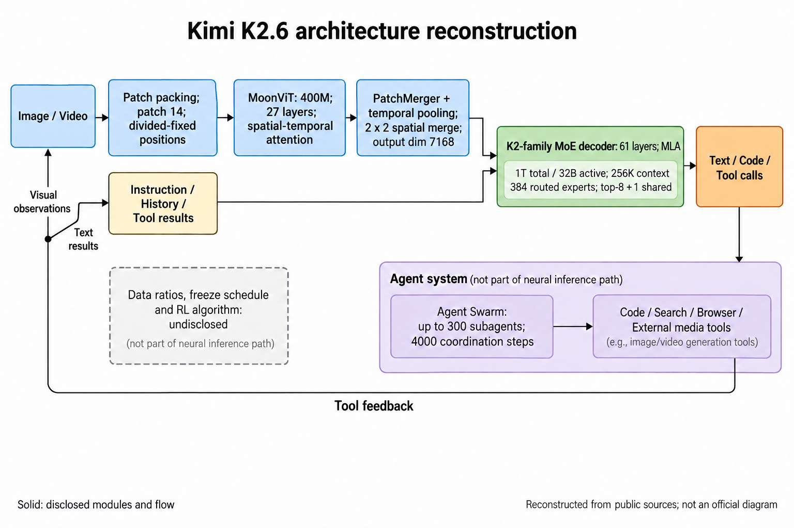

*图：依据当前模型配置和官方“与 K2.5 相同架构”的声明绘制，非独立论文原图。媒体生成工具和 Swarm 在模型外部。*

**核心思想与贡献：** 代理能力需要跨许多轮保持目标、正确调用工具，并从失败中恢复。K2.6 将重点放在持续执行和设计反馈：模型先理解视觉目标，写代码，查看截图，再修改。并行任务则由编排层匹配不同代理的工具与能力。多调用本身不是进步，关键是更长流程中有多少步骤真正推进最终目标。[官方技术讨论](https://www.kimi.com/en/blog/kimi-k2-6)

**模型结构：** 语言网络为 61 层、隐藏维度 7,168、MLA 注意力，包含 384 个路由专家，每 token 激活八个并加一个共享专家，上下文 256K。MLA 压缩历史键值表示以降低缓存负担，但仍保留针对历史位置的注意力访问；它与后面 K3 的 KDA 递归状态不同。[完整配置](https://huggingface.co/moonshotai/Kimi-K2.6/raw/main/config.json)

视觉端为约 400M MoonViT，27 层、14 像素 patch，图像和帧共享处理路径。配置保留统一视觉分块、时空相关模块及 2×2 空间合并，再经 MLP 接入语言层。依据相同架构声明，可参考 K2.5 的时空组和时间压缩设计；具体服务端抽帧与像素预算仍需按当前接口设置，不能仅由配置推导每个请求固定四帧或固定 token 数。

从信息流看，原图/视频 → patch 网格 → 视觉特征 → 压缩投影 → 混合语言序列 → 答案或工具参数。视觉压缩控制进入 LLM 的数量，MLA 控制语言历史缓存，MoE 控制每 token 激活参数。这三个优化对应不同成本，不能把某个压缩比例乘起来当作整体加速倍数。

多轮 preserve_thinking 可以保留之前推理内容，使代码代理继续使用已形成的计划与诊断；它改变会话历史的组织方式，不是新增记忆网络层。保留内容也占用上下文，错误假设如果未经检验可能被继续沿用，因此工具反馈应及时修正计划。[当前多轮接口](https://huggingface.co/moonshotai/Kimi-K2.6#preserve-thinking)

Agent Swarm 最大约 300 个代理和 4,000 次协调工具调用，较 K2.5 的上限扩展。Claw Groups 还可连接来自不同设备、模型与工具集的代理，由 K2.6 编排任务和交付物；这些都是系统能力。官方展示的图像/视频生成由外部工具完成，视觉理解骨干接收其结果，不据此假设模型内有原生扩散或视频解码头。

**训练：** 目前主源是模型卡、权重配置和技术博客，尚未提供独立 K2.6 全流程报告。可确认它是经过训练更新的 K2.5 同构模型，采用相同原生 INT4 路线，并强化长流程任务；不能把 K2.5 的 15T 联合训练预算、Zero-Vision SFT 实验或 PARL 的冻结策略直接写成 K2.6 新版确定配方。

结合公开行为可以解释训练需要解决的任务：视觉编程要求截图目标与代码实现对应，长流程代理要求动作序列、工具返回和最终结果一致，Swarm 编排要求子任务可验证且结果能够合并。例如网页任务的监督不能只比较 HTML 字符串，还需要观察渲染布局；多文件修改要用测试和实际运行约束“看似合理”的代码。这里是对训练需求的解释，官方没有披露对应数据比例、阶段长度、损失权重和更新范围。[官方长流程与设计示例](https://www.kimi.com/en/blog/kimi-k2-6#coding-driven-design)

模型卡公开的是评测工具和协议，它们帮助确定成果是什么，却不能倒推出 RL 算法。思考模式、完整推理保留、上下文管理和量化是独立可检查项：训练能力提升与服务配置正确结合，才能复现长流程行为。训练章节保留这些证据边界，避免用“采用 GRPO、全部解冻”填补未公开内容。

**效果：** 同一模型卡对比 K2.5 与 K2.6：

| 指标 | K2.5 | K2.6 |
| --- | ---: | ---: |
| MMMU-Pro，无 Python | 78.5 | 79.4 |
| CharXiv RQ，无 Python | 77.5 | 80.4 |
| MathVision，无 Python | 84.2 | 87.4 |
| MathVision，含 Python | 85.0 | 93.2 |
| OSWorld-Verified | 63.3 | 73.1 |
| Terminal-Bench 2.0 | 50.8 | 66.7 |
| SWE-Bench Pro | 50.7 | 58.6 |

视觉题总体上升，工具辅助数学提升更大，表明新版本在“看懂后操作”方面有明确进展。Python 可承担精确计算、绘制和分析步骤，含工具分数应与无工具结果分别解释。OSWorld 是多步交互成功率，不能用它代替静态 GUI 定位准确率。[完整结果](https://huggingface.co/moonshotai/Kimi-K2.6#3-evaluation-results)

视觉评测最大输出 98,304，取三次平均；Python 设置每步最多 65,536 tokens、最多 50 步。一般评测 temperature=1、top-p=1、上下文 262,144；代码系列取十次独立运行平均。BrowseComp 带上下文管理为 83.2，Swarm 为 86.3，包含不同执行资源。博客长时间运行案例说明可行性，公开基准才提供成组统计，二者应各自用于理解能力与成本。

### Kimi K3

**简介：** Kimi K3 于 2026 年 7 月发布，随后开放权重与完整技术报告。它约 2.78T 总参数、104.2B 激活，支持 1M 上下文和原生图像、视频输入。相较 K2.6，它同时改变序列混合、层间信息流、专家计算与视觉初始化，属于骨干和训练体系的更新。[官方发布](https://www.kimi.com/en/blog/kimi-k3)、[官方技术报告](https://github.com/MoonshotAI/Kimi-K3/blob/main/k3_tech_report.pdf)

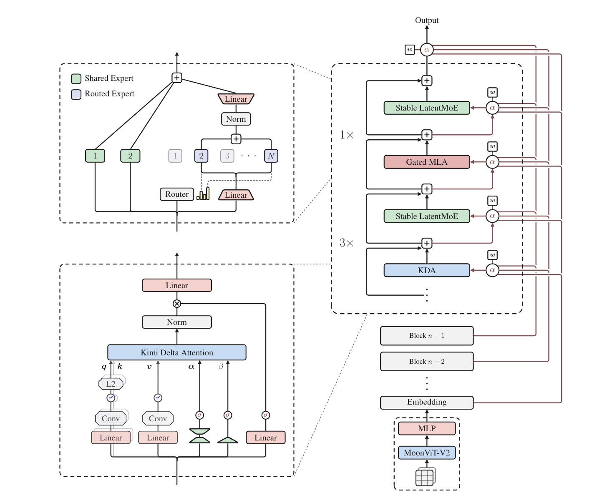

*图：实际技术报告 Figure 2，含 MoonViT-V2 入口、Token Mixer、Channel Mixer 与 Layer Mixer。截取报告第 3 页，非重建图。 [原图与论文上下文](https://raw.githubusercontent.com/MoonshotAI/Kimi-K3/main/k3_tech_report.pdf)*

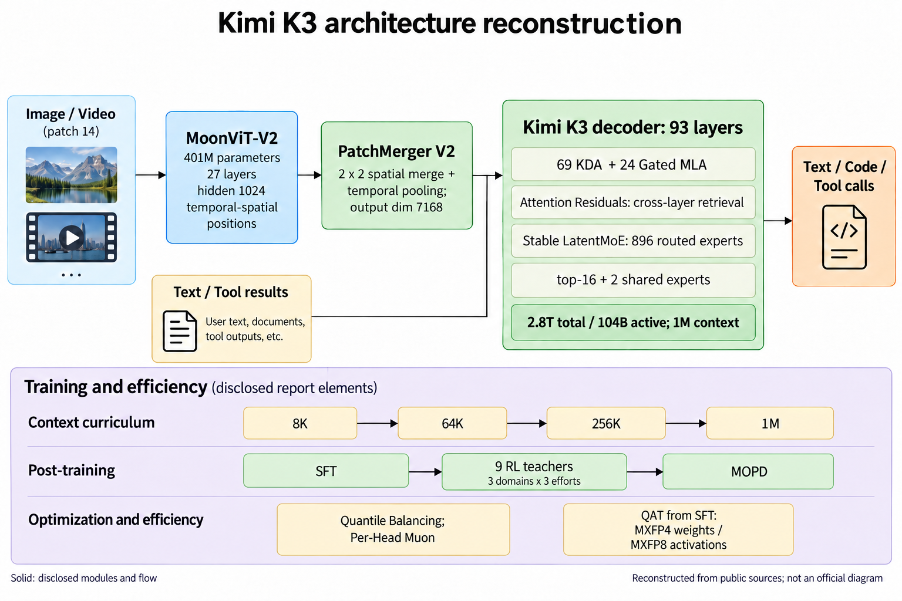

*图：按当前报告和权重配置补充重建的阅读示意；层数与比例对应公开配置。量化框指路由专家的权重与激活，共享专家和其余模块保持较高精度。*

**核心思想与贡献：** 模型的记忆同时沿序列与深度流动。KDA 改善长前缀的状态计算，Gated MLA 提供显式检索，Attention Residuals 让后层选择此前层级信息，Stable LatentMoE 控制巨大专家容量的计算与数值稳定性。视觉端从零联合学习，避免先训练的视觉空间与语言目标发生不稳定冲突。后训练再把领域和思考预算专家整合为单模型。

**模型结构：** 语言骨干 93 层，由 69 个 KDA 和 24 个 Gated MLA 组成；隐藏维度仍为 7,168。KDA 通过细粒度门控与 Delta 更新维护递归记忆，历史不必全部存为独立 K/V；MLA 层保留压缩缓存上的全序列访问。混合路径让长文档既能持续汇总，也能检索具体证据，完整注意力部分仍有随上下文增长的成本。[配置与层型](https://huggingface.co/moonshotai/Kimi-K3/raw/main/config.json)

Attention Residuals 用注意力权重重新组合此前层或块的输出，代替所有前层信息持续无差别相加的固定残差累积。这里“注意力”的选择轴是网络深度，KDA/MLA 的选择轴是序列，两者不能混为一种时序注意力。某一层需要细节或抽象表示时，可以从不同深度取信息；报告采用块级组织，使跨层存储和计算可控。

Stable LatentMoE 将部分专家计算放到 3,584 维潜空间，路由专家增至 896，每 token 选择 16 个，再加两个共享专家；专家中间维度 3,072，使用 SiTU-GLU。降维/升维投影围绕专家路径，不能解释为把全模型隐藏宽度改成 3,584。Quantile Balancing 根据路由分数边际的分位数调整专家偏置，更新供后续 batch 使用，推理时冻结；它平衡训练负载，不代表推理时每张图固定平均使用所有专家。[报告 §2 与架构表](https://github.com/MoonshotAI/Kimi-K3/blob/main/k3_tech_report.pdf)

视觉路径为 **MoonViT-V2 → 2×2 Pixel Shuffle → MLP → 共享语言骨干**。MoonViT-V2 约 401M、27 层、patch 14，用 RMSNorm 并移除线性/注意力投影 bias。帧内空间注意力与帧间时间注意力分解执行，再进行时间池化；空间重组把视觉 token 减为四分之一。报告支持至 3584×3584 像素输入，但具体图片仍受上下文与服务预算约束。

与 K2.5 不同，MoonViT-V2 **从零训练**，不再从 SigLIP 对比学习检查点初始化。下一 token 目标使视觉特征直接服务文字、结构和定位任务。语言侧使用 NoPE，不使用显式位置嵌入；位置依靠 KDA 门控和衰减隐式表达，因此长上下文不需要 RoPE 重缩放。这一结论限定语言骨干，不能推成视觉网格完全没有位置表达。[原生视觉与位置方案，报告 §2.4、§3.4](https://github.com/MoonshotAI/Kimi-K3/blob/main/k3_tech_report.pdf)

**训练：** 预训练从一开始联合优化语言与视觉，没有事后独立模态对齐阶段。文本涵盖网页、代码、数学和知识，视觉包括描述、交错文档、OCR、感知、视频、视觉编程。SVG、3D、网页、游戏与 CAD 的程序化样本把代码和渲染结果配对，使模型能学习代码变化如何影响视觉产物；坐标同时提供绝对与归一化格式。[官方训练概览](https://huggingface.co/moonshotai/Kimi-K3)

优化采用 Per-Head Muon，分别对注意力头的矩阵动量做正交化，减小大尺度头支配更新的问题；配合权重裁剪、Quantile Balancing、1% 线性 warmup 与余弦学习率。上下文按 8K → 64K → 256K → 1M 扩展，后两段集中在 cooldown。长数据经过清洗、去重、结构检验与视频感知哈希，并上采样连贯长样本；合成任务把证据分散到全长范围，避免模型只靠局部读取获得奖励。

后训练按 **SFT → 领域/预算 RL → MOPD 整合**。SFT 使用经过验证和人工检查的代理轨迹，以 XTML 统一序列化。一般任务、一般代理、代码代理三个领域，各训练 low/high/max 三种思考预算，形成九个教师策略。预算奖励对超出问题初始预算倍数的轨迹覆盖为 −1：一般任务统计 thinking tokens，代理任务累计推理和工具参数，鼓励在任务成功基础上控制成本。

长流程 RL 使用 partial rollout：一定比例轨迹结束后就优化，未结束者暂停并在下一轮继续，避免等最慢任务。轨迹跨轮带来策略陈旧，因此配合 token 级正则限制更新。开放任务采用生成式奖励模型，先读实际产物、建立 rubric、逐项评分，再比较候选，减少只凭答案表面风格作判断。[后训练方法，报告 §4.1](https://github.com/MoonshotAI/Kimi-K3/blob/main/k3_tech_report.pdf)

MOPD 让学生在自身 rollout 的前缀上向对应领域/预算教师学习。报告的逐 token 密集奖励为：

$$
r_{\mathrm{OPD}}^d(y_t)=
\operatorname{clip}\!\left[
\operatorname{sg}\!\left(
\log\frac{\pi_{\mathrm{teacher}}^{(d,e)}(y_t\mid x,y_{<t})}
{\pi_\theta(y_t\mid e,x,y_{<t})}
\right),-R_{\max},R_{\max}\right].
$$

教师概率较高而学生不足的 token 得到正向信号；停止梯度和裁剪控制极端变化。它将多个训练期教师整合进单个部署模型，不意味着每次回答在线运行九个大模型。[报告公式 15](https://github.com/MoonshotAI/Kimi-K3/blob/main/k3_tech_report.pdf)

部署感知后训练自 SFT 起使用 QAT，路由专家权重为 MXFP4、激活为 MXFP8；注意力、潜空间投影、共享专家和路由器等保持较高精度。RL rollout 与训练采用相同量化方式，减少训练/服务分布差异。另将预训练 MTP 微调为 EAGLE-3 草稿层，冻结主模型，只更新草稿与融合投影；这是有明确冻结策略的单独效率步骤，而不是把整模型训练称为冻结。

白盒代理 RL 环境把工具接口、系统提示、上下文管理、技能、记忆和子代理作为可组合模块，训练时变化 harness，降低对单一工具协议的过拟合。例如同一代码任务可以用不同文件编辑工具和终端组织完成，但都要通过相同执行结果验收。视觉编程则让截图反馈与代码测试并存：测试验证功能，视觉结果验证布局或图形，二者共同限定“任务完成”的含义。[报告代理环境 §4.2](https://github.com/MoonshotAI/Kimi-K3/blob/main/k3_tech_report.pdf)

**效果：** 当前完整报告 max 模式结果如下：

| 基准 | 无 Python | 含 Python |
| --- | ---: | ---: |
| MMMU-Pro | 81.6 | 83.4 |
| CharXiv RQ | 84.8 | 91.3 |
| MathVision | 94.3 | 97.8 |
| ZeroBench-main，pass@5 | 23.0 | 41.0 |

另有 OmniDocBench 91.1、PerceptionBench 58.5、Video-MME 有字幕 90.0、MMVU 82.1；OSWorld-Verified 84.8。表中数学和图表工具增益明显，视频成绩带字幕，ZeroBench 为五次候选成功率，不能与一次回答的指标直接混用。[报告 Table 2](https://github.com/MoonshotAI/Kimi-K3/blob/main/k3_tech_report.pdf)

一般采用 temperature=1、max effort，视觉结果多取三次平均；代码代理报告使用多种 harness，并按协议说明最佳配置。发布博客案例与后来的报告表采用不同版本和设置，因此这里以完整报告作为技术与评测主源。报告的约 2.5 倍 scaling efficiency 是验证损失对训练 FLOPs 的拟合比较，不能当作单次推理速度。它的主要进展是同时优化序列、深度和视觉闭环，并把高成本教师训练整合为可控预算的一个多模态模型。

### Qwen3-Omni

**Qwen3-Omni** 于 2025 年 9 月发布，延续 Qwen2.5-Omni 的 Thinker–Talker 路线，理解文本、图像、音频和视频，输出文本及流式语音。公开的 30B-A3B-Instruct、Thinking、Captioner 分别侧重常规交互、跨模态推理和音频描述；30B-A3B 是 Thinker 语言主干的总参数／激活参数标记，整套系统另有感知和语音组件。权重采用 Apache 2.0 许可证。[官方仓库](https://github.com/QwenLM/Qwen3-Omni)、[模型卡](https://huggingface.co/Qwen/Qwen3-Omni-30B-A3B-Instruct)

**核心思想：** 前代已经能“看、听、说”，这一代主要解决联合训练与实时部署的问题。一方面，文本、视觉、音频从预训练早期就共同学习，让跨模态能力与语言能力一起成长；另一方面，把强大的理解主干和频率更高的语音生成过程分开，用 MoE、低 token 率音频表征和轻量波形解码器减少计算量。与只输出转写文本的语音模型相比，它还要保留说话者、情绪、环境声和视频事件的信息。[技术报告](https://arxiv.org/html/2509.17765v1#S2)


*论文原图：Figure 2，展示理解主干、Talker、MTP 和 Code2Wav 的完整连接。[图源及原文](https://arxiv.org/html/2509.17765v1#S2.F2)*

**模型结构：**

1. **输入编码与统一理解。** 文本经 Qwen BPE tokenizer；图像和动态采样的视频帧经约 0.54B 的视觉编码器，其初始化来自 SigLIP2-So400M、训练路线来自 Qwen3-VL。声音先重采样为 16 kHz，再用 25 ms 窗口、10 ms 步长转换为 128 维 Mel 频谱。新的 AuT 音频编码器以卷积把时间长度缩短 8 倍，输出 **12.5 个 token／秒**，即每个表征约覆盖 80 ms；这比把音频按更密集序列交给 LLM 更节省上下文。AuT 支持动态窗口注意力，窗口覆盖约 1—8 秒，使离线理解和流式缓存共用一个编码器。
2. **用共同时间坐标连接视听信息。** TM-RoPE 把位置拆成时间、高度、宽度；这一代交错分配三组旋转角度，分别为 24、20、20。静态图像共享时间坐标，保留不同空间坐标；视频帧按实际时间戳赋予时间 ID，音频也按 80 ms 粒度赋值。例如，屏幕上某人挥手与声音中的一句问候，虽然来自不同模态，仍可落到相近时间位置。相较前代固定 2 秒分块，直接按时间 ID 对齐更灵活。
3. **Thinker 与 Talker 分工。** Thinker 是 30B-A3B MoE，生成文本；Talker 是约 3B 总参数、0.3B 激活参数的 MoE，消费历史文本、当前流式文本及多模态特征。Talker 不再依赖 Thinker 的高层**文本隐状态**，因此检索、函数调用或文本处理可以介入两者之间；语义回答和声音风格也可以使用各自的系统提示词控制。
4. **一次大步生成一个声音帧。** Talker 先预测当前帧的主 RVQ 码本，约 80M 的小型 MTP 再依次补足残余码本；约 200M 的因果 ConvNet 将完整码本帧还原为波形。可把该层级关系写成 $p(c_t^0\mid H,c_{<t})\prod_{j=1}^{K-1}p(c_t^j\mid c_t^{<j},H,c_{<t})$，其中 $H$ 是会话条件。这个公式只是对报告分层预测流程的概率表达；MTP 在这里补的是同一语音帧的声学细节。因果解码器只需左侧历史，第一帧码本生成后便可开始播放。[报告架构与延迟分析](https://arxiv.org/html/2509.17765v1#S2)

从信息流上看，一次摄像头语音对话同时存在两种声音表示：输入 AuT 输出的是适合理解的**连续特征**，输出 Talker 预测的是适合还原波形的**离散 codec**。前者要识别人声内容、音乐和背景事件，后者要重建音色、节奏和细节，因而无需共用同一个 tokenizer。RVQ 可理解为逐层编码剩余误差：第一码本描述较粗表征，后续码本不断补充第一层未表达的声学细节；多码本容量使轻量卷积声码器也能得到较高保真声音。这解释了为什么降低声音 token 率可以与较丰富的语音表达并存，关键在于每帧携带多层码本，而非只有一个粗糙符号。[报告感知与语音生成](https://arxiv.org/html/2509.17765v1#S2)

**训练：**

AuT 先独立在约 **2000 万小时**有监督音频上训练，数据约为 80% 中英文伪标注 ASR、10% 其他语言 ASR、10% 音频理解。这样的混合目标使它学习的不止是“把字听出来”，也包括非语音声音的语义。随后，全模态预训练分三步：**S1** 冻结语言模型，分别对齐视觉和音频端，先学习各自 adapter，再训练编码器；**S2** 解冻全部组件，混合纯文本、图文、音文、视频以及视听样本；**S3** 将最大训练序列从 8192 扩展到 32768，并增加长音频和长视频比例。报告把 S2 概括为约 2T token 规模，各模态数值为近似统计，不宜把分项当成精确会计表。[报告预训练](https://arxiv.org/html/2509.17765v1#S3)

Thinker 后训练先做轻量 **SFT**，再做强到弱蒸馏：离线阶段用教师答案训练学生，在线阶段让学生自行生成，再以 KL 散度对齐 Qwen3-32B 或 Qwen3-235B-A22B 教师的预测。最后用 **GSPO** 优化跨模态任务；数学、代码和可验证指令使用规则奖励，开放式回答采用带参考信息的模型评价。Talker 则依次经过大规模语音预训练、高质量持续预训练与长上下文训练、多语言 **DPO**、目标说话人微调。Captioner 在主模型上用详细音频描述数据专门微调，服务于音乐、环境声与复合声景描述。[报告后训练](https://arxiv.org/html/2509.17765v1#S4)

各阶段的优化对象也不相同：感知预训练先让“声音／图像特征能被读懂”，Thinker 的 SFT 和蒸馏学习回答与推理，Talker 的偏好与说话人训练学习发声形式。因此，以同一视频进行字幕生成、跨模态问答和带情绪的语音回答，可以共享理解基础，但最终监督目标不同。蒸馏中的学生轨迹尤其重要：教师直接给标准答案能提供知识，让教师评价学生自己会生成的序列，则更接近实际推理时的分布。[报告后训练](https://arxiv.org/html/2509.17765v1#S4)

**效果：**

下面保留版本和模式，以免把内部 Flash 的结果算到开放权重上。

| 报告评测项 | Qwen2.5-Omni | Qwen3-Omni 30B-A3B | 比较条件 |
|---|---:|---:|---|
| MMAU-v05.15.25 | 65.5 | 77.5 | Instruct，音频推理 |
| VoiceBench 总分 | 73.6 | 85.5／88.8 | 新模型分别为 Instruct／Thinking |
| WorldSense | 45.4 | 54.0 | Instruct，视听联合理解 |
| DailyOmni | — | 75.8 | Thinking；同表 Gemini 2.5 Flash Thinking 为 72.7 |

报告所选的 36 项音频／视听基准中，作者统计 32 项达到当时开放模型最佳、22 项达到所有对照最佳；这个结论对应其版本与评测集合。视觉侧，MathVista-mini 从 Instruct 的 75.9 提高到 Thinking 的 80.0，但 Video-MME 无字幕从 70.5 变为 69.7，说明增加思考并非所有视频任务都受益。[报告理解评测](https://arxiv.org/html/2509.17765v1#S5)

低延迟主要来自流水执行：Thinker 处理后续输入块时，Talker 可并行预填充已完成的块。报告的理论冷启动音频／视频首包分别为 **234／547 ms**；并发增至 6 时为 **1172／2284 ms**，声音生成 RTF 为 0.66，仍低于实时播放速度所要求的 1。实验使用 vLLM、torch.compile 与 CUDA Graph 优化，因此数字应连同实现和并发量读取。公开模型支持 119 种文本语言、19 种语音输入语言和 10 种语音输出语言，主要提升是联合感知与流式发声；长视频的上下文和位置外推仍是报告明确指出的短板。[报告表 1—3](https://arxiv.org/html/2509.17765v1#S2.SS5)、[模型卡](https://huggingface.co/Qwen/Qwen3-Omni-30B-A3B-Instruct)

### LLaVA-OneVision-1.5

**LLaVA-OneVision-1.5** 于 2025 年提出，提供 4B、8B 等尺寸，将传统 LLaVA 的视觉编码器、连接器、语言模型路线发展为可复现的大规模训练方案。它使用 Qwen3 作为语言主干，重点是图像理解、OCR、图表与文档分析，而“Fully Open”还包括训练数据、代码、配置和中间检查点。读这个模型时，应同时观察视觉端如何提取局部信息，以及中期训练数据如何把这些信息变成可用知识。[论文](https://arxiv.org/abs/2509.23661)、[团队介绍](https://www.lmms-lab.com/posts/llava_onevision_1_5/)

**核心思想：** 全球图文对比学习擅长判断一张图的大意，却可能忽略图中的小物体、文字行及它们的空间关系。OneVision-1.5 用 **RICE-ViT** 加强区域级语义，再用概念均衡的 8500 万图文样本进行充分中期训练；其改进并不依赖复杂的新增语言侧分支。模型希望用相对简单、可检验的架构和数据组合，同时提升一般问答、定位、计数和 OCR。[论文架构与数据章节](https://arxiv.org/html/2509.23661v1#S2)

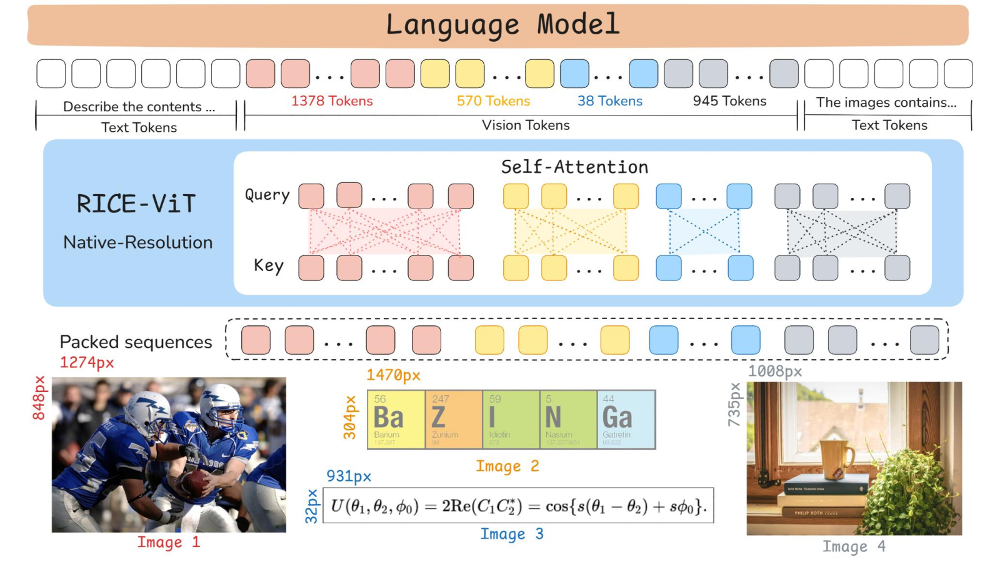

*论文原图：Figure 2。图中包括区域语义与 OCR 区域学习、保留全局语义的 CLS、视觉连接器和语言主干。[图源及原文](https://arxiv.org/html/2509.23661v1#S2.F2)*

**模型结构：**

1. **RICE-ViT 负责把区域“看清”。** 编码器以区域感知注意力加强局部建模，将物体区域和 OCR 区域放进统一的 cluster discrimination 学习框架。它的独立预训练使用约 4.5 亿张图像、24 亿个候选区域。与把所有其他实例一律视为负样本的普通实例对比不同，聚类判别利用训练集内部的语义相似结构，使内容相近的局部区域具有更一致的表示。这里的区域监督发生在视觉表征学习阶段，最终使用时仍可直接输入普通图像。
2. **原生分辨率与位置。** 编码器使用 2D RoPE，把高度和宽度位置直接用于注意力，不必为每种图像尺寸重新学习一张固定位置表。保留纵横比有利于文档、长图和图表：例如，把窄长表格强行挤成正方形会改变文字和单元格的几何关系。模型保留 CLS 全局表示，在加强细节的同时维持整图语义。
3. **连接器负责压缩和模态映射。** 相邻 $2\times2$ patch 特征先拼接，再经过两层 MLP 投到 Qwen3 的嵌入空间。若原来有 $N$ 个局部 patch，大致得到 $N/4$ 个局部视觉 token；这是在语言主干入口压缩 token，仍由视觉编码器先处理原始 patch。可将连接器写为 $v_{i,j}=W_2\,\sigma(W_1[h_{2i,2j};h_{2i+1,2j};h_{2i,2j+1};h_{2i+1,2j+1}])$；这是根据报告流程展开的通用 MLP 表达，不是额外提出的算法。
4. **Qwen3 负责联合推理与输出。** 投影后的视觉 token 与问题文本组成同一输入序列，自回归生成答案、描述或定位内容。模块之间的分工很清楚：RICE 改善输入证据，MLP 解决嵌入维度与 token 数，LLM 学习如何按问题读取证据。它的主要输出是文本，本文架构图中的解码器并非视频或语音合成器。[论文第 2 节](https://arxiv.org/html/2509.23661v1#S2)

这一结构的区域优势主要发生在“表征质量”，并非把一个额外检测器的最终标签直接拼到提示中。例如，文档问题同时依赖标题、正文和表格位置，区域语义需要保留局部文字，CLS 则提供全文主题；语言主干再根据问题选择哪些局部 token 更相关。连接器合并四个邻近 patch 时仍把四份向量拼接保留，区别于直接平均像素：它降低语言侧序列长度，但投影器仍能学习合并区域内部的排列关系。后续生成一段较长答案时，视觉输入通常只需预填充一次，答案 token 通过自回归注意力读取视觉证据；因此减少视觉 token 对训练和回答阶段都有意义。[论文结构](https://arxiv.org/html/2509.23661v1#S2)

**训练：**

首先准备 **概念均衡数据**。团队用 MetaCLIP 的图像／文本表示把候选图像与约 50 万个概念词条匹配，给每张图分配最相近的一组概念，再按概念出现频率的倒数加权采样。这样可以降低高频“常见图片”的占比，提高稀有类别、专业场景和文字丰富图片的覆盖；原始 caption 简短或缺失的样本也能参与。之后用 captioner 重写中英文描述、去重和过滤，形成约 **8500 万图文对**，其中 6500 万英文、2000 万中文。指令数据另有约 **2200 万**样本，覆盖问答、OCR、图表、数学代码、科学、定位与计数等任务。[论文数据章节](https://arxiv.org/html/2509.23661v1#S3)

正式训练分三阶段。**Stage 1 图文对齐**只训练投影器，以 LLaVA-558K 建立视觉特征到语言嵌入的初始映射，已有视觉编码器和 LLM 保持冻结。**Stage 1.5 高质量知识学习**解冻全部模块，在 85M 图文数据上中期训练，使模型既理解视觉表征，也获取广泛视觉知识。**Stage 2 视觉指令微调**继续全参数更新，混合自建 22M 指令集与 FineVision，学习按用户要求进行问答、读图、定位和分析。报告的主配方是对齐、全参数中期训练与 SFT，没有把强化学习写成该版本的必要阶段。[论文训练策略](https://arxiv.org/html/2509.23661v1#S4)

训练效率来自**离线数据打包**：预处理时把短样本装进较均匀长度的序列，减少 GPU 执行大量 padding 的浪费，并用桶分组和多线程安排负载。报告在 85M 数据上给出最高 11 倍的打包压缩率；这指填充与样本组织效率，不是模型的图像压缩率。8B 中期训练采用 8K 上下文、128 张 A800，耗时约 3.7 天；团队估计的 1.6 万美元预算属于其训练设置，独立视觉编码器的全部开发成本不能自动视为包含其中。[训练实现](https://arxiv.org/html/2509.23661v1#S4.SS2)、[团队发布说明](https://www.lmms-lab.com/posts/llava_onevision_1_5/)

中期训练与 SFT 解决的也是不同问题。图文描述给模型广泛概念及对应视觉证据，指令样本教它按指定格式回答、区分读图与推理任务。若直接用少量问答训练连接器，模型可能学会熟悉问题的模板，却缺乏罕见概念；扩大 85M 中期数据正是为了补充这一层。论文还比较独立 22M 指令集、FineVision 与合并 46M 数据，合并设置在多数评测上更强，说明任务覆盖和样本互补也影响最终能力。[论文数据与消融](https://arxiv.org/html/2509.23661v1#S5)

**效果：**

作者使用 LMMs-Eval 默认提示评测。8B 在 27 项所选基准中有 18 项超过 Qwen2.5-VL-7B；更有解释力的是任务分布与前代差距：

| 基准 | LLaVA-OV 7B | Qwen2.5-VL 7B | LLaVA-OV-1.5 8B |
|---|---:|---:|---:|
| MMStar | 61.7 | 62.5 | 67.7 |
| MMMU-val | 48.8 | 51.3 | 55.4 |
| ChartQA | 80.0 | 84.1 | 86.5 |
| DocVQA | 87.2 | 94.9 | 95.0 |
| OCRBench | 62.1 | 84.2 | 82.9 |

OneVision-1.5 相对前代在文档和 OCR 上跃升明显，但相对 Qwen2.5-VL 仍有强弱项：OCRBench、InfoVQA 和 MMMU-Pro 的纯视觉设置并未全胜。编码器消融在统一 LLaVA-NeXT 框架中比较 RICE 与其他视觉主干，378 分辨率下 RICE 在 14 项中胜过 SigLIP2 的 9 项；因此不能把整个模型的提高全部归因于 Qwen3。另一个 2M 数据对照中，概念均衡采样在 27 项里改善 25 项，支持“数据分布”本身也重要。这个版本最适合用于研究可复现的视觉语言训练，后续 OneVision-2 才进一步加入专门的视频码流表示与空间／时间监督。[论文评测及消融](https://arxiv.org/html/2509.23661v1#S5)

### MiniCPM-o 4.5

**MiniCPM-o 4.5** 于 2026 年 2 月开放权重，4 月公布报告。它以 Qwen3-8B 为语言主干，整套约 9B 参数，接收文本、图像、视频和声音，生成文本和语音。它继承 MiniCPM-V 4.5 的视觉基础，新增语音理解、生成及全双工交互；MiniCPM-V 与 MiniCPM-o 的字母区分有实际意义，后者具有完整声音输出链路。[官方仓库](https://github.com/OpenBMB/MiniCPM-V)、[模型卡](https://huggingface.co/openbmb/MiniCPM-o-4_5)

**核心思想：** 一般按轮语音助手要等用户说完才能答复，回答时往往暂停读取新环境。**Omni-Flow** 把环境视觉、环境声音与模型输出组织在同一时间轴上，让每次输出都能参考最近到达的输入；模型还学习是否应该继续监听、开始发言或主动提醒。同时，语言主干只负责文本语义，高频声音 token 由小型解码器生成，以较低开销维持连续交互。[技术报告](https://arxiv.org/html/2604.27393v1#S2)

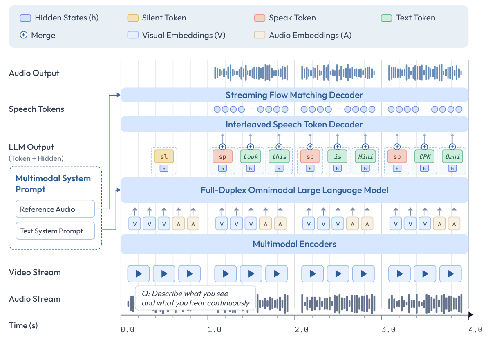

*论文原图：Figure 4。视觉、声音、语言和语音生成组件通过隐状态连接；输入与输出按时间块组织。[图源及论文](https://arxiv.org/pdf/2604.27393v1)*

**模型结构：**

1. **视觉端压缩持续视频。** 图像按 LLaVA-UHD 思路切成适合纵横比的切片，每片经约 0.4B 的 SigLIP ViT 得到 1024 个 token，再由 Resampler 压到 **64 个**，压缩比为 16 倍。常规模式允许更高分辨率，报告设置上限为 2240×2240；全双工流式模式使用最多 448×448，优先控制持续感知成本。因此端侧实时场景与高分辨率静态 OCR 是两个不同预算。
2. **声音端压缩时间长度。** 约 0.3B 的 Whisper Medium 以分块方式编码输入，输出每秒 50 个特征 token；两层 MLP 将时间维进一步压缩 5 倍，语言主干只需接收 **10 个音频 token／秒**。视觉与声音都变成可直接进入 Qwen3-8B 的连续表征。
3. **语义生成与声学生成解耦。** Qwen3-8B 产生文本 token 和对应隐状态；经过 MLP 整形的语言隐状态与语音解码器表征相加，输入约 0.3B 的 Llama 语音 token 解码器，生成 S3 声音 token。随后，流式 **Flow Matching** 解码器结合系统提示中的参考音频生成波形。报告估计自然说话时大语言主干每秒只需约 3—4 次文本解码，而不必按约 25 次／秒声音 token 频率运行；语气与韵律仍由上下文隐状态影响。
4. **用时间块学习“何时说”。** 第 $k$ 块被序列化为 $\mathbf g_k=[\mathbf v^k;\mathbf a^k;\mathbf o^k]$：先读取本块视觉与音频，再产生输出。模型先预测 listen/speak 控制，未发言时输出监听 token，再继续接受下一块。显式边界让它区分新观察与刚生成的内容。TAIL 根据累计声音播放进度动态交错文本与语音，避免模型已经看见场景变化，用户却仍在听很久以前生成的句子。全双工因此同时涉及输入更新、发言控制与播放同步。[报告架构及 Omni-Flow](https://arxiv.org/html/2604.27393v1#S2)、[报告时间对齐](https://arxiv.org/html/2604.27393v1#S3)

TAIL 的训练监督也来自真实时间，而非预先指定统一字数比例。团队收集输出文本 token 的开始／结束时间，把开始时间落在第 $k$ 窗口的文字与对应声音分到同一块。推理时若此前声音已稍微落后，当前块可以少生成一些文字，让累计播放接近边界 $kt$。同时保留有限向前看的文字上下文：块末少数 token 的发音延到下一块，利用后续词决定连读、重音等局部韵律。这使“说出的内容紧跟环境”与“发音需要一点未来信息”可以兼顾。[报告 TAIL](https://arxiv.org/html/2604.27393v1#S3.SS4)

用一个场景说明 Omni-Flow 的控制过程：模型正在描述球员动作，下一时间块出现进球，新的视觉证据仍会进入主干；模型可以据最新画面更新描述。若观众在旁说话，声音同时进入环境流，控制 token 决定继续说还是监听。这个例子解释架构如何组织信息，并非保证所有打断都成功。listen/speak 先于内容生成，也给训练增加了一个独立学习问题：沉默是否合适。连续输入并不自动带来这种行为，必须用包含“无需发言”时间块的监督，避免每次场景刷新都触发无意义输出。[报告统一序列与控制消融](https://arxiv.org/html/2604.27393v1#S3)

**训练：**

**第一阶段语音预训练**从 MiniCPM-V 4.5 的预训练检查点和 Whisper 初始化，新增音频投影器、语言到语音投影器及语音解码器。已有组件保持冻结，只学习新增组件，先建立声音表征到语言空间、语言隐状态到声音 token 的映射。**第二阶段联合预训练**解冻全部参数，在图文、语音及全模态数据上使用统一下一 token 目标；不同数据并行 rank 固定不同模态组合，使每个训练步的模态比例稳定，减少一个 batch 偶然偏向某模态造成的干扰。[报告训练章节](https://arxiv.org/html/2604.27393v1#S5)

联合数据既有普通问答，也有时间标注的视听输入、输出文本和输出语音。网络视频会过滤单人独白或弱视听相关片段，并移除可被 OCR 直接读取的字幕捷径；人工构造的全双工任务包含连续场景描述和主动提醒。**第三阶段 SFT**先做大规模指令学习，再用高质量人工样本细调交互行为；随机分辨率和 1—5 FPS 数据让部署能选择不同质量／效率预算。**第四阶段 RL**使用 GRPO 的正确性与格式奖励加强推理、指令遵循，添加平滑长度奖励减少无用长回答；错误答案不会因短而得到正奖励。最后用 RLAIF-V 降低视觉幻觉，报告观察到这种改进也能迁移到流式全模态交互。[数据构建](https://arxiv.org/html/2604.27393v1#S4)、[后训练](https://arxiv.org/html/2604.27393v1#S5)

长度奖励消融展示了多目标训练的取舍。在轻量 RL 实验中，原始 Thinking 任务平均为 73.5；更激进的长度奖励把回答缩短 50.7%，平均降至 73.0；平滑奖励缩短 35.3%，平均升至 74.3。这里比较的是 MMBench、MathVista 等七项视觉任务的平均，不能当成所有全双工任务的统一涨幅，但说明控制语言主干步数也可以从训练目标入手，而不只靠量化或换解码器。[报告长度奖励消融](https://arxiv.org/html/2604.27393v1#S6.SS6)

**效果：**

报告 Instruct 视觉评测中，OpenCompass 八项平均为 **77.6**，Qwen3-VL-8B 为 76.5，Qwen3-Omni-30B-A3B 为 75.7；MathVista 为 **80.1**，但 MMMU 为 67.6，低于 Qwen3-VL 的 69.6。英文／中文 OmniDocBench 错误指标为 **0.109／0.162**，相应 Qwen3-Omni 为 0.216／0.363，体现文档分析优势。这些数字对应 Instruct 表，不能与 Thinking 行混合比较。[报告表 2—3](https://arxiv.org/html/2604.27393v1#S6)

| 任务 | MiniCPM-o 4.5 | Qwen3-Omni | 指标与设置 |
|---|---:|---:|---|
| Daily-Omni | 80.2 | 70.7 | 普通单工视听理解，越高越好 |
| Speech TriviaQA | 75.5 | 62.9 | 语音知识问答，越高越好 |
| SeedTTS Test-ZH | 0.86 | 1.41 | 中文 CER，越低越好 |
| SeedTTS Test-EN | 2.38 | 3.39 | 英文 WER，越低越好 |
| LongTTS 英文 | 3.37 | 17.33 | 长语音 WER，越低越好 |

全双工证据需单独看：LiveSports-3K-CC 的胜率为 **54.4**，高于 LiveCC 的 41.5 和 StreamingVLM 的 45.6；这是**不含音频的连续视觉基准**，不能当作完整声音打断能力的总评分。时间块消融中 1 秒优于 0.2／0.1 秒，原因是更短的块虽然更新快，却给控制和连贯生成留下更少信息。TAIL 也有真实代价：其英文 WER 为 3.93，高于固定交错的 2.38，换来声音与新环境更及时的对齐。作者报告的低于 12GB 内存开销有其实现条件；官方全双工示例要求至少 12GB GPU 显存或至少 24GB RAM 的 Apple M4 Max。这个模型的代表意义是把“持续感知并决定何时发言”纳入训练，而不仅是加一个流式 TTS。[报告全双工与消融](https://arxiv.org/html/2604.27393v1#S6.SS5)、[部署模型卡](https://huggingface.co/openbmb/MiniCPM-o-4_5)

### Qwen3.5-Omni

**Qwen3.5-Omni** 于 2026 年 4 月公布技术报告，包含 Plus 与 Flash 服务版本。它延续 Thinker–Talker，接收文本、图像、声音和视频，生成文字及声音，增加长输入、多语言、语音控制和原生工具调用。报告将训练上下文扩到 256K，并披露数千亿级模型规模，但没有足够信息给各服务版本列出精确总参数／激活参数。其技术重点是让长视听理解和稳定声音生成一起扩展。[报告](https://arxiv.org/abs/2604.15804)、[官方服务文档](https://www.alibabacloud.com/help/en/model-studio/qwen-omni)

**核心思想：** 长音视频带来两类困难：感知 token 数增长，以及“文本说了什么”和“声音播到哪里”不同步。前者用 **Hybrid Attention MoE**、低速音频表征和明确时间戳处理；后者用 **ARIA 自适应速率交错对齐**处理。同时，它把回答质量、交互行为与声音表达分成不同后训练目标，避免只改善 ASR 或声线而忽略用户真正需要的回答。[报告架构](https://arxiv.org/html/2604.15804v1#S2)

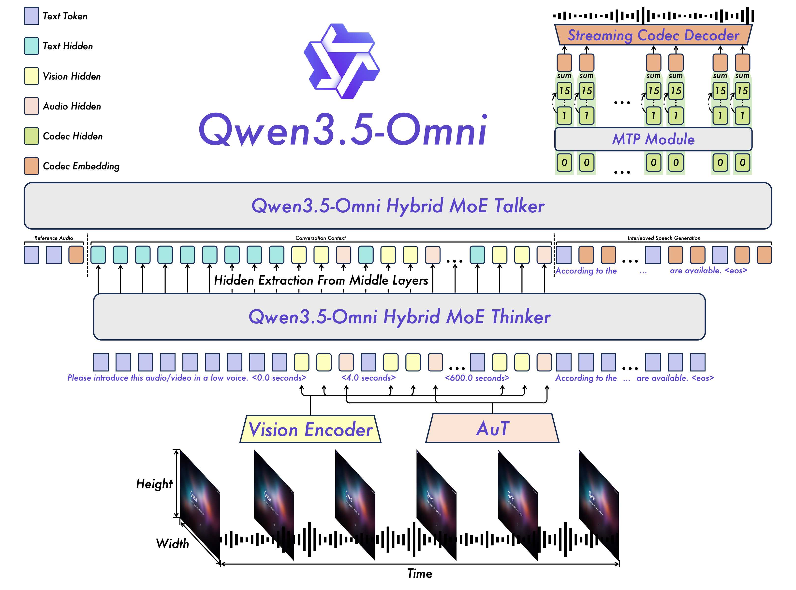

*论文原图：Figure 2。Thinker、Talker、语音 MTP 和 Code2Wav 构成渐进式理解与流式生成链路。[图源及原文](https://arxiv.org/html/2604.15804v1#S2.F2)*

**模型结构：**

1. **感知链路进一步降低音频 token 率。** 文本使用约 250K 词表的 Qwen3.5 BPE；声音仍转换为 16 kHz、128 维 Mel，AuT 前端增加到四个 Conv2D 块，以 16 倍时间下采样输出 **6.25 Hz** 表征，一个 token 约覆盖 160 ms。与 Qwen3-Omni 的 12.5 Hz 相比，相同长度音频需要的主干输入约减半。视觉编码器来自 Qwen3.5，处理图像及动态采样视频帧。图像、音频和视频经各自表示进入统一 Thinker。
2. **长时间定位不只依赖 RoPE。** 继续使用 TM-RoPE 对齐时间、高度、宽度，但在视频／视听时间片前加秒数格式的**文本时间戳**，纯音频也在随机间隔插入时间戳。长视频若仅让时间 ID 随绝对秒数增加，位置会非常稀疏，不利于外推；显式字符串让语言主干直接学习时间码，回答“第三分钟发生了什么”时更容易把语义与源时间联系起来。音频和视频时间分辨率统一到 160 ms。
3. **Hybrid MoE 同时控制容量与上下文成本。** Thinker 和 Talker 都采用混合主干，包含 Gated DeltaNet 与注意力组件，前馈侧使用稀疏专家。DeltaNet 类模块以状态递推建模序列，降低长序列反复读取 KV 的开销；注意力仍承担需要直接访问上下文的部分。这里公开的是设计类别，不能从图中推断某个 Plus／Flash 服务的精确层数、专家数和显存。
4. **ARIA 使文字与声音按适应性比例前进。** Talker 使用会话多模态特征、历史文字和当前流式文字，采用 RVQ 声音 token。不同语言的文本 tokenizer 与声音 tokenizer 速率不同，固定“几个字配几个声音 token”可能导致漏词或数词发音异常。ARIA 将两路组织成单一交错序列，约束任意前缀的累计声音／文本比例不超过该样本全局比例。若完整样本比例为 $\rho=A/T$，可用 $A_p\leq\rho T_p$ 表示其核心前缀约束；这是对报告文字条件的符号化说明。主码本由 Talker 预测，残余码本由 MTP 补足，因果 ConvNet 还原波形。独立 Talker 系统提示还能包含声音描述及参考 codec，实现声线、音量、语速和情绪控制。[报告第 2 节](https://arxiv.org/html/2604.15804v1#S2)

以 token 预算估算，6.25 Hz 的一小时声音约占 **22500** 个编码器输出位置，前代 12.5 Hz 约为 45000；十小时约为 225000，因此 256K 上下文在纯音频条件下具有长材料意义。这是对公开采样率的算术解释，尚未计入文字提示、时间戳、回答与视频帧。视听输入通常先被视觉 token 用掉更多预算：高分辨率、多帧率与更长时长不能同时无限增加。报告给出 720P、1 FPS、400 秒视频作为一种设置，说明长上下文能力必须同时描述分辨率和采样率。[报告长上下文设置](https://arxiv.org/html/2604.15804v1#S2.SS1)

ARIA 与传统强制对齐也有区别。它不要求为每个词获得精确音素边界，也不预设所有语言都按同一文字／声音速率交错；总体比例给出了声音前进速度的上界，局部片段仍可自适应安排。这样，一个由文本 tokenizer 切成较多 token 的专有名词，或带停顿、强调的短句，可以采用不同交错节奏。独立声音提示负责“用什么声音与风格表达”，ARIA 负责“文字和声音如何同步推进”，残余码本负责具体声学细节，三个机制对应不同层次的控制。[报告 ARIA](https://arxiv.org/html/2604.15804v1#S2.SS4)

**训练：**

AuT 在约 **4000 万小时**音文对上训练，转写由 Qwen3-ASR 产生；中、英、其他多语言比例为 3.5∶3.5∶3，动态注意力窗口覆盖流式与离线场景。正式全模态训练仍分三阶段：**S1** 冻结 Qwen3.5 语言主干，先训练各模态 adapter，再对齐编码器；**S2** 解冻全部参数，在约 4T token 上共同训练，报告分项包含约 0.92T 文本、1.99T 音频、0.95T 图像、0.14T 视频、0.29T 视听；**S3** 把长度从 32768 提高到 262144，增加长音频及长视频。报告给出的最长音频／视频处理示例是研究能力设置，线上服务的文件数量、大小与时长另由接口文档规定。[报告预训练](https://arxiv.org/html/2604.15804v1#S3)

Thinker 后训练先分别用 SFT 与 RL 训练文本、视觉、声音、代码和代理等**领域教师**，再把教师轨迹蒸馏进统一模型。第二步专门缩小音频问题与同内容文本问题的答复差距：对同一音文问题，让较强的文本条件回答成为音频条件的蒸馏目标。第三步通过多轮交互 RL 优化语言切换、角色一致性和长对话指令遵循。这里的目标从“单题答对”进一步走向“持续对话行为正确”。

Talker 单独经历四阶段：2000 万小时以上多语言语音与上下文预训练；高质量持续预训练，并扩到 64K 声音上下文；人工多语言偏好对的 DPO，加规则奖励与 GSPO；最后目标说话人微调。训练包含按指令发声，要求声音形式也符合语义上下文，例如紧急提醒与平静解释应有不同韵律。[报告后训练](https://arxiv.org/html/2604.15804v1#S4)

视觉与视听评测补充了另一面。Omni Plus 在无字幕 Video-MME 为 81.9，Qwen3.5-Plus-NoThinking 为 81.0；LVBench 为 71.2，对照为 68.6，长视觉输入有所收益。联合视听 DailyOmni 为 84.6，同表 Gemini 3.1 Pro 为 82.7；但 WorldSense 为 62.8，Gemini 为 65.5，模型不是所有视听任务最佳。工具任务 OmniGAIA 的 57.2 来自不加 thinking 提示与答案标签的指定设置，报告使用 DeepSeek-V3.2-Thinking 评价，属于完整任务执行能力证据。[报告视觉与视听表](https://arxiv.org/html/2604.15804v1#S5)

**效果：**

| 报告任务 | Gemini 3.1 Pro | Qwen3.5-Omni Flash | Qwen3.5-Omni Plus |
|---|---:|---:|---:|
| MMAU | 81.1 | 80.4 | 82.2 |
| MMAR | 83.7 | 74.0 | 80.0 |
| RUL-MuchoMusic | 59.6 | 60.5 | 72.4 |
| VoiceBench | 88.9 | 87.8 | 93.1 |
| FLEURS top60 ASR WER↓ | 7.32 | 10.75 | 6.55 |

Plus 在音频推理、音乐理解和对话上有明显优势，Flash 更强调开销与响应速度；MMAR 上 Gemini 仍更高，所以“覆盖 215 项任务”的整体宣传不能替代逐项比较。纯文本 MMLU-Pro，Omni Plus 为 85.9，同表 Qwen3.5-Plus-NoThinking 为 86.8；IFEval 二者均为 89.7，表明全模态能力保持较强语言基础，但不是每项完全相等。ASR 还需看方向：WER 越低越好，MMAU 等理解分越高越好。[报告表 4—5](https://arxiv.org/html/2604.15804v1#S5)

首包实验中，单并发 Flash 的音频／视频值为 **235／426 ms**，Plus 为 **435／651 ms**；这是报告内部优化实现的分项合计，并非所有 API 请求的客户端延迟。模型支持 113 种输入语言／方言、36 种声音输出语言／方言，并具备声音克隆和多维声音控制。相较 Qwen3-Omni，它最值得关注的变化是：更省 token 的声音感知、长时间码定位、按交互目标训练的理解主干，以及能跨语言适应速率差的声音对齐方式。[报告延迟与语言覆盖](https://arxiv.org/html/2604.15804v1#S2.SS5)、[官方规格](https://www.alibabacloud.com/help/en/model-studio/qwen-omni)

### LLaVA-OneVision-2

**LLaVA-OneVision-2** 于 2026 年发布，以 OneVision-Encoder、两层 MLP 和 Qwen3-8B 构成开放视觉语言模型。它延续 OneVision-1.5 的数据与训练透明路线，但重点从静态读图扩展到长视频、空间关系、时间定位和跟踪。与全模态声音模型不同，该模型的核心输出是文本及结构化定位结果；本文讨论的架构中没有语音合成模块。[官方仓库](https://github.com/EvolvingLMMs-Lab/LLaVA-OneVision-2)、[论文](https://arxiv.org/abs/2605.25979)

**核心思想：** 相邻视频帧往往只改变很少像素，均匀抽帧会反复编码相同背景。压缩视频本来已记录“整图在哪里、变化在哪里”：I 帧提供完整场景，P/B 帧包含帧间预测、运动和残差信息。**Codec-stream Tokenization** 用这些信息决定时间区间和空间 patch 预算，让视觉 token 更集中在动作、视角切换和感知变化附近，而不是每隔相同时间平均分配。[论文方法](https://arxiv.org/html/2605.25979v1#S2)


*论文原图：Figure 2。不同输入转换为统一视觉 token 接口，经 OneVision-Encoder、连接器和语言模型处理。[图源及原文](https://arxiv.org/html/2605.25979v1#S2.F2)*

**模型结构：**

1. **编码器保持统一，输入证据可以变化。** OneVision-Encoder 支持原生分辨率，多数视觉层用空间窗口注意力降低计算量；图像、抽帧视频和码流构造的视觉画布共用主干。3D RoPE 保存时间、高度、宽度坐标，group-visible mask 控制 token 在视觉编码器内部能看到哪些同组证据。静态图像是单时间组；普通抽帧／IPPP 输入使用固定四槽分组；Codec-stream 输入使用自适应 GOP 标识。
2. **用帧间预测码量决定时间组边界。** 把视频按短时间 bin 划分，只累计 P/B 包的字节数，得到 $e_b=\sum_{q\in b,\ q\in P/B}\mathrm{bytes}(q)$。I 帧码量主要反映静态空间复杂度，故不用于该时间变化统计。目标组数给出平均码量配额，累计达到配额且满足最短跨度时打开新组；最长跨度保证稳定区间也不无限延长，随后局部搜索低码量谷底微调边界。动作密集区更快达到阈值，得到更短组；平静区形成更长组。这是由编码信息驱动的预算安排，尚不等同于语义事件的完美检测。
3. **用运动与残差选择空间证据。** 运动向量被展开为像素运动幅度，亮度残差按稳健分位数归一化，合成显著性，再结合局部 bit-cost。选择单位为邻近 **2×2 patch 块**，与编码器后续 2×2 合并对齐，避免把不相关位置随意拼成一个 token。每组保留 I 画布作为背景锚点，把变化区域装入多个 P 画布；采用分层时间分配，防止一个高响应帧耗尽整组预算。
4. **压缩画布不丢来源坐标。** 打包后的 patch 仍携带原视频的时间和空间坐标，以及 GOP 组号。视觉编码器的可见性由组号决定，位置语义由 3D 坐标决定，两者作用不同。输出再经统一两层 MLP 投到 Qwen3-8B，和问题文本一起自回归生成答案、点位置或时间区间。Codec-stream 改变视觉端选择的证据与注意力分组，没有另加码流重建解码器、语言端分支或专属 LLM adapter。[论文架构与公式](https://arxiv.org/html/2605.25979v1#S2)

group-visible 视觉注意力与语言主干的因果注意力也要区分。前者决定一个来自某 GOP 的 patch 可以借助哪些同组视觉证据，帮助编码器解释分散在多个画布上的运动；后者决定生成答案时只能读取已输入的信息和已生成文字。画布上相邻位置不一定来自相邻时间，因此若只用重新打包后的行列编号，会把来源语义打乱；保留原始 3D 坐标正是为了让“如何装进计算张量”和“原视频里发生在哪里”分开。这使统一编码器能够处理不规则选择的视频证据，而不必要求每一帧拥有相同数量的 token。[论文统一接口](https://arxiv.org/html/2605.25979v1#S2)

**训练：**

训练从 OneVision-1.5 的图像预训练 8B 检查点开始，逐步拉长时间跨度和帧预算。**Stage 1** 混合继承的约 85M 图文对与 4.2M、0—30 秒视频描述，按 1 FPS、最多 30 帧建立视频基础。**Stage 2** 加入约 22M 原系列指令与约 24M FineVision，并用 2.7M 的 30—60 秒和 0.7M 的 60—180 秒视频描述，把预算提至 60／90 帧。**Stage 3** 加入既有视频指令集与 0.35M 的 10—15 分钟长视频描述，预算增至 384 帧；前三阶段对应标准抽帧输入。[论文数据与课程训练](https://arxiv.org/html/2605.25979v1#S3)、[四阶段配方](https://arxiv.org/html/2605.25979v1#S4)

**Stage 4** 才将上述长视频描述样本用 Codec-stream 重新编码，分别采用最多 384、768 帧的设置，用同一描述监督更密集证据；同时加入 **4M 空间 QA** 和 Molmo2 的视频跟踪／指点数据。空间样本覆盖大小、方向、计数、距离和出现顺序，让模型从“描述大意”进一步学习明确几何关系。需要区分课程中的数据路径：Codec-stream 是长视频描述组件的定向表示，其他空间、指令和跟踪数据仍按各自格式输入，并非 Stage 4 的所有文件都先转成压缩画布。

语言侧采用监督下一 token 目标，结构化坐标、点和时间段也以目标序列学习；这使理解任务与定位任务共用语言解码器。公开配方未把强化学习作为这四阶段的必要环节，也没有给出可用于断言“每阶段冻结某个模块”的完整逐阶段冻结表，复现时应以所用训练配置的 trainable 参数为准。约 8M 重标注视频及 4M 空间样本、训练配置和日志的开放，使研究者能进一步分辨数据课程与编码器变化的贡献。[官方配方与数据](https://github.com/EvolvingLMMs-Lab/LLaVA-OneVision-2#method)、[论文训练](https://arxiv.org/html/2605.25979v1#S4)

**效果：**

| 报告汇总指标 | Qwen3-VL-8B | LLaVA-OneVision-2-8B | 指标范围 |
|---|---:|---:|---|
| 视频任务平均分 | 58.2 | 62.5 | 18 项所选视频任务 |
| 空间任务平均分增益 | — | +5.3 | 相对同表对照，11 项任务 |
| 跟踪平均 J&F 增益 | — | +15.6 | 相对同表对照，4 项任务 |
| JumpScore mAP | 30.1 | 74.9 | 密集重复动作的时间定位 |
| 图像／文档平均分 | 80.7 | 79.7 | 同报告所选图像任务 |

JumpScore 专门考查相似动作反复发生时能否找对某一次，例如多个跳跃周期中定位要求的实例。74.9 这一结果不是普通“视频问答准确率”；mAP 对预测时间区间的精确程度也敏感。**同模型、匹配视觉 token 预算**的对照中，Codec-stream 相对抽帧在时间定位提高 9.7 个点，比跨模型平均分更直接支持其证据选择机制。与此同时，图像／文档平均分仍落后 1.0 点，说明它不是各方向都压倒通用视觉模型。[论文评测](https://arxiv.org/html/2605.25979v1#S7)

其优势集中在视频中“哪一刻、哪一处、哪个对象”的精细定位，而非只回答发生了什么。码流信息也受视频编码器、压缩质量和预处理可用性影响：运动较大或残差较大未必就是用户关心的区域。因此，普通抽帧仍保留在统一接口中，模型可按数据来源与任务选择输入表示。把画布压缩率、观看的源帧数和实际视觉 token 预算分开比较，才能判断某项收益来自更聪明地选证据，还是单纯输入了更多信息。[方法及预算分析](https://arxiv.org/html/2605.25979v1#S2)、[官方实现](https://github.com/EvolvingLMMs-Lab/LLaVA-OneVision-2)

### Gemma 4

**Gemma 4** 是 Google 在 2026 年推出的开放模型家族，包含 E2B、E4B、12B、26B-A4B 和 31B，提供预训练与指令版本，采用 Apache 2.0 许可证。全部支持图像和文本，E2B／E4B／12B 另支持音频输入，主要输出为文本。它承接 Gemma 3 的视觉路线和 Gemma 3n 的端侧音频经验，尤其值得比较两种多模态结构：使用独立编码器的变体，以及 6 月发布的 **Encoder-free 12B**。[官方模型卡](https://ai.google.dev/gemma/docs/core/model_card_4)、[12B 官方介绍](https://developers.googleblog.com/gemma-4-12b-the-developer-guide/)

**核心思想：** 多模态能力不一定必须依赖同一种大小的视觉或音频编码器。小型模型通过专门编码器先提炼输入、减轻语言主干负担；12B 则把原始图像 patch 和音频波形直接投影给统一 Transformer，让跨模态表征更多在同一主干内形成。模型家族同时采用局部／全局混合注意力、低精度训练及文本 MTP 草稿头，从感知、上下文和解码三个环节改善本地部署。[技术报告](https://arxiv.org/html/2607.02770v1#S2)

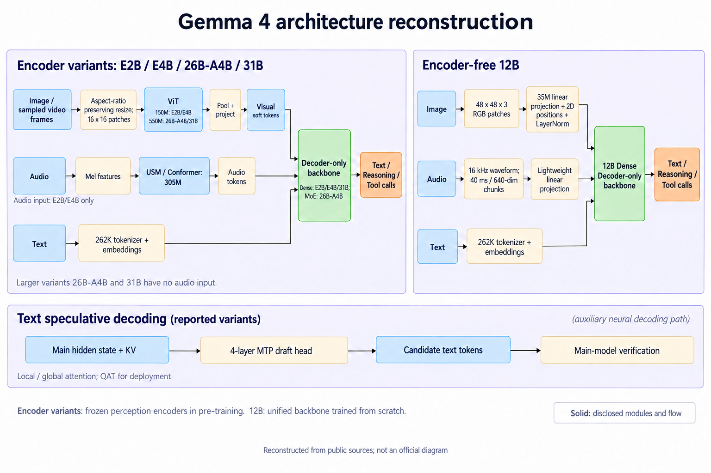

*依据技术报告第 2 节、官方模型卡和 12B 开发者说明重建的整体对比图，**非论文原图**。图中把支持音频的版本和文本输出边界分别标明。[结构依据](https://arxiv.org/html/2607.02770v1#S2)、[官方配置](https://ai.google.dev/gemma/docs/core/model_card_4)*

**模型结构：**

1. **带编码器的视觉路径。** E2B、E4B 使用约 150M 的 ViT，26B-A4B、31B 使用约 550M 的 ViT，patch 为 16×16。先保留纵横比缩放，再利用 2D RoPE、二维绝对位置和非因果视觉注意力建模，池化／投影后形成视觉软 token。视觉预算支持 70、140、280、560、1120 等档位：细小文字需要更高预算，视频可按帧设置较小预算容纳更多时间点。
2. **端侧音频路径。** E2B、E4B 的约 305M USM 音频编码器包含两个下采样卷积和 12 层 Conformer，输入 Mel 特征，以 40 ms 粒度处理声音。与 Gemma 3n 的 680M 编码器相比，它更小；输出为连续表征，**不经过声音码本量化**，主干产生转写、翻译或问答文本。26B-A4B 和 31B 不应画出这条音频路径。
3. **12B 的原始输入投影。** 图像直接分成 **48×48×3 RGB patch**，通过约 35M 参数的单次线性投影，加上二维坐标嵌入与 LayerNorm 后进入语言主干。16 kHz 原始波形每 40 ms 分块，得到 640 维向量，再线性投到同一嵌入空间。没有独立 ViT／Conformer，感知、融合与推理在统一的 48 层 Decoder-only Transformer 中进行；但仍有分块、投影和位置预处理。“Encoder-free”不能解释为模型不需要视觉空间信息。
4. **语言主干按设备分层。** E2B、E4B 的“有效”参数约为 2.3B／4.5B，另有较大的 Per-Layer Embeddings，完整权重约为 5B／8B；这些表按 token 查询，降低有效计算成本。26B-A4B 是 MoE，每 token 激活约 3.8B，具有 128 个专家、8 个活跃专家和共享专家。12B／31B 为 Dense。各模型交替使用局部滑窗和全局注意力，小模型支持 128K，中等模型支持 256K；部分全局层共享 Key 与 Value，并用 p-RoPE 减少 KV 成本。总权重、激活参数、上下文缓存应分别估算。[报告结构](https://arxiv.org/html/2607.02770v1#S2)、[官方参数表](https://ai.google.dev/gemma/docs/core/model_card_4)

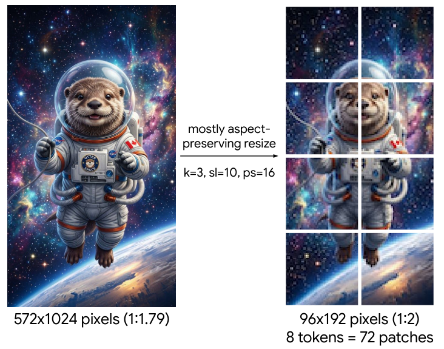

*论文原图：Figure 2，解释保纵横比缩放、视觉编码与池化；它对应带编码器变体，12B 结构请看上方整体对比。[原图及上下文](https://arxiv.org/html/2607.02770v1#A1.F2)*

Encoder-free 的计算转移值得单独理解。带编码器结构先对图像做双向视觉建模，再将压缩表征交给语言主干；12B 省掉这一步，让原始 patch 的语义关联由统一 Transformer 学习。因此，减少独立编码器参数和启动阶段不等于全部任务一定更省总计算：视觉预算、输入长度和主干大小仍影响开销。统一结构的另一个实际益处是微调，LoRA 或全参数更新可以在同一模型路径上调整文本、视觉与声音能力，无须同时管理不同冻结策略的多个感知编码器。官方例子把 313 个 1 FPS 帧、音频和问题共同送入 12B，并用每帧 70 的较低视觉预算分析约五分钟视频，说明输入预算需要随任务配置。[12B 官方结构与示例](https://developers.googleblog.com/gemma-4-12b-the-developer-guide/)

**训练：**

预训练混合网页、代码、图像，以及 E2B／E4B／12B 的声音数据；报告给出的数据截止时间为 2025 年 1 月，分词器使用约 262K 词表的 SentencePiece，并保留空白与字节编码。带编码器变体在预训练期间冻结感知编码器，语言主干学习读取连续模态表征；12B 采用统一架构从头训练，感知并不依赖一个事先冻结的独立编码器。自回归任务让图像问题、声音转写／翻译和文本任务最终落到同一文本预测空间。[报告预训练](https://arxiv.org/html/2607.02770v1#S2.SS4)

指令后训练延续 Gemma 3 路线，增加可配置 Thinking 模式，学习在最终回答前输出推理过程，并支持 system 角色、函数调用和明确回合结束符。报告披露数据过滤与格式，但未给出足以复原所有 SFT／偏好优化／RL 阶段的数据比例或奖励细节，因此不能替它指定某个未公开的 GRPO 配方。**QAT** 在训练中模拟低精度误差，为移动端混合 int2/int4 权重与 int8 激活，以及常见 Q4_0 部署准备更稳的权重；图像和音频编码器也量化，感知部分同样影响真实内存与速度。[报告指令微调及量化](https://arxiv.org/html/2607.02770v1#S3)

另一个训练组件是**文本 MTP 草稿头**：小型 4 层 Transformer 消费主模型上一步隐状态、token 嵌入和主模型 KV，先生成候选文字，再由主模型验证，以降低平均解码成本。它与 Qwen-Omni 中补残余声学码本的 MTP 用途不同。端侧草稿头还将大词表投影改成 token 簇 top-k 计算，减少每一步的矩阵开销。[报告 MTP](https://arxiv.org/html/2607.02770v1#S2.SS6)

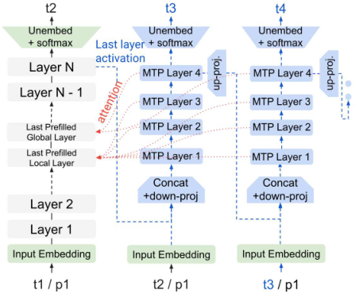

*论文原图：Figure 1。它是文本解码加速子系统，不是语音生成器，也不替代多模态整体架构图。[原图及上下文](https://arxiv.org/html/2607.02770v1#S2.F1)*

MTP 推测解码的最终决定仍在主模型。草稿头更小，能快速提出未来文字，但候选并不直接作为不可校验的最终答案；主模型一次验证多个候选，接受前缀后继续解码。性能收益取决于草稿被接受的比例、草稿长度和主模型验证成本，因而不能从“四层草稿头”直接推出固定加速倍数。QAT 也有类似边界：它优化低精度表示保真度，具体设备速度还受矩阵内核、内存带宽和上下文长度影响。把这两个机制放在一起看，可区分减少权重存储、降低 KV 开销与减少主模型逐 token 调用三种不同效率来源。[MTP 与 QAT](https://arxiv.org/html/2607.02770v1#S2)

**效果：**

| 视觉基准 | Gemma 3 27B | Gemma 4 E4B | Gemma 4 12B | Gemma 4 31B |
|---|---:|---:|---:|---:|
| MMMU Pro | 49.7 | 52.6 | 69.1 | 76.9 |
| MATH-Vision | 46.0 | 59.5 | 79.7 | 85.6 |
| InfographicVQA | 70.6 | 70.0 | 88.4 | 92.0 |
| OmniDocBench 1.5 错误指标↓ | 0.365 | 0.181 | 0.164 | 0.131 |

表中 Gemma 4 为 Thinking、最高 1120 视觉 token 设置，Gemma 3 对照为 non-thinking、Pan & Scan；它同时反映模型、输入处理与推理方式的变化，不能当成严格仅换架构的消融。音频方面，E4B 在 FLEURS 多语言转写的混合 WER／CER 平均为 **0.075**，Gemma 3n E4B 为 0.085；CoVoST 翻译平均 CorpusBLEU 为 **38.2**，前代为 34.7。12B 即使没有音频编码器，英文 FLEURS WER 仍为 **0.063**，支持统一主干学习原始声音的可行性。[报告视觉与音频表](https://arxiv.org/html/2607.02770v1#S4)、[模型卡](https://ai.google.dev/gemma/docs/core/model_card_4)

部署收益也应按组件读取：报告中量化后的端侧音频编码器文件从 Gemma 3n 的 390MB 降到 **87MB**，视觉编码器前向内存约从 400MB 降到 200MB。12B 的 Q4_0 文本权重约 **7.65GB**，表中 32K int8 KV 另约 0.28GB；这是文本配置，不代表带视觉／声音输入和所有运行开销后的设备占用。Gemma 4 的特点是让用户在专门编码器和统一原始输入之间选择，并保持文本推理、工具调用与本地部署能力。[报告内存表](https://arxiv.org/html/2607.02770v1#S2.SS3)、[12B 开发者指南](https://developers.googleblog.com/gemma-4-12b-the-developer-guide/)

### Qwen3.8-Omni-Flash

**Qwen3.8-Omni-Flash** 于 2026 年 9 月 18 日发布，9 月 22 日已有正式技术报告，不能再归类为“没有对应论文的服务”。它接收文本、图像、声音和视频，强化长材料理解、规划、工具调用与执行。HTTP Flash 服务输出文本和工具调用；**Flash-Realtime** 是另一个实时语音接口，具有 Talker 声音链路。模型服务与开放的 Qwen-MM-Plugins／Qwen-Live-Harness 框架也应区分。[官方发布](https://qwen.ai/blog?id=qwen3.8-omni-flash)、[技术报告](https://arxiv.org/abs/2609.25611)、[HTTP 规格](https://www.alibabacloud.com/help/en/model-studio/qwen-omni)

**核心思想：** 从“理解一段音视频”走向“围绕音视频完成工作”。例如分析长会议后生成笔记，或定位镜头后调用剪辑工具，都需要感知证据、长期记忆、计划和执行反馈。该模型用稀疏长上下文主干控制计算，再让模型自主读取相关片段；新加入的空间音频路径还保留声音方向等线索。视频编辑和音乐 MV 成品来自工具工作流，不能把这些应用称作本模型内置视频解码器。[报告介绍与应用](https://arxiv.org/html/2609.25611v1#S1)

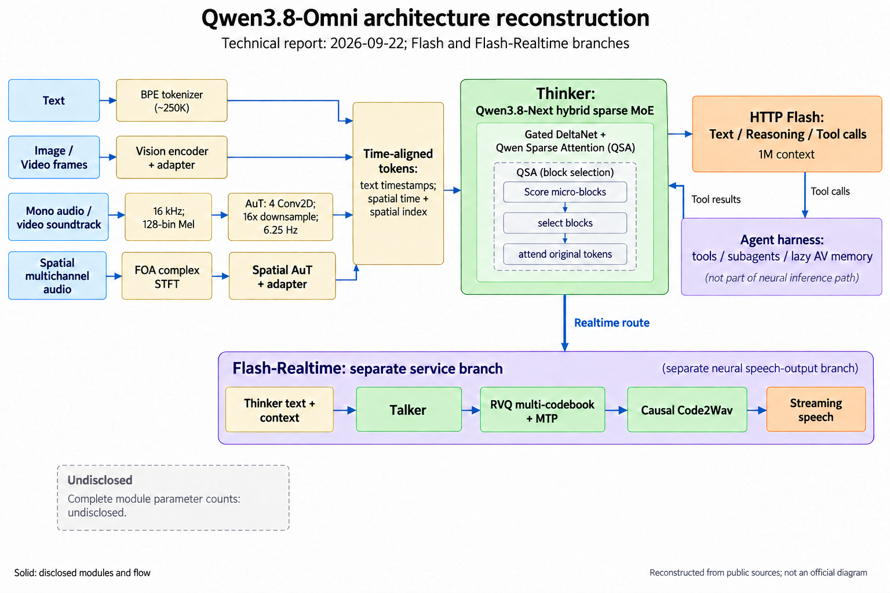

*依据新技术报告与官方接口资料重建的整体示意图，**非论文原图**。实线表示 HTTP 理解和工具路径，Realtime 声音路径单独分支；公开资料未给出的完整参数表不作补造。[结构依据](https://arxiv.org/html/2609.25611v1#S2)、[服务边界](https://www.alibabacloud.com/help/en/model-studio/qwen-omni)*

**模型结构：**

1. **三路感知与统一时间轴。** 视觉编码器处理图像／动态抽帧视频；普通 AuT 延续四个 Conv2D、16 倍下采样，以 **6.25 Hz** 表征声音。新 **Spatial AuT** 平行处理空间声音：多声道输入转为 FOA 表示，复数 STFT 同时保留实部与虚部，维护声道间幅度和相位关系，再经卷积、时间自注意力和投影形成空间表征。它补充普通 AuT 的声学与语言信息，而不是用更多声道重复做 ASR。三路通过各自 adapter 进入共享嵌入空间，显式文本时间戳帮助对齐；同一时间片的空间音频共享时间 ID，保留不同空间 ID。
2. **Hybrid sparse MoE Thinker。** 主干继承 Qwen3.8-Next，结合 Gated DeltaNet 与 **Qwen Sparse Attention（QSA）**。GDN 用固定大小递归状态汇总历史；QSA indexer 给压缩的 micro-block 表征评分，选择相关上下文块，核心注意力仍读取这些块中的原始 token。它同时保留状态建模和选择性检索，支持扩展到 **1M token**。报告没有完整 Omni 模块参数表，因此纯文本 Next 的参数数值不能直接当作整个 Omni 系统。
3. **执行与实时发声分工。** Thinker 输出文本、推理和 tool call，harness 执行工具后把结果送回上下文；Omni-Memory 等模块支持按需加载视听材料。Realtime 继承 RVQ、ARIA、MTP 与因果 Code2Wav，Talker 可依据部分流式文字开始生成声音，波形路径增加上采样，由 24 kHz 提至 **48 kHz**。Live Harness 还能异步委派长任务，让语音对话在后台执行期间继续进行。[报告模型设计](https://arxiv.org/html/2609.25611v1#S2)、[Realtime 结构](https://arxiv.org/html/2609.25611v1#S7)

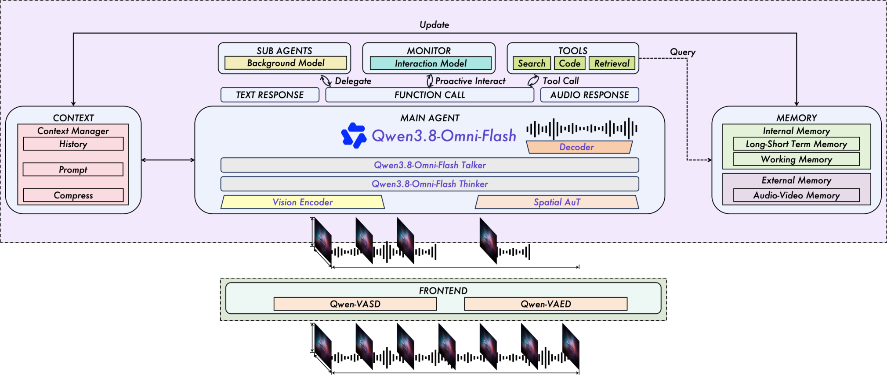

*论文原图：Figure 3，专门描述 **Flash-Realtime** 的声音链路与运行框架；HTTP Flash 的文本接口范围以官方服务文档为准。[原图及上下文](https://arxiv.org/html/2609.25611v1#S7.F3)*

**训练：**

原生预训练保持 256K 序列，分四阶段。**S1** 冻结语言主干，分别对齐视觉、AuT 和 Spatial AuT，先 adapter 后编码器；**S2** 解冻全部参数，报告称约 **2.5T token**，列出的分项为 1.1T 文本、0.7T 音频、0.35T 图像、0.15T 视频和 0.3T 视听（分项约数合计为 2.6T，原文总量与分项存在口径差），音频兼有单声道与多声道；**S3** 固定主干，仍运行稠密注意力，以其注意力分布监督 QSA indexer；**S4** 开启 QSA，联合训练主干与 indexer，让模型适应真正稀疏的上下文读取。1M 扩展发生在后训练之后，不是全部预训练样本一开始都用百万长度。[报告预训练](https://arxiv.org/html/2609.25611v1#S3)

后训练先用领域教师分别学习推理、代码、Agent、视觉和音频，再将高质量执行轨迹蒸馏进统一学生；随后联合 RL 同时考虑任务正确性、模态回答一致性和多轮行为。代理任务奖励依据实际结果与执行反馈，避免仅靠模型声称“已经完成”。Realtime Talker 另经过大规模预训练、复杂对话持续预训练、多语言教师在线蒸馏、说话人微调与 RL；这使文字规划能力与声音表达各有训练目标。[后训练](https://arxiv.org/html/2609.25611v1#S4)、[Talker 训练](https://arxiv.org/html/2609.25611v1#S7.SS1)

**效果：**

直接输入的 Static 评测中，OmniVideoBench 从 Qwen3.5-Omni-Plus 的 **53.8** 提到 **63.4**，Video-MME-v2 从 47.9 提到 65.0，LVOmniBench 从 53.2 提到 63.3。模型加入 Qwen Code 规划和证据查验后，这三项分别为 **67.8、71.3、73.6**；同工具条件 Gemini 3.8 Flash 分别为 70.1、72.7、70.7。优势随任务变化，不能把 Agent 分数与对照的 Static 分数混比。OmniVideoBench 的每题报告 token 从 145736 降到 79117，约减少 45.7%，且准确率提高；这未直接测量整体耗时或费用。[报告表 5、7、8](https://arxiv.org/html/2609.25611v1#S6)

Realtime API 测试使用 6／12／20 秒片段、16 kHz 单声道 PCM，视频另为 720P、1 FPS，每条件预热一次后测 10 次。首声音块约 **0.98—1.03 秒**（音频）、**1.21—1.35 秒**（视听）；客户端计时包含网络与服务处理，排除建连和输入上传，不能与上一代内部理论首包直接排名。生成 RTF 约 0.153，强调的是启动之后持续生成效率。该系列的新增价值，是把空间声学证据、选择性长上下文读取和基于执行结果的代理训练连接起来；实际接口的语音输出、文件时长和缓存能力仍需按 Flash／Realtime 具体版本读取。[报告实时测试](https://arxiv.org/html/2609.25611v1#S7.SS2)、[官方接口](https://www.alibabacloud.com/help/en/model-studio/qwen-omni)

### GPT-6 Astra / GPT-6.1 Sol

GPT-6 Astra 于 **2026 年 9 月 3 日**发布；GPT-6.1 Sol 的系统卡增补发表于 **9 月 29 日**。这两个型号延续原文 o3/o4-mini 的“视觉理解与推理结合”路线，并把看图、长上下文推理和工具操作用于完整工作任务。以下描述针对这两个具体模型 ID：其原生接口为**文本和图像输入、文本输出**，音频与视频文件不是这两个 ID 的原生输入模态；应用中出现语音、视频或生成图片，还需查看所调用的专门模型或工具。[Astra 模型接口](https://developers.openai.com/api/docs/models/gpt-6-astra)、[Sol 模型接口](https://developers.openai.com/api/docs/models/gpt-6.1-sol)

**核心思想：** 视觉不再只服务于“这张图里有什么”的一次性回答，也成为智能体持续观察环境的通道。以图形软件操作为例，模型先从截图识别目标和当前状态，再决定下一步动作；动作执行后，新的截图继续进入上下文，模型据此检查结果并修正计划。这里需要区分三种能力：图像内容理解、目标位置定位，以及把若干视觉观察和操作组织成完整任务。三者相互关联，但不能用一个图像问答分数代替全部能力。

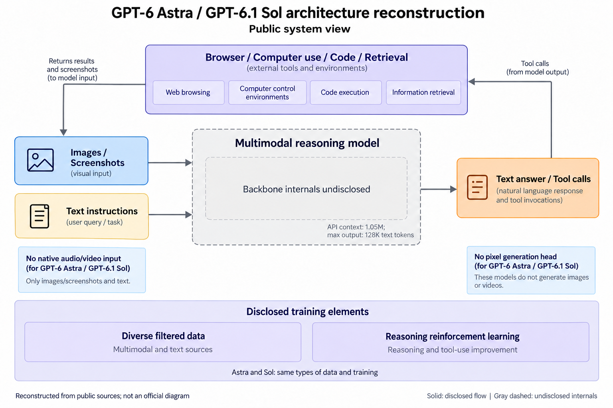

*根据官方 API 文档与系统卡生成的结构示意图，非官方论文原图。实线表示已公开的输入、输出与工具反馈关系，反馈支路以截图观察为例，文字工具结果则并入文本上下文；灰色虚线框表示未公开的神经网络内部结构。工具位于模型之外。[系统卡](https://deploymentsafety.openai.com/gpt-6-astra)、[6.1 Sol 增补](https://deploymentsafety.openai.com/gpt-6-1-sol)*

**模型结构：**

1. **多模态输入与长上下文。** 文本指令、图像或截图与此前对话组成模型条件。两个接口均提供约 **1.05M token 上下文**和 **128K 最大输出**。这说明接口可容纳的序列预算，不说明图像编码器的层数、注意力形式或每个像素如何进入骨干；这些内部设计没有完整公开。
2. **视觉输入预算。** 图像细节会影响可观察的信息与计算预算。Astra 的官方文档区分 `low`、`high` 与 `original`：高细节模式允许最多 2,500 个 patch；原始模式保留尺寸，受最长边与 30,000 patch 上限约束。这个规则是输入处理与计费口径，不能据此推断其视觉骨干就是原文某个公开 ViT。[图像输入规则](https://developers.openai.com/api/docs/guides/images-vision)
3. **推理与最终回答。** 输入进入支持推理的模型，模型可以在最终文本之前使用推理 token。`reasoning.effort` 控制任务的思考投入，Astra 和 6.1 Sol 支持 `low` 到 `max`，而非每次固定生成同样长的过程。它是推理行为的可调接口，并不是已公开的“第几层推理模块”。[推理接口说明](https://developers.openai.com/api/docs/guides/reasoning)
4. **工具反馈闭环。** 当模型输出工具调用，外部程序执行检索、代码、计算机操作等动作，结果随后返回模型。图中的回路因此是“观察—决策—执行—再观察”的系统数据流。模型生成调用参数与执行工具是两个环节；图像生成工具产生的图片也不能计作 Astra/Sol 的原生像素输出。

读这张图时，最关键的是把中间的未知骨干与右侧可观察工作流分开。公开评测能证明系统在截图定位和操作任务上的能力，却不能反推出它使用了某种投影器、多少个 MoE 专家，或与 Qwen、InternVL 相同的视觉连接方式。

**训练：**

官方系统卡公开的训练信息包括：采用经过处理和过滤的多样化数据；通过**强化学习训练推理行为**，使模型尝试不同策略、发现错误并改进思考过程。6.1 Sol 增补明确采用与 Astra 相同类型的数据和训练，但没有宣称两个模型拥有完全相同的权重或规模。[Astra 数据与训练](https://deploymentsafety.openai.com/gpt-6-astra#model-data-and-training)、[Sol 数据与训练](https://deploymentsafety.openai.com/gpt-6-1-sol)

从学习目标看，可以把这一路线理解为两个层面。基础学习建立语言、知识与视觉条件下的预测能力；推理后训练则改善面对复杂任务时的策略选择与纠错。以图形界面任务为例，正确描述截图并不保证完成任务：模型还需要判断动作是否使环境朝目标变化。一个任务的成败可能到多步之后才显现，因此动作序列、执行反馈和最终结果之间的信用分配，是理解智能体训练的重要问题。这里是对学习问题的分析，**不是厂商已披露的具体奖励函数**。

目前公开资料不足以写出可复现的视觉预训练阶段表：训练 token 总量、图文采样比例、视觉模块冻结安排、RL 算法和 reward 权重均不完整。图中训练区域并列列出官方确认的多样化过滤数据与推理 RL，表示已披露的要素，不把它们补画成固定的完整阶段顺序。

**效果：**

下面选取 Astra 发布表中与视觉智能体最相关的结果，按原表任务和设置阅读：

| 评测 | GPT-6 Astra | GPT-5.6 Sol | 结果主要反映什么 |
| --- | ---: | ---: | --- |
| ScreenSpot-Pro，no tools | 92.7% | 76.9% | 从截图定位界面目标 |
| OSWorld 2.0，v2026.08.08 offline set，partial score | 72.6% | 65.7% | 多步桌面操作的综合表现 |
| Agents' Last Exam | 59.3% | 53.6% | 更复杂的智能体工作任务 |
| MRCR v2，8-needle，512K–1M | 96.3% | 73.8% | 特定长上下文检索与区分能力 |

这些是官方发布时的特定运行结果；发布说明指出分数取可用 effort 下的最好结果，研究/API 环境与产品系统可能不同。MRCR 是长文本评测，不是长视频成绩；ScreenSpot 的无工具定位也不等同于 OSWorld 的完整执行成功率。[官方评测表与脚注](https://openai.com/index/gpt-6-astra/)

6.1 Sol 的官方定位是以更低成本提供接近 Astra 的复杂工作能力，但应单独评测它在目标任务上的质量与延迟，不能把上表 Astra 的数值直接复制给 Sol。这个家族相对早期 VLM 的进展，主要体现在**把视觉观察接入推理和执行闭环**；由于完整训练配方和骨干未公开，其学习价值更适合放在能力边界、工作流和评测设计上。

### Gemini 3.1 Pro

Gemini 3.1 Pro 于 **2026 年 2 月 19 日**推出。它基于 Gemini 3 Pro，面向复杂推理、代码、长上下文和多模态理解；模型卡列出的输入为**文本、图像、音频、视频**，输出为文本，上下文最大 **1M token**。这一输入范围与只接收图像的视觉语言模型不同，但不代表该 ID 同时生成图像、音频和视频。[3.1 Pro 模型卡](https://deepmind.google/models/model-cards/gemini-3-1-pro/)

**核心思想：** 将不同模态提供的证据共同用于推理，同时用稀疏专家结构扩大模型容量。分析一段实验视频时，画面给出操作和物体变化，声音可能提供解释或事件线索，文本问题则规定需要回答的内容。多模态能力的价值在于建立这些证据之间的对应，而不是把各路输入分别摘要后拼成一个答案。

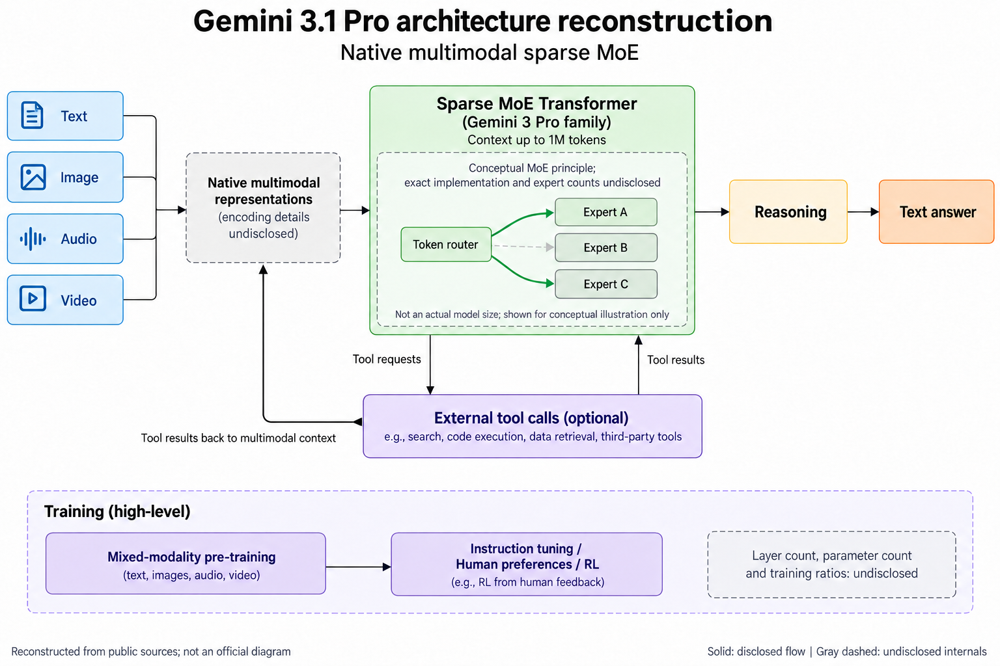

*根据 3.1 Pro 模型卡及其明确引用的 Gemini 3 Pro 架构信息生成，非官方论文原图。稀疏 MoE Transformer 与原生模态支持已有公开依据；图内 router／experts 仅解释 MoE 通用原理，未表示真实专家数和路由配置。工具结果回模型／回上下文的两条示意线是同一反馈的不同抽象视角，不表示独立的双路神经反馈模块。[Gemini 3 Pro 基础模型卡](https://storage.googleapis.com/deepmind-media/Model-Cards/Gemini-3-Pro-Model-Card.pdf)*

**模型结构：**

1. **原生多模态条件。** 四类输入共同进入模型。官方没有发布足以还原完整前端的视觉 patch 大小、音频 tokenizer、视频时间编码和投影器配置，因此图中把它们概括为多模态表示，灰色区域保留未披露边界。这一表示框是教学抽象，不是已确认的独立“统一编码器”。
2. **稀疏 MoE Transformer。** 3.1 Pro 模型卡把架构细节指向 Gemini 3 Pro；后者明确为稀疏 MoE Transformer。其基本思想是每个 token 只使用部分专家，使总模型容量和单 token 计算量不再一一对应。为说明原理，可写为 \(h'=\sum_{e\in\mathcal S(h)}g_e(h)E_e(h)\)：路由器选择专家集合 \(\mathcal S\)，各专家计算后加权组合。此式是 MoE 的一般表达，不能用来推断 Gemini 的 top-k、共享专家或负载均衡损失。
3. **上下文中的联合推理。** 图像细节、视频片段和音频内容都消耗输入预算。1M 是接口上限；即使序列装得下，模型也可能漏掉中间证据，或错误关联相距较远的事件。因此长上下文的可容纳长度与实际检索、时序理解能力应分开检查。
4. **文本与工具调用。** 最终结果由文本给出，工具调用则属于应用工作流。官方展示的 SVG 动画和交互界面是模型生成代码后由浏览器渲染的结果，不能据此把 3.1 Pro 归为直接生成视频像素的模型。[官方发布与应用示例](https://blog.google/innovation-and-ai/models-and-research/gemini-models/gemini-3-1-pro/)

**训练：**

3.1 Pro 的训练数据说明继承 Gemini 3 Pro：预训练覆盖文本、代码、图像、音频和视频；后训练包含指令、强化学习和人类偏好数据，也使用多步推理、问题求解等材料。其数据处理包含去重与质量过滤，训练采用 TPU 以及 JAX/ML Pathways。[基础模型训练说明](https://storage.googleapis.com/deepmind-media/Model-Cards/Gemini-3-Pro-Model-Card.pdf)

这类共同训练要解决两个层面的对齐。一是内容对应：文本是否忠实描述某张图或某段声音；二是任务对应：模型是否根据问题选择相关证据，而不是被无关画面或背景音干扰。图像问答能够训练静态事实，视频和音频任务还涉及时间、顺序与跨模态事件关系；后训练进一步把这些表示用于有约束的回答和复杂决策。这是对公开训练材料作用的分析，而非额外披露的厂商数据配比。

3.1 Pro 发布材料强调核心推理进步，但没有公开“相对 3 Pro 增加了多少视觉数据”或新视觉模块的独立消融。因而不能把推理分数的上升归因于某个猜测的编码器替换。图中训练链只是基础训练和后训练的逻辑关系，并不声称视觉前端在某阶段冻结，或该版本一定使用 GRPO、DPO 等指定算法。

**效果：**

官方 2026 年 2 月评测表可同时看到明显进步和基本持平的项目：

| 评测 | Gemini 3.1 Pro，Thinking High | Gemini 3 Pro，Thinking High | 条件与含义 |
| --- | ---: | ---: | --- |
| ARC-AGI-2 | 77.1% | 31.1% | ARC Prize verified，抽象规则推理 |
| MMMU-Pro | 80.5% | 81.0% | 无工具，Standard 与 Vision 设置平均 |
| HLE，无工具 | 44.4% | 37.5% | 综合学术推理，不能单独当作视觉指标 |
| MRCR v2，8-needle，128K average | 84.9% | 77.0% | 长上下文特定检索任务 |
| MRCR v2，1M pointwise | 26.3% | 26.3% | 在完整长度处的结果，不能与 128K 平均混用 |

评测文档说明一般采用单次尝试、不做多数投票或并行测试时计算；小基准可能多次运行取平均。3.1 Pro 的推理提升很突出，但 MMMU-Pro 没有随之上升，1M MRCR 也保持不变。这组结果说明**核心推理能力、视觉知识推理和超长证据检索不会自动同步改善**。[官方评测与方法](https://deepmind.google/models/evals-methodology/gemini-3-1-pro/)

### Gemini 3.8 Flash

Gemini 3.8 Flash 于 **2026 年 9 月 2 日**发布，其模型卡说明它基于 3.7 Flash；3.7 又基于 3.6。该版本接收文本、图像、音频与视频，最大上下文 **1M token**，文本输出上限 **64K token**。其主要定位是多步推理和智能体工作；视觉能力在此成为文档、图表、视频以及计算机环境中的证据来源。[3.8 Flash 模型卡](https://deepmind.google/models/model-cards/gemini-3-8-flash/)

**核心思想：** 把“较低成本的多模态理解”与“持续执行复杂任务”结合。官方发布说明把进步描述为更充分地思考与迭代调用工具；高 effort 下可能消耗更多 token。因此 Flash 名称描述的是产品路线，不能推出每个任务的总耗时都比所有 Pro 模型短，也不能推出其参数规模。[官方发布说明](https://blog.google/innovation-and-ai/models-and-research/gemini-models/3-8-flash-and-3-8-flash-cyber/)

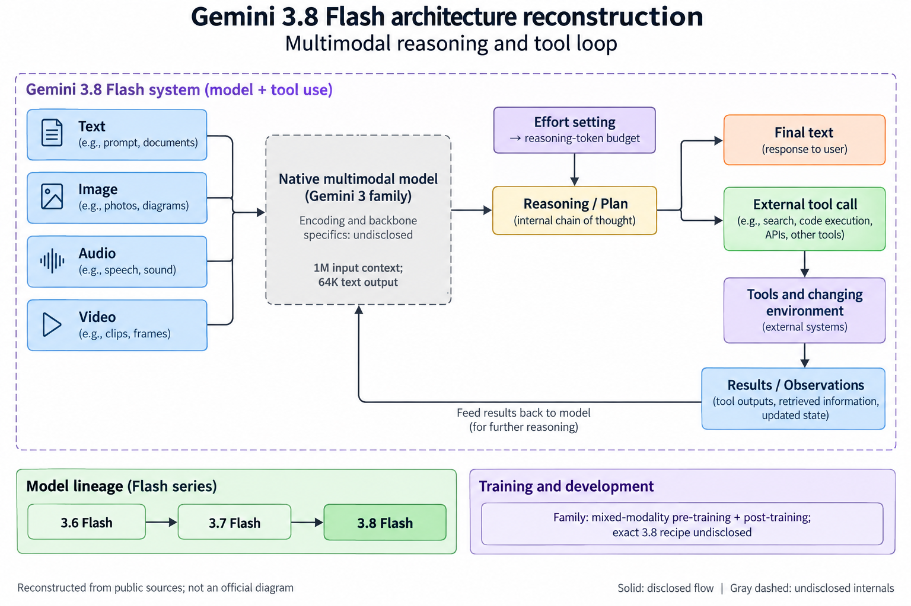

*根据模型卡与发布说明生成的结构／系统流程图，非官方论文原图。输入模态、上下文、文本输出和工具循环有公开依据；内部编码器、层数与路由实现未在 3.8 卡中完整展开。图中的工具闭环属于应用运行流程，Reasoning／Plan 与 effort 控制是推理行为的教学抽象，不是公开确认的独立神经模块或固定 token 预算公式。*

**模型结构：**

1. **多模态观测。** 一次输入既可包含文本目标，也可包含 PDF 页面、图表或视频。静态输入时，模型根据已有证据生成答案；智能体场景下，程序可以在模型请求后补充资料、截图或新的观测。两种模式共享任务目标，但观察策略并不相同。
2. **可调推理投入。** 模型在判断、计划、工具调用与最终文本之间分配计算。更多步骤可能让它检查失败并继续尝试，也会增加序列长度和延迟。图中的 reasoning/plan 框是可观察行为的抽象，不是与骨干分离的已公开神经网络模块。
3. **工具动作与结果回注。** 模型提出结构化动作，外部工具改变状态或取得数据，结果返回上下文。与单轮看图不同，任务是否完成取决于动作是否有效、证据是否被正确保留，以及模型是否在错误反馈后改正计划。若模型生成网页代码或调用图像生成服务，渲染器与生成服务应画在模型外。
4. **公开架构的继承关系。** 3.8 卡通过 3.7 卡指向前代架构资料，并未给出独立的详细模块图。图中保留家族依赖和模型整体，不把前代任意细节冒充为 3.8 新公开的设计。[3.7 Flash 模型卡](https://storage.googleapis.com/deepmind-media/Model-Cards/Gemini-3-7-Flash-Model-Card.pdf)

**训练：**

3.8 的训练数据与处理说明同样指向 3.7 及其前代，没有单独发布完整数据量、冻结策略或损失组合。可核验的家族层面训练路线是多模态基础学习，加上指令、偏好和推理强化学习；**不能由继承关系推断 3.8 只是一次简单 SFT，或已使用某种特定蒸馏算法**。

理解这个版本的训练目标，应把“回答正确”和“工作完成”分开。前者可以通过问题与答案监督；后者还依赖工具参数、步骤顺序和环境状态。例如分析 PDF 后修改一份代码，模型可能正确读出数值，却把修改写到错误位置；也可能代码编译成功，但视觉界面没有达到要求。对这样的任务，具有执行反馈的训练材料有助于学习检查和纠错，但公开发布说明中的“更勤勉”属于行为描述，**并没有公开其 reward、轨迹数量与优化配方**。

图中的训练框因此只展示家族层面的概念路线。具体改进来自基础权重、后训练、推理策略或工具系统中的哪一部分，公开材料缺少完整消融，不能从几项分数中独立识别。这个边界也影响复现：使用相同模型 ID 但不同工具、观察频率或步骤上限，得到的结果可能不同。

**效果：**

以下取自 2026 年 9 月官方评测 PDF，而非将宣传图中的不同任务合并为总排名：

| 评测 | Gemini 3.8 Flash | Gemini 3.7 Flash | 主要测试对象 |
| --- | ---: | ---: | --- |
| CharXiv Reasoning，无工具 | 86.2% | 84.5% | 科研图表信息综合与推理 |
| LVBench，static | 87.1% | 85.4% | 长视频理解 |
| GDP.PDF，all pass rate | 35.0% | 34.0% | 专业 PDF 任务的严格通过口径 |
| DeepSWE v1.1 | 73.7% | 65.3% | 长程软件工程任务 |
| OSWorld 2.0，partial score | 59.0% | 50.6% | 基于截图的计算机操作 |

LVBench 的静态设置给 Gemini 输入 1,024 帧；其独立 agentic 行为设置报告 87.8%，二者应分别阅读。DeepSWE 使用 high thinking 与 mini-swe harness；OSWorld 还涉及截图分辨率、500 步上限和批量工具调用等设置，且方法文档注明运行在 OSWorld 2.0 的 2026 年 8 月 8 日补丁之前。这里的分数反映“模型＋具体运行方法”，不能把版本差值全部归因于视觉编码器，也不宜直接与另一厂商更改过任务集的 OSWorld 分数比较。[官方评测表与方法](https://deepmind.google/models/evals-methodology/gemini-3-8-flash/)

总体进步更集中于完成多步工作。图表与视频分数同时提升，但 GDP.PDF 严格通过率仍明显低于百分之百，说明理解页面与稳定解决完整专业任务之间仍存在距离。

### Gemini 3.8 Audio

Gemini 3.8 Audio 于 **2026 年 9 月 15 日**公布，模型卡索引于 **9 月 24 日**更新。它是一个包含不同接口的家族：**Live、Live Extended Thinking、Flash TTS、Flash-Lite TTS**。前两者用于原生语音交互，后两者用于文本生成语音，不能把四个型号的能力混成一个“全能接口”。[Audio 模型卡](https://deepmind.google/models/model-cards/gemini-3-8-audio/)、[模型卡更新索引](https://deepmind.google/models/model-cards/)

**核心思想：** 在语音场景中，模型既要理解内容，又要处理交流时机。用户可能插话、改变请求、指向摄像头里的物体，或者在模型执行工具时继续讲话。Live 路线把这些交互作为持续输入；Extended Thinking 增强较复杂任务中的思考投入；TTS 则针对给定文本的声音呈现，不承担相同的视觉理解与工具任务。

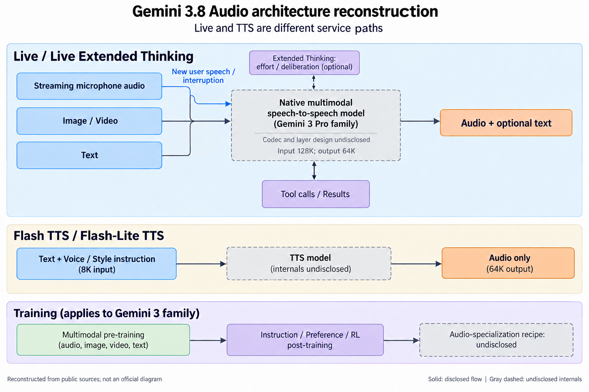

*根据官方模型卡、Live 发布说明与开发文档生成，非官方论文原图。上方为基本 Live 输入输出与工具闭环，下方为独立 TTS 路径，未展开可选 Live Avatar 扩展。灰色内部区域表示未公开的音频 tokenizer、codec 与网络实现；此图没有把传统 ASR→LLM→TTS 级联冒充为 Live 架构。*

**模型结构：**

1. **Live 的输入与输出。** Live 和 Extended Thinking 接收音频、图像、视频与文本，输入上下文 **128K**，输出音频和文本，输出预算 **64K**。音频 token 与文字 token 对应不同表示，64K 是接口给出的 token 预算，不能直接换算成固定时长的录音。
2. **持续会话与视觉 grounding。** 音频流、画面和当前任务持续进入会话状态。用户说“这个零件”时，视觉信息帮助消解所指对象；之后的语音回应应根据同一任务状态继续。Live API 通过有状态、低延迟的连接处理输入，并支持工具调用、打断等行为。[Live API 说明](https://ai.google.dev/gemini-api/docs/live-api)
3. **Extended Thinking 的任务投入。** 对复杂请求，该变体强化多步推理与工具任务完成。更高质量不必然伴随最低延迟；对话自然度、任务正确率和响应时机要分别测量。图中 Extended Thinking 标签属于同一类语音交互任务的变体，不能理解为在已公开 Talker 上直接加了一层 CoT。
4. **TTS 的独立路径。** Flash TTS 与 Flash-Lite TTS 接收最多 **8K 文本输入**，输出音频。它们依据文本和语音控制指令合成声音；模型卡没有给这条路径赋予图像/视频输入能力。原生语音对话模型直接接收声音，TTS 接收文字，两者在输入信息、训练任务和评价指标上不同。

更新后的模型卡还列出可选 **Live Avatar**：配置这一扩展时，Live 与 Extended Thinking 可输出音频、视频和文本，输出预算为 **24K**，根据配置图像与音频生成头部动作和唇音同步。这个输出模式应与图中基本音频／文本模式区分；它也不代表能像 Omni 一样生成任意场景视频。

因此读图要先选路径：实时口语助手走上方 Live；已写好的旁白或多人脚本配音走下方 TTS。把两者混在一张没有分支的“音频编码器＋语言模型＋声码器”图里，会掩盖产品接口和学习任务的实际差异。

**训练：**

Audio 模型卡明确这些模型基于 Gemini 3 Pro，基础数据与处理参照其模型卡；没有公开完整语音专门训练阶段、codec 词表、声码器设计或 loss 权重。因此可确认的是多模态基础模型与后训练的继承关系，不能写成已知的三阶段 Thinker–Talker 训练。

从任务角度分析，Live 不仅需要理解音频中的词义，还要利用说话方式、对话历史和可能的视觉上下文；TTS 则需要忠实读出给定文本并控制声音表现。若训练只优化文本转录正确率，不能充分约束音色、停顿、语气和对话时机。若只优化声音听感，也不能保证工具任务完成。因此对原生语音模型，需要同时检查语义理解、音频生成、交互行为和任务结果。以上是训练目标的教学分析，**不代表 Google 已公开采用了这些名称对应的独立损失**。

官方开发者说明确认新版 Live 支持保持对话的同时完成任务；确切的语音专项数据量及各任务混合比例仍未披露。图中灰色部分保留这一边界，同时实线把已确认的实时输入、语音输出与外部工具反馈画清楚。[开发者发布说明](https://blog.google/innovation-and-ai/technology/developers-tools/build-real-time-voice-applications-gemini-audio/)

**效果：**

官方发布与评测报告给出两类互补证据：

| 项目 | Gemini 3.8 Live | Live Extended Thinking | 阅读方式 |
| --- | ---: | ---: | --- |
| Artificial Analysis Speech-to-Speech Index | 76.0 | 82.6 | 综合语音交互指数，不能当作 ASR 准确率 |
| Sierra τ³-Banking | 未在所引结果图中列出 | 35.1% | 多轮语音任务中的知识检索与工具执行 |

官方说明还报告 Extended Thinking 在 τ-Voice 上为 **68.6%**。这些数字针对对应模型、思考设置和运行环境：方法文档区分 Gemini API 与 Enterprise 平台的评测，默认单次尝试，不使用多数投票。Speech-to-Speech 综合指数和银行工作流成功率衡量的是不同对象，不能互相替代。[发布结果](https://blog.google/innovation-and-ai/models-and-research/gemini-models/gemini-3-8-live-gemini-3-8-live-extended-thinking/)、[评测方法与结果](https://deepmind.google/models/evals-methodology/gemini-3-8-live/)

这组结果体现了更强的语音任务能力，但不能转用到 Flash TTS 的语音自然度。官方对 **Flash TTS 与 Flash-Lite TTS** 另行发布评测：使用 production checkpoints、默认采样和单次生成，Hume 人类听评检查自然度、表现力及风格／情感／语速指令，Voice Arena 通过盲评成对偏好比较并计算 Elo。它们衡量声音质量与控制能力，而不是 Live 的银行任务成功率；不同语言和脚本还需分别检查。[TTS 独立评测方法与结果](https://deepmind.google/models/evals-methodology/gemini-3-8-tts/)

### Gemini Omni Flash / Gemini Omni 1.1 Flash

Gemini Omni Flash 于 **2026 年 5 月**推出，模型卡 **8 月 27 日**更新并覆盖 Omni 1.1 Flash。它接收文本、图像、音频和视频，主要输出是**带音频的视频**，并支持通过对话编辑已有视频。它与前面的 Gemini 3.8 Flash 不是相同任务：这里研究的是多模态条件下的媒体生成和编辑。[Omni 模型卡](https://deepmind.google/models/model-cards/gemini-omni-flash/)

**核心思想：** 把多模态理解用于生成目标的控制。文本规定动作或修改要求，参考图像规定主体和风格，源视频规定已有运动与场景；模型要生成符合新要求的视频，同时保留未要求改变的内容。多轮编辑比单轮生成多了一层约束：第二轮应接续第一轮的结果和修改意图，而不是每次重新创造一个无关场景。

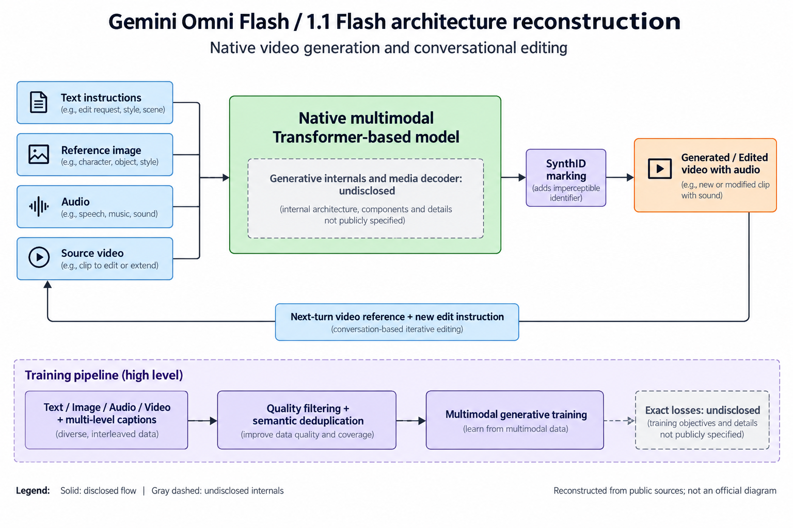

*根据官方模型卡与研究／产品说明生成，非官方论文原图。Transformer 与输入输出模态已有明确公开依据；媒体编码器、生成解码器、具体目标函数没有完整公开，图中不假设扩散模型、离散视频 token 或调用 Veo 的固定实现。[官方介绍](https://blog.google/innovation-and-ai/models-and-research/gemini-models/gemini-omni/)*

**模型结构：**

1. **多模态条件输入。** 指令与参考素材进入模型，参考不仅用于“看懂”，也限制生成结果。例如相同角色需要跨帧保持身份，背景图与动作描述共同限定场景。模型卡确认支持四类输入，但各产品或 API 开放的具体组合可有差异，应用时应按对应接口核验。
2. **理解与生成结合的 Transformer 模型。** 官方明确其为支持原生多模态输入的 Transformer，并描述为结合 Gemini 智能与生成媒体能力。现有资料不足以确定生成主干是纯自回归、扩散，还是混合设计。因此图中以整体生成模型表示已知能力，内部灰色框不补造具体算法。
3. **视频与音频输出。** 结果需要同时满足视觉、运动和声音约束。单帧漂亮并不能保证视频中的物体持续一致、动作合理或声音与事件同步；评价对象因此从静态图像扩展到时间上的连续媒体。音频具体的解码器与同步实现未公开。
4. **对话编辑回路。** 新一轮指令和上一轮视频形成新的条件。例如先改变环境，再调整镜头角度，应尽量保留此前角色与动作。图中的回路说明这个外部输入关系，不声称模型拥有永久保存场景的特定神经记忆模块。官方还对输出使用 SynthID 标记，该环节属于媒体交付系统，不等于骨干中的某一层。

公开开发者说明展示了从文本、图像和视频参考进行生成与对话编辑的接口。图中所列音频输入来自更广的模型卡能力，不能推断每一个上线入口均允许上传任意音频。[开发者发布说明](https://blog.google/innovation-and-ai/models-and-research/gemini-models/gemini-omni-flash-nano-banana-2-lite/)

**训练：**

模型卡公开说明训练覆盖音频、视频、图像和文本；音视频带有**不同细节层级的文本描述**；视频经过质量等过滤，并进行语义去重。训练使用 TPU、JAX 与 ML Pathways。它没有公开完整训练 token、阶段冻结安排、生成损失或单独 RL 配方，因此本节不把通用扩散损失写成 Omni 的真实训练目标。[模型卡训练信息](https://deepmind.google/models/model-cards/gemini-omni-flash/)

多层级描述可以从监督作用上理解：较粗描述对应整体场景和动作，较细描述对应物体属性、局部事件以及声音等细节。生成模型需要把这些条件映射到连续一致的媒体。语义去重则不仅检查文件字节是否相同，还减少同一内容的近重复样本；其作用是改善有效数据多样性，而不是简单减少下载文件数量。这些是对已公开数据处理的解释，不能由此推断具体 captioner 或去重阈值。

编辑训练还面临保留与修改的矛盾：修改区域必须响应新指令，其他部分应保持稳定。但公开资料没有给出编辑样本构造与 mask loss 的明确配方，因此图中只展示任务条件关系，不声称已有某种特定区域监督。它为理解生成系统提供了框架，无法替代可复现训练方案。

**效果：**

官方提供的证据主要为生成与编辑示例，而不是与 MMMU、Video-MME 同口径的理解榜单。可以按以下维度阅读这些展示：

| 展示能力 | 对应结构关系 | 还需独立检查的结果 |
| --- | --- | --- |
| 对已有视频改变材质、动作或场景 | 源视频＋编辑指令→新视频 | 改动是否局限于指定内容、身份是否稳定 |
| 连续多轮编辑并调整镜头 | 上轮结果回注＋新指令 | 是否遗忘前轮约束、运动是否连续 |
| 结合参考图创建视频 | 图像条件＋文本目标→视频 | 主体一致性、指令符合度及时间稳定性 |

这些来自官方案例和构建者展示，是**定性证据**，不能写成未经报告的成功率，也不能推出 Omni 1.1 在所有生成任务上优于所有同类模型。具体应用仍需统计多次生成的符合率、时序一致性与编辑保留率；单条精选视频只能展示可达到的效果。[官方演示](https://blog.google/innovation-and-ai/models-and-research/gemini-models/gemini-omni-3-5-videos/)、[构建者案例](https://blog.google/innovation-and-ai/models-and-research/gemini-models/gemini-omni-builders/)

Omni 的代表性在于从“理解多模态内容”迈向“按多模态约束生成和修改内容”。它的模型图应突出条件、生成输出与编辑回路，而不是复用只输出文本答案的传统 VLM 三模块图。

## 总结

多模态大语言模型正朝着更全面、更智能、更高效的方向发展。它们不仅能够理解和生成跨越文本、图像、视频、音频等多种模态的内容，还能进行复杂的推理、规划和工具调用。未来，我们可以期待 MLLMs 在效率优化、更深层次的跨模态融合与推理、更强的时序和空间理解能力、以及安全性和可控性方面取得进一步突破。

## 参考文献

[1] OpenAI. ["Hello gpt‑4o."](https://openai.com/index/hello-gpt-4o/) OpenAI Blog (2024).

[2] DeepMind. ["Gemini 2.5 Pro"](https://deepmind.google/technologies/gemini/pro/) DeepMind Blog (2025).

[3] OpenAI. ["Introducing OpenAI o3 and o4‑mini."](https://openai.com/index/introducing-o3-and-o4-mini/) OpenAI Blog (2025).

[4] Zhang, Duzhen, et al. ["MM-LLMs: Recent advances in multimodal large language models."](https://arxiv.org/abs/2401.13601) arXiv preprint arXiv:2401.13601 (2024).

[5] Dosovitskiy, Alexey, et al. ["An image is worth 16×16 words: Transformers for image recognition at scale."](https://arxiv.org/abs/2010.11929) arXiv preprint arXiv:2010.11929 (2020).

[6] Radford, Alec, et al. ["Learning transferable visual models from natural language supervision."](https://arxiv.org/abs/2103.00020) International conference on machine learning. PmLR, 2021.

[7] Li, Junnan, et al. ["Blip: Bootstrapping language-image pre-training for unified vision-language understanding and generation."](https://arxiv.org/abs/2201.12086) International conference on machine learning. PMLR, 2022.

[8] Li, Junnan, et al. ["Align before fuse: Vision and language representation learning with momentum distillation."](https://arxiv.org/abs/2107.07651) Advances in neural information processing systems 34 (2021): 9694-9705.

[9] Li, Junnan, et al. ["Blip-2: Bootstrapping language-image pre-training with frozen image encoders and large language models."](https://arxiv.org/abs/2301.12597) International conference on machine learning. PMLR, 2023.

[10] Liu, Haotian, et al. ["Visual instruction tuning."](https://arxiv.org/abs/2304.08485) arXiv preprint arXiv:2304.08485 (2023).

[11] Bai, Jinze, et al. ["Qwen-vl: A frontier large vision-language model with versatile abilities."](https://arxiv.org/abs/2308.12966) arXiv preprint arXiv:2308.12966 1.2 (2023): 3.

[12] Wang, Peng, et al. ["Qwen2-vl: Enhancing vision-language model's perception of the world at any resolution."](https://arxiv.org/abs/2409.12191) arXiv preprint arXiv:2409.12191 (2024).

[13] Dehghani, Mostafa, et al. ["Patch n' pack: NaViT, a vision transformer for any aspect ratio and resolution."](https://arxiv.org/abs/2307.06304) Advances in Neural Information Processing Systems 36 (2023): 2252-2274.

[14] Su, Jianlin, et al. ["Roformer: Enhanced transformer with rotary position embedding."](https://arxiv.org/abs/2104.09864) Neurocomputing 568 (2024): 127063.

[15] Su, Jianlin. ["Transformer升级之路：4、二维位置的旋转位置编码."](https://spaces.ac.cn/archives/8397) *科学空间* (blog) (2021).

[16] Bai, Shuai, et al. ["Qwen2.5‑VL Technical Report."](https://arxiv.org/abs/2502.13923) arXiv preprint arXiv:2502.13923 (2025).

[17] Xu, Jin, et al. ["Qwen2.5‑Omni Technical Report."](https://arxiv.org/abs/2503.20215) arXiv preprint arXiv:2503.20215 (2025).

[18] Lipman, Yaron, et al. ["Flow matching for generative modeling."](https://arxiv.org/abs/2210.02747) arXiv preprint arXiv:2210.02747 (2022).

[19] Lee, Sang-gil, et al. ["Bigvgan: A universal neural vocoder with large-scale training."](https://arxiv.org/abs/2206.04658) arXiv preprint arXiv:2206.04658 (2022).

[20] Kimi Team. ["Kimi‑VL Technical Report."](https://arxiv.org/abs/2504.07491) arXiv preprint arXiv:2504.07491 (2025).

[21] Zhai, Xiaohua, et al. ["Sigmoid loss for language image pre-training."](https://arxiv.org/abs/2303.15343) Proceedings of the IEEE/CVF international conference on computer vision. 2023.

[22] Kimi Team.  ["Kimi k1.5: Scaling reinforcement learning with LLMs."](https://arxiv.org/abs/2501.12599) arXiv preprint arXiv:2501.12599 (2025).

[23] Snell, Charlie, et al. ["Scaling llm test-time compute optimally can be more effective than scaling model parameters."](https://arxiv.org/abs/2408.03314) arXiv preprint arXiv:2408.03314 (2024).

[24] Wang, Yaoting, et al. ["Multimodal chain-of-thought reasoning: A comprehensive survey."](https://arxiv.org/abs/2503.12605) arXiv preprint arXiv:2503.12605 (2025).


### 续篇参考文献

[25] GLM-V Team. [GLM-4.5V and GLM-4.1V-Thinking: Towards Versatile Multimodal Reasoning with Scalable Reinforcement Learning](https://arxiv.org/abs/2507.01006). 2025，本文架构说明参照包含后续 GLM-V 版本的 v6。

[26] InternVL Team. [InternVL3.5: Advancing Open-Source Multimodal Models in Versatility, Reasoning, and Efficiency](https://arxiv.org/abs/2508.18265). 2025。

[27] MiniCPM Team. [MiniCPM-V 4.5 Cooking Efficient MLLMs via Architecture, Data, and Training Recipe](https://arxiv.org/abs/2509.18154). 2025。

[28] Qwen Team. [Qwen3-VL Technical Report](https://arxiv.org/abs/2511.21631). 2025。

[29] Ai2. [Molmo2 Open Weights and Data for Vision-Language Models with Video Understanding and Grounding](https://arxiv.org/abs/2601.10611). 2026。

[30] Kimi Team. [Kimi K2.5 Visual Agentic Intelligence](https://arxiv.org/abs/2602.02276). 2026。

[31] Qwen Team. [Qwen3-Omni Technical Report](https://arxiv.org/abs/2509.17765). 2025。

[32] LLaVA-OneVision Team. [LLaVA-OneVision-1.5: Fully Open Framework for Democratized Multimodal Training](https://arxiv.org/abs/2509.23661). 2025。

[33] MiniCPM Team. [MiniCPM-o 4.5: Towards Real-Time Full-Duplex Omni-Modal Interaction](https://arxiv.org/abs/2604.27393). 2026。

[34] Qwen Team. [Qwen3.5-Omni Technical Report](https://arxiv.org/abs/2604.15804). 2026。

[35] LLaVA-OneVision Team. [LLaVA-OneVision-2: Towards Next-Generation Perceptual Intelligence](https://arxiv.org/abs/2605.25979). 2026。

[36] Gemma Team. [Gemma 4 Technical Report](https://arxiv.org/abs/2607.02770). 2026。

[37] Qwen Team. [Qwen3.5 官方发布文章](https://qwen.ai/blog?id=qwen3.5)、[397B-A17B 模型卡与配置](https://huggingface.co/Qwen/Qwen3.5-397B-A17B). 2026。服务版本与其他后续更新的一手来源见对应章节。

[38] Qwen Team. [Qwen3.8-Omni Technical Report](https://arxiv.org/abs/2609.25611). 2026。HTTP、Realtime 与音频前端的具体图号见正文。

[39] OpenAI. [GPT-6 Astra 发布与评测](https://openai.com/index/gpt-6-astra/)、[系统卡](https://deploymentsafety.openai.com/gpt-6-astra)、[GPT-6.1 Sol 增补](https://deploymentsafety.openai.com/gpt-6-1-sol). 2026。

[40] Google DeepMind. [Gemini 3.1 Pro 模型卡](https://deepmind.google/models/model-cards/gemini-3-1-pro/)、[Gemini 3.8 Flash 模型卡](https://deepmind.google/models/model-cards/gemini-3-8-flash/)、[Gemini 3.8 Audio 模型卡](https://deepmind.google/models/model-cards/gemini-3-8-audio/)、[Gemini Omni Flash 模型卡](https://deepmind.google/models/model-cards/gemini-omni-flash/). 2026。版本依赖、评测方法及具体报告见对应章节链接。

[41] Kimi Team. [Kimi K3 官方技术报告](https://github.com/MoonshotAI/Kimi-K3/blob/main/k3_tech_report.pdf)、[公开权重与配置](https://huggingface.co/moonshotai/Kimi-K3). 2026。Figure 2 与训练章节见正文。

[42] InternVL Team. [Expanding Performance Boundaries of Open-Source Multimodal Models with Model, Data, and Test-Time Scaling](https://arxiv.org/abs/2412.05271). 2024。InternVL2.5 架构和训练图参照 v1 的 Figure 2、4。

[43] InternVL Team. [InternVL3: Exploring Advanced Training and Test-Time Recipes for Open-Source Multimodal Models](https://arxiv.org/abs/2504.10479). 2025。本文参照 v3；架构教学重建图与原论文性能图明确区分。

## 引用

以下署名与 BibTeX 对应 Yue Shui 原文；本版新增模型章节与技术校订不归为原作者的表述。

> **引用**：转载或引用本文内容时，请注明原作者和来源。

**Cited as:**

> Yue Shui. (May 2025). 多模态大语言模型.
> https://syhya.github.io/zh/posts/2025-05-04-multimodal-llm/

Or

```bibtex
@article{yue_shui_multimodal_llm_2025,
  title   = "多模态大语言模型",
  author  = "Yue Shui",
  journal = "syhya.github.io",
  year    = "2025",
  month   = "May",
  url     = "https://syhya.github.io/zh/posts/2025-05-04-multimodal-llm/"
}
```

## 原文校订与素材说明

原文的校订集中在 ViT 迁移收益、动态分辨率与位置编码、窗口注意力复杂度、CLIP 温度参数化、Qwen2-VL 命名与参数口径、Kimi-VL 专家配置，以及 o4-mini 参数量和内部搜索算法的披露边界。原始版本另存为 `mllm-original.md`，逐项修订记录保存在 `original-corrections.json`。

校订依据：[ViT 原论文](https://arxiv.org/abs/2010.11929)、[CLIP 原论文](https://arxiv.org/abs/2103.00020)、[Qwen2-VL 报告](https://arxiv.org/html/2409.12191v2#S2.SS1)、[Qwen2.5-VL 报告](https://arxiv.org/html/2502.13923v1#S2.SS1)、[Kimi-VL 报告](https://arxiv.org/html/2504.07491v1#S2.SS1)、[Kimi-VL 官方配置](https://huggingface.co/moonshotai/Kimi-VL-A3B-Instruct/blob/main/config.json)、[o3/o4-mini 官方发布说明](https://openai.com/index/introducing-o3-and-o4-mini/)。

原文图保留原图注。续篇论文原图的出处、图号与保存路径记录在 `figure-sources.json`；根据公开资料生成的教学重建图记录在 `reconstructed-figure-sources.json`，其中保存依据、完整生成提示词、文件哈希和检查信息。重建图不冒充论文原图，也不把未披露的骨干画成已知实现。博客仓库的 MIT 许可不覆盖论文第三方素材的重新授权。

<details>
<summary>原文源码仓库 MIT 许可声明</summary>

```text
MIT License

Copyright (c) 2024 YUE SHUI

Permission is hereby granted, free of charge, to any person obtaining a copy
of this software and associated documentation files (the "Software"), to deal
in the Software without restriction, including without limitation the rights
to use, copy, modify, merge, publish, distribute, sublicense, and/or sell
copies of the Software, and to permit persons to whom the Software is
furnished to do so, subject to the following conditions:

The above copyright notice and this permission notice shall be included in all
copies or substantial portions of the Software.

THE SOFTWARE IS PROVIDED "AS IS", WITHOUT WARRANTY OF ANY KIND, EXPRESS OR
IMPLIED, INCLUDING BUT NOT LIMITED TO THE WARRANTIES OF MERCHANTABILITY,
FITNESS FOR A PARTICULAR PURPOSE AND NONINFRINGEMENT. IN NO EVENT SHALL THE
AUTHORS OR COPYRIGHT HOLDERS BE LIABLE FOR ANY CLAIM, DAMAGES OR OTHER
LIABILITY, WHETHER IN AN ACTION OF CONTRACT, TORT OR OTHERWISE, ARISING FROM,
OUT OF OR IN CONNECTION WITH THE SOFTWARE OR THE USE OR OTHER DEALINGS IN THE
SOFTWARE.
```

</details>
